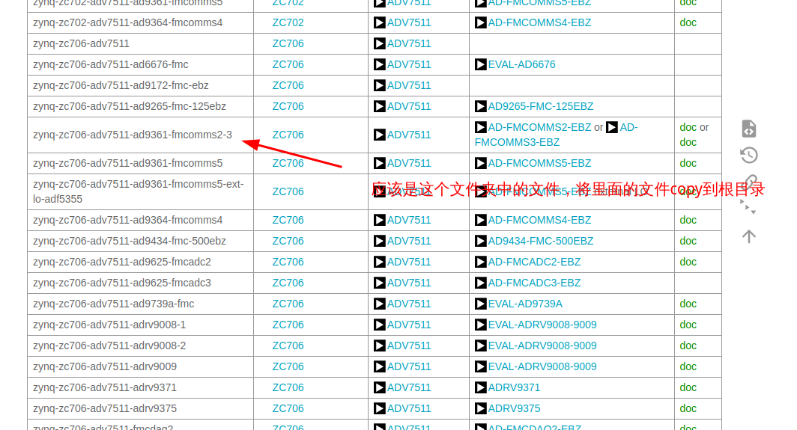
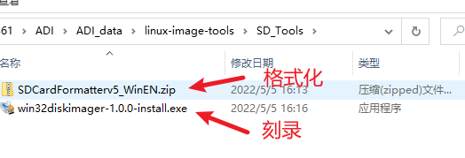
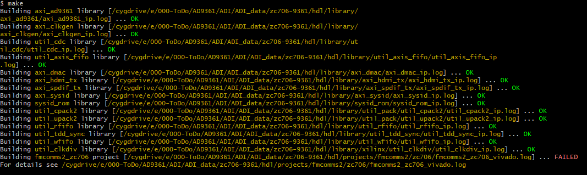
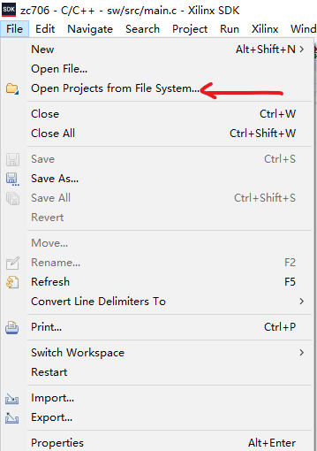
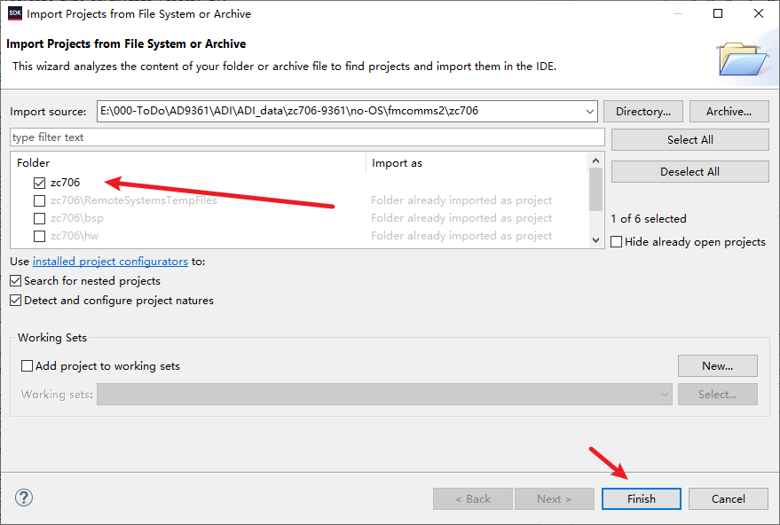
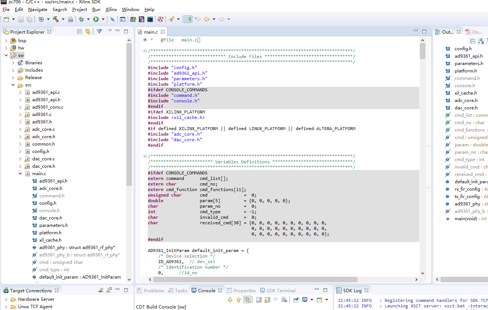
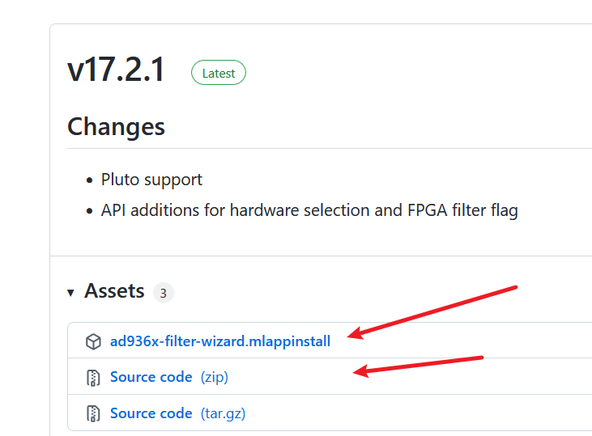
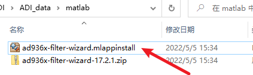

# AD9361

**写在前面：**下文中提到的软件，镜像插件我以都下载到了`./ADI_data/software_image_plugin`文件夹下，可以安装需要自行安装。

[ADI产品 User guides](https://wiki.analog.com/resources/eval/user-guides)

[**AD-FMCOMMS3官方文档中心**](https://wiki.analog.com/resources/eval/user-guides/ad-fmcomms3-ebz)跳转链接。

## clock 

[AD-FMCOMMS2-EBZ and AD-FMCOMMS3-EBZ](https://wiki.analog.com/resources/eval/user-guides/ad-fmcomms3-ebz/hardware/configuration_options) are both clocked from a 40.000000 MHz Epson crystal.


## ZC706上使用AD-FMCOMMSX

[如何在zc706上开始我们的开箱测试？](https://wiki.analog.com/resources/eval/user-guides/ad-fmcomms2-ebz/quickstart/zynq)

好像adi的这个镜像可以适用于所有平台


[AD936X的block Diagram](https://wiki.analog.com/resources/eval/user-guides/ad-fmcomms2-ebz/ad9361)

### 基于zc706的Linux开箱测试指南


官网开箱指南阅读顺序

1. [第一步](https://wiki.analog.com/resources/eval/user-guides/ad-fmcomms2-ebz/quickstart/zynq)整体流程

2. 准备与[下载linux镜像](https://wiki.analog.com/resources/tools-software/linux-software/zynq_images)

   已经放在了`.\ADI_data\software_image_plugin\linux-image-tools`目录下

   在这一篇文中的Preparing the image: FPGA Carrier小节中提到对于不同的FPGA平台BOOT分区需要使用不同的启动引导文件与设备树文件，这些文件都在制作好的SD卡的BOOT分区中的子文件夹下。为了正常启动系统，你需要将对应平台的文件从BOOT分区的子文件夹复制到BOOT分区的根目录中。

   ​	所以在BOOT分区的根目录中应该包含下面的文件

   1. An uImage file or Image file for ZynqMP
   2. A BOOT.BIN specific to your board+FPGA
   3. A devicetree.dtb or system.dtb for ZynqMP specific to your board+FPGA

   当然由于你使用的是zynq7000系列的平台，所以可能有所区别，我推测只需要一个BOOT.BIN 和设备树文件就可以了。当然一切已实际测试为准。

   

3. [制作SD卡镜像](https://wiki.analog.com/resources/tools-software/linux-software/zynq_images/windows_hosts)

   1. 相关软件与镜像已经放在了`.\ADI_data\software_image_plugin\linux-image-tools`目录下

   2. 准备linux镜像

   3. 下载格式化([SD Card Formatter](https://www.sdcardformatter.com/))sd卡和[刻录SD卡](https://sourceforge.net/projects/win32diskimager/)的软件

      - 格式化

      - 将镜像刻录到sd卡中

        

        - 具体的操作根据[Flash the SD Card](https://wiki.analog.com/resources/tools-software/linux-software/zynq_images/windows_hosts)这一小节操作就可以了

4. 你可能还需要一些其他操作！！！

   1. 我在[Analog Devices Kuiper Linux](https://wiki.analog.com/resources/tools-software/linux-software/zynq_images)这篇文章中的`Boot`小结中看到可以在引导启动时设置环境变量，来设置mac地址。当然你也可以尝试不去设置这个环境变量测试启动，如果不成功再回来重新设置。因为我也不清楚这里怎么设置才是正确的。

   2. 关于linux的用户与密码

      | user   | password |
      | ------ | -------- |
      | root   | analog   |
      | analog | analog   |

   3. 关于**文件共享**与访问参照`Accessing Files`小节

   

   


###  no-Os 开箱

1. 下载源码：**源码已经下载好了**在`.\ADI_data\src`文件夹下

2. [Building HDL](https://wiki.analog.com/resources/fpga/docs/build)

   在这里可以看到对应的[eda版本](https://github.com/analogdevicesinc/hdl/releases)是什么

   在win下编译工程需要先安装一个 Cygwin

   1. [安装教程](https://blog.csdn.net/kkg89/article/details/118770749)

   2. 配置环境变量

      ```sh
      #这个没有用，只是作为一个记录
      Copying skeleton files.
      These files are for the users to personalise their cygwin experience.
      
      They will never be overwritten nor automatically updated.
      
      './.bashrc' -> '/home/zsz//.bashrc'
      './.bash_profile' -> '/home/zsz//.bash_profile'
      './.inputrc' -> '/home/zsz//.inputrc'
      './.profile' -> '/home/zsz//.profile'
      ```

      

      ```sh
      #打开安装Cygwin的目录，找到 D:\cygwin64\home\user-name\.bashrc文件
      #在.bashrc文件最后添加自己的vivado SDK的路径
      export PATH=$PATH:/cygdrive/d/Xilinx/Vivado/2018.3/bin:/cygdrive/d/Xilinx/SDK/2018.3/bin
      ```

   3. 编译FPGA工程

      - **下载源文件：**找到之前下载好的[HDL](https://github.com/analogdevicesinc/hdl/tree/hdl_2019_r1)文件和[no-OS](https://github.com/analogdevicesinc/no-OS/tree/2019_R1)文件注意因为我的vivado的版本是2018.3所以根据HDL releases note中关于版本的说明我下载的hdl_2019_r1和no-OS_2019_r1(这个no-OS的版本说明我没有找到，不过我也是使用的no-OS_2019_r1这个版本) 。

      - **开始编译：**

        1. 这里我以9361 fmcomms2的zc706平台编译工程，

        2. 打开Cygwin软件切换到`hdl\projects\fmcomms2\zc706`目录

           ```sh
           cd E:/xxxx/ADI/ADI_data/zc706-9361/hdl/projects/fmcomms2/zc706
           ```

        3. 开始make

           ```sh
           #在命令行中输入 
           make
           #就可以自动编译工程了哈哈啊哈哈
           ```

           

3. [sdk 编译](https://wiki.analog.com/resources/eval/user-guides/ad-fmcomms2-ebz/software/baremetal)

   1. 打开Cygwin切换到 `e/000-ToDo/AD9361/ADI/ADI_data/zc706-9361/no-OS/fmcomms2/zc706`

   2. 运行make

   3. 当make完成后，有两种方法打开sdk工程：1.打开sdk 选择从文件系统打开工程：选择`e/000-ToDo/AD9361/ADI/ADI_data/zc706-9361/no-OS/fmcomms2/zc706`这个文件夹；2.也可以直接将sw文件夹下的`src`文件夹里的文件copy出来，直接重新建立sdk工程。

      

      

   4. 点击finish就打开工程了 O(∩_∩)O

   5. 然后你就傻眼了，这个工程超级大O(∩_∩)O

      


## [MATLAB Design AD936X](https://wiki.analog.com/resources/eval/user-guides/ad-fmcomms2-ebz/software/filters)

这里其实主要讲的是关于AD936X中FIR滤波器的设计;

这一节中提到的软件，插件已经放在了`.\ADI_data\software_image_plugin\matlab`目录下

### ad936x-filter-wizard

#### 下载[ad936x-filter-wizard](https://github.com/analogdevicesinc/ad936x-filter-wizard/releases)

点击上述的链接，下载ad936x-filter-wizard.mlappinstall 文件，这个要求matlab>2015版



#### 安装app插件

方法1直接双击ad936x-filter-wizard.mlappinstall 就可以自动安装



方法2如果使用下载的压缩源码，[有两种方法](https://wiki.analog.com/resources/eval/user-guides/ad-fmcomms2-ebz/software/filters)：

1.  Right click “AD9361_Filter_Wizard.fig” and select “Open in GUIDE” to open the figure. Then type “Ctrl+T” to run the figure.
2.  Within the application directory run the command “AD9361_Filter_Wizard” from the MATLAB command line.


### Mathwork中Matlab对9361的建模支持

mathwork中对9361建模的支持[参考](https://ww2.mathworks.cn/hardware-support/analog-devices-rf-transceivers.html)

### 如何使用MATLAB App - ad936x-filter-wizard

- 具体的如何使用请参考这篇[文章](https://wiki.analog.com/resources/eval/user-guides/ad-fmcomms2-ebz/software/filters)中的Use MATLAB App一节

一般来说有两种方式使用设计向导：

- MATLAB App
- MATLAB function


## iio_oscilloscope

[iio_oscilloscope](https://wiki.analog.com/resources/tools-software/linux-software/iio_oscilloscope)是ADI的跨平台的GUI应用，该应用程序支持以四种不同模式（时域、频域、星座和互相关）绘制捕获的数据。该应用程序还允许查看和修改评估板设备的多个设置。

这个应用程序可以本地运行(我的理解是9361的运行平台，比如说在zc706的linux上)，也可以连接远程运行(在一台PC上远程连接到zc706中运行的iio上)。

另外可以利用IIO这个应用程序进行调试963X等器件，也可以保存一些数据

### 安装

1. [win](https://github.com/analogdevicesinc/iio-oscilloscope/releases)
2. [linux](https://wiki.analog.com/resources/tools-software/linux-software/iio_oscilloscope)中Linux 一节
3. mac

​	这一节中提到的软件，插件已经放在了`.\ADI_data\software_image_plugin\matlab`目录下

### 用户指南

参考[iio_oscilloscope](https://wiki.analog.com/resources/tools-software/linux-software/iio_oscilloscope)这篇文章中的User guide这一小节


### [no-OS IIO](https://wiki.analog.com/resources/tools-software/no-os-software/iio)

关于no-OS如何使用IIO参考[no-OS IIO](https://wiki.analog.com/resources/tools-software/no-os-software/iio)这篇文章


## GitHub资源地址

1. [no-Os](https://github.com/analogdevicesinc/no-OS)
2. [Linux](https://github.com/analogdevicesinc/linux)
3. [iio-oscilloscope](https://github.com/analogdevicesinc/iio-oscilloscope)
   - win下安装[iio-oscilloscope](https://github.com/analogdevicesinc/iio-oscilloscope/releases)
4. [libiio](https://github.com/analogdevicesinc/libiio)
5. [AD9361 HDL Reference Designs](https://wiki.analog.com/resources/eval/user-guides/ad-fmcomms2-ebz/reference_hdl)

注意：Please note that the projects **FMCOMMS2**, **FMCOMMS3** and **FMCOMMS4** are using the [same](https://github.com/analogdevicesinc/hdl/tree/master/projects/fmcomms2) hdl design