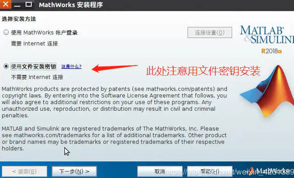
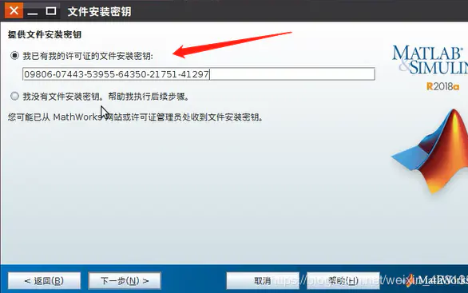
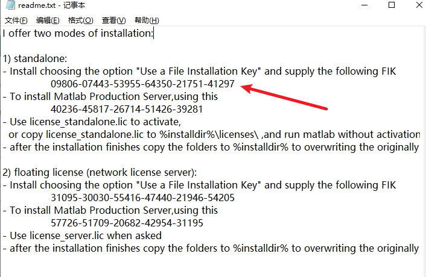
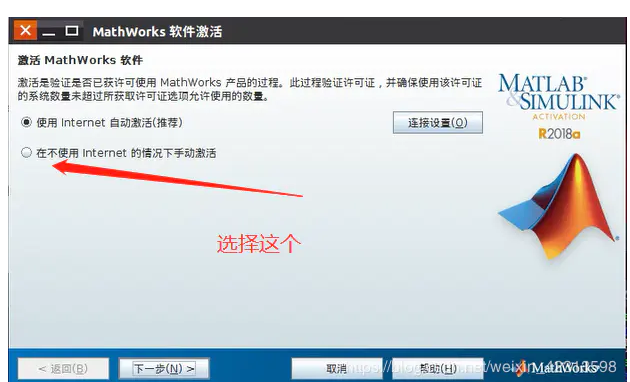
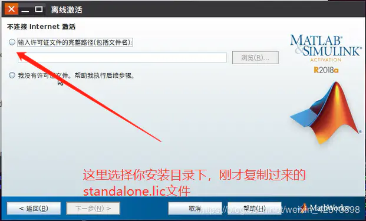

[TOC]

# Archlinux 安装笔记

## 问题记录

1. 在使用live系统完成了分区与引导器的安装后，由于我没有安装sudo,dhcpcd导致了我启动系统后无法配置网络，无法连接到网络，无法使用visudo
2. 在发现系统的配置错误后，可以重新通过live镜像进行修改。
3. 为什么那个自由软件者的kde桌面安装教程没有安装xorg
4. 显示主文件磁盘空间不足/分配了10G
5. 


# Arch Linux 日常使用

## 更新系统

```shell
pacman -Syyu    #升级系统中全部包
```

## 安装软件

```shell
pacman -S package_name1 package_name2 ...
pacman -S --noconfirm  gcc 
# man pacman 为什么不能使用
```


## 下载文件

### linux wget指定下载目录和重命名 

当我们在使用wget命令下载文件时，通常会需要将文件下载到指定的目录，这时就可以使用 -P 参数来指定目录，如果指定的目录不存在，则会自动创建。

示例：

wget -P /usr/local/src http://download.redis.io/releases/redis-4.0.9.tar.gz


如果需要对下载的文件进行重命名，则可以通过 -O 参数指定文件名，需要注意的是，如果重命名中包含路径，那么该路径必须实现创建好。

示例：

wget http://download.redis.io/releases/redis-4.0.9.tar.gz -O /usr/local/src/redis.tar.gz

经测试 小写的和大写的都可以 但是大写的会显示下载过程 小写的不会

## 安装激活xmind

```shell
编辑
/etc/environment
添加
VANA_LICENSE_MODE=true
VANA_LIENCE_TO=ZSZ
```


## arch Linux 安装pip的一种方法

文档链接：https://pip.pypa.io/en/stable/installation/

​	

### ⚠警告

```shell
[root@ae5d7bf3b1fc python_pip]# wget 	https://bootstrap.pypa.io/get-pip.py
[root@ae5d7bf3b1fc python_pip]# python3 ./get-pip.py 
Collecting pip
  Downloading pip-21.2.4-py3-none-any.whl (1.6 MB)
     |████████████████████████████████| 1.6 MB 24.0 MB/s 
Collecting setuptools
  Downloading setuptools-58.2.0-py3-none-any.whl (946 kB)
     |████████████████████████████████| 946 kB 32.6 MB/s 
Collecting wheel
  Downloading wheel-0.37.0-py2.py3-none-any.whl (35 kB)
Installing collected packages: wheel, setuptools, pip
Successfully installed pip-21.2.4 setuptools-58.2.0 wheel-0.37.0
WARNING: Running pip as the 'root' user can result in broken permissions and conflicting behaviour with the system package manager. It is recommended to use a virtual environment instead: https://pip.pypa.io/warnings/venv
```


创建我的archlinux 镜像

```dockerfile
FROM archlinux
MAINTAINER zsz<2668838984@qq.com>

ENV MYPATH /home

WORKDIR $MYPATH

RUN pacman -Syuu

RUN pacman -S python3
RUN pacman -S 
```


## 报错

```shell
root@d61d4b3a39dc:/migen# python3 ./setup.py 
Traceback (most recent call last):
  File "./setup.py", line 4, in <module>
    from setuptools import setup
ModuleNotFoundError: No module named 'setuptools'
root@d61d4b3a39dc:/migen# python3 ./setup.py develop --user
Traceback (most recent call last):
  File "./setup.py", line 4, in <module>
    from setuptools import setup
ModuleNotFoundError: No module named 'setuptools'

#安装python3-setuptools
## Ubuntu
apt-get install python3-setuptools
#使用脚本安装
wget  https://bootstrap.pypa.io/get-pip.py
chmod +x ./get-pip.py
python get-pip.py

apt-get install python3-pip
#安装
apt-get install verilator

#archlinux
pacman -S python-setuptools
#这条命令安装后，执行./litex_setup.py init install --user 时出错。 又试了一遍又可以了！！！！
#通过安装pip使用pip install setuptools 后成功安装。
```


## Docker

修改docker 的存储位置，避免docker 占用过多的空间。

### 将docker中的GUI应用显示到本机上

```shell
#将docker中的GUI应用显示到本机上。
#1、archlinux 安装xorg-xhost

sudo pacman -S xorg-xhost

#2、在主机上运行 
sudo xhost +
#3、启动docker容器

docker run -it -v /tmp/.X11-unix:/tmp/.X11-unix -e DISPLAY=unix$DISPLAY -e GDK_SCALE -e GDK_DPI_SCALE --name quartus1 yitiandelan/quartus:18.1 /bin/bash

#4、在容器里面启动Gui应用。
/opt/..../bin/quartus
```

## archlinux GPG 错误


```shell
sudo pacman -S archlinux-keyring && sudo pacman -Syu
sudo pacman -S archlinuxcn-keyring

```


## 压缩与解压zip 文件

安装7zip

```shell
sudo pacman -S p7zip

#例如解压 xxx.zip
7z x -o新文件夹 xxx.zip # 保留原始文件结构
#压缩：
7z a [目标文件名].7z [原文件名/目录名]
```

## archlinux 安装quartus 

```shell
sudo pacman -S noto-fonts adobe-source-han-sans-cn-fonts freetype2 fontconfig 

sudo pacman -S lib32-expat lib32-fontconfig lib32-freetype2 lib32-glibc lib32-gtk2         lib32-libcanberra lib32-libpng lib32-libice lib32-libsm lib32-util-linux lib32-ncurses lib32-zlib         lib32-libx11 lib32-libxau lib32-libxdmcp lib32-libxext lib32-libxft lib32-libxrender lib32-libxt lib32-libxtst 

sudo pacman -S  git libpng12 tcl lsb-release 

```

## archlinux 安装计算器

[speedcrunch](https://speedcrunch.org/) 

```shell
 sudo pacman -S speedcrunch 
```

## Deepin QQ 非中文模式下中文显示黑框，可以调用输入法，但是仍然为黑框

```shell
#修改桌面图表的这一行
Exec="/opt/apps/com.qq.im.deepin/files/run.sh" -u %u
改为：
Exec=LC_ALL=zh_CN.UTF-8 "/opt/apps/com.qq.im.deepin/files/run.sh" -u %u
```

## openocd install


安装位置

/usr/local/share/openocd


```shell
openocd -c 'adapter driver ftdi; ftdi_vid_pid 0x0403 0x6014; adapter speed 100;transport select jtag;init;jtag init;exit;'

```


## MBFTDI

```shell
ldd libjtag_hw_mbftdi-blaster.so 

pacman -Qo /usr/lib/libftd2xx.so /usr/include/ftd2xx.h /usr/lib/libusb-1.0.so

pacman -Qo /usr/lib/libstdc++.so.6 /usr/lib/libgcc_s.so.1 

```


## install ftdi2XX 驱动

## 

```shell
1、下载驱动包：libftd2xx-x86_64-1.4.22.tgz
2、解压 
tar -zxvf ./libftd2xx-x86_64-1.4.22.tgz
3、进入解压文件 打开readme.txt

D2XX for Linux
--------------

As Linux distributions vary these instructions are a guide to installation 
and use.  FTDI has tested the driver with LTS Ubuntu distributions for 
x86 and x86_64 architectures, and Raspbian on Raspberry Pi.

FTDI developed libftd2xx primarily to aid porting Windows applications 
written with D2XX to Linux.  We intend the APIs to behave the same on
Windows and Linux so if you notice any differences, please contact us 
(see http://www.ftdichip.com/FTSupport.htm).

FTDI do not release the source code for libftd2xx.  If you prefer to work
with source code and are starting a project from scratch, consider using
the open-source libFTDI.

libftd2xx uses an unmodified version of libusb (http://libusb.info) which
is distributed under the terms of the GNU Lesser General Public License 
(see libusb/COPYING or http://www.gnu.org/licenses).  Source code for 
libusb is included in this distribution.


Installing the D2XX shared library and static library.
------------------------------------------------------

1.  tar xfvz libftd2xx-x86_64-1.4.22.tgz

This unpacks the archive, creating the following directory structure:

    build
        libftd2xx        (re-linkable objects)
        libusb           (re-linkable objects)
        libftd2xx.a      (static library)
        libftd2xx.so.1.4.22   (dynamic library)
        libftd2xx.txt    (platform-specific information)
    examples
    libusb               (source code)
    ftd2xx.h
    WinTypes.h

2.  cd build

3.  sudo -s 
  or, if sudo is not available on your system: 
    su

Promotes you to super-user, with installation privileges.  If you're
already root, then step 3 (and step 7) is not necessary.

4.  cp libftd2xx.* /usr/lib

Copies the libraries to a central location.

5.  chmod 0755 /usr/lib/libftd2xx.so.1.4.22

Allows non-root access to the shared object.

6.  ln -sf /usr/lib/libftd2xx.so.1.4.22 /usr/lib/libftd2xx.so

Creates a symbolic link to the 1.4.22 version of the shared object.

7.  cd ..
    cp ftd2xx.h  /usr/include
    cp WinTypes.h  /usr/include
	
Copies the header files to a central location. 

8.  ldconfig -v

Update the linker shared object cache to include the newly installed library.

9.  exit

Ends your super-user session.
```

## IC_EDA

缺失 libnuma.so.1

```shell
sudo pacman -S numactl
```


archlinux lmgrd遇到lmgrd: No such file or directory

```shel
sudo pacman -S ld-lsb
```

lmg_synopsys


# ubuntu 更新软件

```shell

apt-get update: 升级安装包相关的命令,刷新可安装的软件列表(但是不做任何实际的安装动作)

apt-get upgrade: 进行安装包的更新(软件版本的升级)

apt-get dist-upgrade: 进行系统版本的升级(Ubuntu版本的升级)

do-release-upgrade: Ubuntu官方推荐的系统升级方式,若加参数-d还可以升级到开发版本,但会不稳定

```

​	


```shell
docker run -it -v /home/proton/app/config/config.toml:/app/config --name tsrrr 7bc49bdacfa2 /app/rly -config config/config.toml
docker run -it -v /home/proton/app/config/rly.toml:/bin/rly.toml --name tsdrrr 7bc49bdacfa2 /bin/rly -config config/rly.toml


在学习docker的时候，经常会编译docker镜像，很多都是基于上一个Dockerfile修改编译而来，因此出现了很多REPOSITORY 和 TAG 为 none 的镜像。每次 docker images 查看镜像，都会列出一长串，有的时候一屏还展示不全，所以就想要删除某些镜像。但是一个一个删又很费时，那就只有批量删除了。
使用 grep 函数查找出所有包含 none 的镜像，然后使用 awk 函数找出所有的镜像ID，并将它们作为参数，使用 docker rmi 命令删除所有包含 none 的镜像。

# 查询所有匹配上的docker镜像ID
$ docker images | grep none | awk '{print $3}'

docker ps -a | grep 7bc49bdacfa2 | awk '{print $3}'
docker images | grep none | awk '{print $3}' | xargs docker rmi

docker ps -a | grep 7bc49bdacfa2 | awk '{print $1}'
docker ps -a | grep 7bc49bdacfa2 | awk '{print $1}' | xargs docker rm

docker ps -a | grep e8e9f8df3fbc | awk '{print $1}'
docker ps -a | grep e8e9f8df3fbc | awk '{print $1}' | xargs docker rm


docker images | grep jhao104/proxy_pool:latest | awk '{print $3}' | xargs docker rmi
```

```shell
##rly 那个
apt-get install vim
apt-get install make
apt-get install yarn
apt-get install git
```


# 代理搭建proxy_pool


1、pull docker images

```shell
docker pull jhao104/proxy_pool
```

2、运行docker 注意这里的docker使用的是外部的redis,需要重新配置本地的redis

```shell
#我第一步运行的是 
docker pull jhao104/proxy_pool

#然后我就运行了
#注意默认的redis没有密码访问：
docker run --env DB_CONN=redis://@173.82.54.177:6379/0 -p 5010:5010 jhao104/proxy_pool:latest
```

3、终端代理

```sh
# 在终端中使用github时好像没有用代理，使用下面的命令手动启用代理
export https_proxy=http://127.0.0.1:8889
[waves@waves-pc 000-ToDo]$ export http_proxy=http://127.0.0.1:8889
```


# ubuntu 16.04 安装python3.6后无法打开终端

安装python3.6后 快捷键Ctrl+alt+T不行，在Applications里面点击图标也打不开：
##参考链接
安装python3.6 https://tding.top/archives/3868725a.html
解决参考连接：https://blog.csdn.net/weixin_39717318/article/details/111447840

1.  ctrl+alt+f1 ，输入gnome-terminal，查看无法启动的错误原因

$ gnome-terminal

2. 提示错误信息如下：Traceback (most recent call last):

File "/usr/bin/gnome-terminal", line 9, in

from gi.repository import GLib, Gio

File "/usr/lib/python3/dist-packages/gi/__init__.py", line 42, in

from . import _gi

ImportError: cannot import name '_gi'

3. 查找_gi的库文件$ ls -la /usr/lib/python3/dist-packages/gi/

_gi_cairo.cpython-35m-x86_64-Linux-gnu.so

_gi.cpython-35m-x86_64-Linux-gnu.so

........

4. 复制一份3.6使用的库文件

$ cd /usr/lib/python3/dist-packages/gi/

$ sudo cp _gi.cpython-35m-x86_64-Linux-gnu.so _gi.cpython-36m-x86_64-Linux-gnu.so

$ sudo cp _gi_cairo.cpython-35m-x86_64-Linux-gnu.so _gi_cairo.cpython-36m-x86_64-Linux-gnu.so

注意：
最后，还要注意一下，你的python3是安装在哪里的：

看看python3装在哪儿
由于我的python3.6的位置原因需要将gi/文件夹拷贝到
/usr/local/python3.6/lib/python3.6/site-packages/

所以需要：sudo cp -fr /usr/lib/python3/dist-packages/gi/ /usr/local/python3.6/lib/python3.6/site-packages/
1. alt+ctrl+f7返回，重新尝试打开终端，问题解决


## 从源代码安装Python 3.6之后，没有名为“ lsb_release”的模块

注意由于我的python3.6所在的位置是/usr/local/python3.6

通过 sys.path 找到了我的路径是
/usr/local/python3.6/lib/python3.6/site-packages
所以
```shell
sudo ln -s /usr/share/pyshared/lsb_release.py /usr/local/python3.6/lib/python3.6/site-packages/lsb_release.py
```

```shel
说明：

我们可以看到 /usr/bin/lsb_release

#!/usr/bin/python3 -Es

# lsb_release command for Debian
# (C) 2005-10 Chris Lawrence <lawrencc@debian.org>
#    This package is free software; you can redistribute it and/or modify
#    it under the terms of the GNU General Public License as published by
#    the Free Software Foundation; version 2 dated June, 1991.
#    This package is distributed in the hope that it will be useful,
#    but WITHOUT ANY WARRANTY; without even the implied warranty of
#    MERCHANTABILITY or FITNESS FOR A PARTICULAR PURPOSE.  See the
#    GNU General Public License for more details.
#    You should have received a copy of the GNU General Public License
#    along with this package; if not, write to the Free Software
#    Foundation, Inc., 51 Franklin St, Fifth Floor, Boston, MA
#    02110-1301 USA
from optparse import OptionParser
import sys
import os
import re

import lsb_release

关键步骤是import lsb_release，但是问题是Python 3.6没有此模块。

因此，您必须已覆盖python3从python3.5到python3.6。这就是为什么你lsb_release坏了。

要进行验证，我们可以在中看到python3.6：

➜  ~ python3.6 
Python 3.6.4 (default, Feb  6 2018, 16:57:12) 
[GCC 5.4.0 20160609] on linux
Type "help", "copyright", "credits" or "license" for more information.
>>> import lsb_release
Traceback (most recent call last):
  File "<stdin>", line 1, in <module>
ModuleNotFoundError: No module named 'lsb_release'

然后在python3.5：

➜  ~ python3.5
Python 3.5.2 (default, Nov 23 2017, 16:37:01) 
[GCC 5.4.0 20160609] on linux
Type "help", "copyright", "credits" or "license" for more information.
>>> import lsb_release
>>> lsb_release.__file__
'/usr/lib/python3/dist-packages/lsb_release.py'

该文件在哪里：

➜  ~ ll /usr/lib/python3/dist-packages/lsb_release.py
lrwxrwxrwx 1 root root 38 Jul   7  2016 /usr/lib/python3/dist-packages/lsb_release.py -> ../../../share/pyshared/lsb_release.py

因此，此模块lsb_release存在于中，python3.5但不存在于中python3.6。我们最终找到了它！

现在，通过添加到原始lsb_release.py文件的链接来修复它！

这个对我有用！
```

# archlinux 访问win10共享文件夹

首先使用archlinux ping 通win

2、 在archlinux的文件管理中，打开一个网络的位置，选择smb的输入

smb://192.168.1.6然后会提示你输入账号与密码，账号是win下，微软账号，或者是本地账号，密码是对应账号的密码。

然后就可以访问win下共享的文件夹了


# Archlinux 安装Matlab2018a

## 安装

1. 在百度网盘下载两个两个iso文件，然后将他们解压到同一个文件夹下，复制到archlinux 中，还有要复制crack文件

2. 进入复制到archlinux中的matlab的安装文件夹，打开终端，

   ```sh
   sudo ./install
   #以管理员的身份进行安装
   ```

3. 选择使用文件安装密钥

   

4. 点击下一步，点击同意条款，点击下一步

5. 提供安装密钥，这个密钥在crack压缩包里，我们打开压缩包

   ```sh
   mkdir crack
   tar -xzvf ./matlabxxxxxxcrack.tar.gz ./crack
   cd ./crack 
   #在解压的文件夹中有一个叫readme.txt的文件
   #使用
   ```

   

   

   使用这一个密钥

   

6. 选择安装目录，我选择安装在`/opt/MATLAB`下

7. 后面就是一直下一步，下一步安装就好了

8. 安装完成后开始准备激活

## 激活

1. 进入`/opt/MATLAB/R2018a/bin`下，执行`./matlab`

   - 如果报错

     ```sh
     MATLAB is selecting SOFTWARE OPENGL rendering.
     /opt/MATLAB/R2018a/bin/glnxa64/MATLAB: error while loading shared libraries: libcrypt.so.1: cannot open shared object file: No such file or directory
     #需要安装
     sudo pacman -S libxcrypt-compat
     ```

   - 使用./matlab后，如果报错

     ```sh
     #如果报下面的错误
     MATLAB is selecting SOFTWARE OPENGL rendering.
     License checkout failed.
     License Manager Error -15
     MATLAB is unable to connect to the license server. 
     Check that the license manager has been started, and that the MATLAB client machine can communicate
     with the license server.
     
     Troubleshoot this issue by visiting: 
     https://www.mathworks.com/support/lme/R2018a/15
     
     Diagnostic Information:
     Feature: MATLAB 
     License path: 27000@waves-pc.localdomain:/opt/IC_EDA/Questasim10.7/questasim/License/mentor.dat:/home/waves/.matla
     b/R2018a_licenses:/opt/MATLAB/R2018a/licenses/license.dat:/opt/MATLAB/R2018a/licenses/*.lic 
     Licensing error: -15,570. System Error: 115
     #使用下面这一条命令解决
     sudo ./matlab
     ```

   - 

   - 

   - 激活完成后还需要copy 补丁文件

2. copy补丁文件

   到crack文件夹下，找到`R2018a\bin\glnxa64\`复制到安装目录下，相同的位置覆盖原来的文件。

3. [创建快捷方式](https://wiki.archlinux.org/title/MATLAB_(%E7%AE%80%E4%BD%93%E4%B8%AD%E6%96%87)#%E5%AE%89%E8%A3%85%E6%97%B6library%E9%94%99%E8%AF%AF)

   在`/usr/share/applications/`文件夹下创建`matlab.desktop`文件内容如下。完成后保存退出。

   ```sh
   #/usr/share/applications/matlab.desktop
   
   [Desktop Entry]
   Version=R2018a
   Type=Application
   Terminal=false
   MimeType=text/x-matlab
   Exec=/opt/MATLAB/R2018a/bin/matlab -desktop
   Name=MATLAB
   Icon=matlab
   Categories=Development;Math;Science
   Comment=Scientific computing environment
   StartupNotify=true
   ```

   
