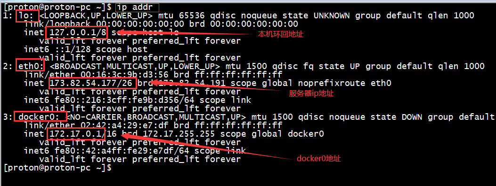

[TOC]

# Docker 学习笔记

## Docker 概述

### docker 可以干什么？

更快速的交付与部署，

docker 打包运行，一键运行。

**更便捷的升级和扩容**

使用docker 之后，我们部署应用更搭积木一样。

**更简单的运维**


**更高效的计算机资源利用**

docker是内核级的虚拟化，一个实体机上可以运行很多个容器。


## Docker 安装

docker 现在有两个版本，一个是Docker Desktop，另一个是Docker Engine。参考文档链接

- [Docker Desktop Doc](https://docs.docker.com/desktop/)
- [Docker Engine Doc](https://docs.docker.com/engine/)

### Docker 的基本组成


**镜像(image)：**

docker 镜像好比是一个模板，可以通过这个创建容器服务， tomcat 镜像====》run ===>tomcat01容器(提供服务)，通过这个镜像可以创建多个容器，（最终服务运行或项目运行就在这个容器中）


**容器(container)**

Docker 利用容器技术可以独立运行一个或一组应用，通过镜像来创建的，

启动，停止，删除，基本命令 

目前，可以把容器理解成一个简易的linux系统。

**仓库(repository)**

仓库就是用来存放镜像的地方。

仓库分为公有仓库和私有仓库！

Docker Hub （默认是国外的）

阿里云   都有容器服务。（配置镜像加速！）

### 安装Docker

```tex
环境准备
```

1. 需要会一点点的linux 的基础
2. Centos7
3. 使用Xshell连接远程服务器进行操作

```tex
环境查看
```

```shell
系统内核是5.14.3-arch1-1
uname -r
```

```shell
系统版本
zsz@zsz-pc ~]$ cat /etc/os-release 
NAME="Arch Linux"
PRETTY_NAME="Arch Linux"
ID=arch
BUILD_ID=rolling
ANSI_COLOR="38;2;23;147;209"
HOME_URL="https://archlinux.org/"
DOCUMENTATION_URL="https://wiki.archlinux.org/"
SUPPORT_URL="https://bbs.archlinux.org/"
BUG_REPORT_URL="https://bugs.archlinux.org/"
LOGO=archlinux
[zsz@zsz-pc ~]$ 

```

#### Centos7 安装 Docker

1. 卸载

   ```shell
   sudo yum remove docker \
                     docker-client \
                     docker-client-latest \
                     docker-common \
                     docker-latest \
                     docker-latest-logrotate \
                     docker-logrotate \
                     docker-engine
   ```

2. 使用官方仓库安装

   ```shell
   #安装环境
   sudo yum install -y yum-utils
   #设置仓库
   sudo yum-config-manager \
       --add-repo \
       https://download.docker.com/linux/centos/docker-ce.repo
   #在国内推荐使用阿里的
   
   ```

3. 安装docker 相关的 docker-ce 社区 -ee 企业版 推荐使用ce

   ```shell
   #更新软件包索引
   yum makecache fast
   
   #安装
   sudo yum install docker-ce docker-ce-cli containerd.io
   ```

4. 启动Docker 

   ```shell
   sudo systemctl start docker
   
   ```

帮助文档

#### Archlinux 安装Docker

```shell
#安装 docker
sudo pacman  -S docker
#启动 docker 服务
systemctl start docker.service

#查看docker的信息

sudo docker version

Client:
 Version:           20.10.8
 API version:       1.41
 Go version:        go1.16.6
 Git commit:        3967b7d28e
 Built:             Wed Aug  4 10:59:01 2021
 OS/Arch:           linux/amd64
 Context:           default
 Experimental:      true

Server:
 Engine:
  Version:          20.10.8
  API version:      1.41 (minimum version 1.12)
  Go version:       go1.16.6
  Git commit:       75249d88bc
  Built:            Wed Aug  4 10:58:48 2021
  OS/Arch:          linux/amd64
  Experimental:     false
 containerd:
  Version:          v1.5.5

#免sudo执行docker
sudo gpasswd -a ${USER} docker
#重新登录，重新开启docker服务，systemctl start docker.service
	#在centos7中 需要刷新docker 组
	newgrp docker
#重新开启docker服务，
systemctl start docker.service

docker info 

#运行hello world 
docker run hello-world
```


```shell
查看一下下载的这个hello-world 镜像
[zsz@zsz-pc ~]$ docker images
REPOSITORY    TAG       IMAGE ID       CREATED        SIZE
hello-world   latest    d1165f221234   6 months ago   13.3kB

```

卸载docker 

```shell
# 1、卸载依赖

# 2、删除资源

```


### 回顾Hello world 


### 底层原理

**Docker是怎么工作的？**

Docker 是一个Client-Server结构的服务，Docker的守护进程运行在主机上，通过Socket从客户端访问。

DockerServer 接受到Docker-Client的指令，就会执行这个命令。


**Docker为什么比虚拟机快**

1. Docker 有着比虚拟机更少的抽象层。
2. Docker 利用的是宿主机的内核，VM需要的是guest os。


所以说，新建一个容器的时候，docker不需要像虚拟机一样重新加载一个操作系统的内核，避免引导，虚拟机是加载Guest OS，分钟级别的，而Docker利用的是宿主机的操作系统，省略了这个过程，秒级的响应速度。

之后学习完毕所有的命令，再回过头来看这段理论，就会非常清晰。	

## Docker 的常用命令

### 帮助命令

```shell
systemctl start docker.service	#启动docker服务
docker version 	#显示docker 的版本信息
docker info		#显示docker的系统信息，包括镜像与容器的数量。
docker --help	#帮助命令
```

帮助文档的地址：https://docs.docker.com/reference/


### 镜像命令

#### **docker images** 

**查看所有本地的主机上的镜像**。

```shell
[zsz@zsz-pc ~]$ docker images
REPOSITORY    TAG       IMAGE ID       CREATED        SIZE
hello-world   latest    d1165f221234   6 months ago   13.3kB

#解释
REPOSITORY	镜像的仓库源
TAG			镜像的标签
IMAG ID		镜像的ID
CREATE		镜像创建的时间
SIZE		镜像的大小

#常用可选项
Options:
  -a, --all            #列出所有的镜像 Show all images (default hides intermediate images)
  -q, --quiet           #只显示镜像的ID Only show image IDs


```

#### **docker search **

**搜索命令**

```shell
[zsz@zsz-pc ~]$ docker search mysql
NAME                              DESCRIPTION                                     STARS     OFFICIAL   AUTOMATED
mysql                             MySQL is a widely used, open-source relation…   11419     [OK]       
mariadb                           MariaDB Server is a high performing open sou…   4339      [OK]       

#可选项
-f, --filter filter   Filter output based on conditions provided
	--format string   Pretty-print search using a Go template
    --limit int       Max number of search results (default 25)
	--no-trunc        Don't truncate output

#可选项 通过收藏来过滤
 --filter=STARS=3000	#搜索出来的就是STARS大于3000的
 
 docker search mysql --filter=STARS=3000
NAME      DESCRIPTION                                     STARS     OFFICIAL   AUTOMATED
mysql     MySQL is a widely used, open-source relation…   11419     [OK]       
mariadb   MariaDB Server is a high performing open sou…   4339      [OK]       
[zsz@zsz-pc ~]$ docker search mysql --filter=STARS=5000
NAME      DESCRIPTION                                     STARS     OFFICIAL   AUTOMATED
mysql     MySQL is a widely used, open-source relation…   11419     [OK] 

```

#### **docker pull** 

**拉取镜像**

```shell
#下载镜像，docker pull 镜像名[:tag]
[zsz@zsz-pc ~]$ docker pull mysql
Using default tag: latest	#如果不写tag,默认就是latest
latest: Pulling from library/mysql
a330b6cecb98: Pull complete #分层下载，docker image 的核心，联合文件系统
9c8f656c32b8: Pull complete 
88e473c3f553: Pull complete 
062463ea5d2f: Pull complete 
daf7e3bdf4b6: Pull complete 
1839c0b7aac9: Pull complete 
cf0a0cfee6d0: Pull complete 
1b42041bb11e: Pull complete 
10459d86c7e6: Pull complete 
b7199599d5f9: Pull complete 
1d6f51e17d45: Pull complete 
50e0789bacad: Pull complete 
Digest: sha256:99e0989e7e3797cfbdb8d51a19d32c8d286dd8862794d01a547651a896bcf00c	#docker 签名，防伪标志
Status: Downloaded newer image for mysql:latest
docker.io/library/mysql:latest	#真实地址

#等价于
docker pull mysql
docker pull docker.io/library/mysql:latest	

#指定版本下载
docker pull mysql:5.7
5.7: Pulling from library/mysql
a330b6cecb98: Already exists 
9c8f656c32b8: Already exists 
88e473c3f553: Already exists 
062463ea5d2f: Already exists 
daf7e3bdf4b6: Already exists 
1839c0b7aac9: Already exists 
cf0a0cfee6d0: Already exists 
fae7a809788c: Pull complete 
dae5a82a61f0: Pull complete 
7063da9569eb: Pull complete 
51a9a9b4ef36: Pull complete 
Digest: sha256:d9b934cdf6826629f8d02ea01f28b2c4ddb1ae27c32664b14867324b3e5e1291
Status: Downloaded newer image for mysql:5.7
docker.io/library/mysql:5.7

```

#### **docker rmi** 

删除镜像

```shell
[zsz@zsz-pc ~]$ docker rmi -f 镜像ID 	#删除指定的容器
[zsz@zsz-pc ~]$ docker rmi -f 镜像1ID 镜像1ID 镜像2ID 	#删除多个容器
[zsz@zsz-pc ~]$ docker rmi -f $(docker images -aq)	#删除所有的容器

```

### 容器命令

说明：我们有了镜像才可以创建容器，linux,下载一个centos镜像来测试学习。

```shell
docker pull centos
```

#### **新建容器并启动**

```shell
docker run [可选参数] image 

#参数说明
--name="Name"	容器的名字，用来区分容器
-d				后台运行
-it				使用交互方式运行，进入容器查看内容。
-p				指定容器的端口	-p 8080:8080
	-p ip:主机端口:容器端口
	-p	主机端口:容器端口(常用的)
	-p	容器端口
	容器端口	
-P				随机指定端口

#测试 启动并进入容器
[zsz@zsz-pc ~]$ docker run -it centos /bin/bash
[root@a67ea1104291 /]# 			#主机名就是images的镜像ID
[root@a67ea1104291 /]# ls		#查看容器内的centos,基础版本，的命令可能都是不完善的
bin  dev  etc  home  lib  lib64  lost+found  media  mnt  opt  proc  root  run  sbin  srv  sys  tmp  usr  var
[root@a67ea1104291 /]# exit		#从容器中退回主机
exit
[zsz@zsz-pc ~]$ ls
Desktop    Downloads  Pictures  Templates  VMwareTools-10.3.10-13959562.tar.gz
Documents  Music      Public    Videos     vmware-tools-distrib
```

#### **列出正在运行的容器**

```shell
# docker ps 命令
	#列出当前正在运行的容器
-a 	#列出当前正在运行的容器+ 带出历史运行过的容器
-n=?	#显示最近创建的容器。
-q	#只显示容器的编号

[zsz@zsz-pc ~]$ docker ps
CONTAINER ID   IMAGE     COMMAND   CREATED   STATUS    PORTS     NAMES
[zsz@zsz-pc ~]$ docker ps -a
CONTAINER ID   IMAGE          COMMAND       CREATED         STATUS                     PORTS     NAMES
a67ea1104291   centos         "/bin/bash"   5 minutes ago   Exited (0) 2 minutes ago             eloquent_wiles
86c173decece   d1165f221234   "/hello"      25 hours ago    Exited (0) 25 hours ago              sharp_shtern

```

#### **退出容器**

```shell
exit 	#直接停止容器并退出
crtl+P+Q 	#容器不停止退出
```

#### **删除容器**

```shell
docker rm 容器ID				#删除指定的镜像 ，不能删除正在运行的容器，如果要强制删除使用 rm -f
docker rm -f $(docker ps -aq)#删除所有的容器
docker ps -a -q |xargs docker rm #也可删除所有的容器
```

#### **启动和停止容器操作**

```shell
docker start 	容器ID	#启动容器
docker	rstart	容器ID	#重启容器
docker  stop	容器ID	#停止当前正在运行的容器
docker kill		容器ID	#强制停止当前的容器
```


### 常用的其他命令

#### 后台启动容器

```shell
#命令 docker run -d 镜像名！
[proton@proton-pc ~]$ docker run -d archlinux
c8419e6e8b0d040e66efba9b4d212752648b47379761811afd680cd288630fca

#问题 docker ps 发现archlinux 停止了
[proton@proton-pc ~]$ docker ps
CONTAINER ID   IMAGE     COMMAND   CREATED   STATUS    PORTS     NAMES

#常见的坑，docker 容器用后台运行，就必须要有一个进程，docker发现没有应用就会自动停止。
#Nignx 容器启动后发现自己没有提供服务，就会立刻停止，就是没有程序。
 
```

#### 查看日志命令

```shell
 docker logs -f -t --tail 容器 没有日志
 
 #自己写一段shell脚本
 “while true;do echo nihao;sleep 1;done”
 [proton@proton-pc ~]$ docker run -d archlinux /bin/sh -c "while true;do echo hihao;sleep 1;done" 
00fd93c63788ca4880b1ef87345977c696d2f275a73083911894883bf8d72353
[proton@proton-pc ~]$ docker ps
CONTAINER ID   IMAGE       COMMAND                  CREATED         STATUS         PORTS     NAMES
00fd93c63788   archlinux   "/bin/sh -c 'while t…"   3 seconds ago   Up 3 seconds             zealous_lichterman

#显示日志
-tf			#显示日志 -t 时间戳 -f 跟踪日志输出
--tail number #要显示的日志条数
 docker logs -f -t --tail 10 00fd93c63788
 
```

#### 查看容器中的进程信息 ps

```shell
#命令 docker top 容器ID

[proton@proton-pc ~]$ docker top d084a3f8133d
UID                 PID                 PPID                C                   STIME               TTY   
root                4613                4593                0                   07:13               ?     
root                4697                4613                0                   07:14               ?     
[proton@proton-pc ~]$ 
# UID 用户ID
# PID 进程ID
# PPID 是父进程ID

```

#### 查看镜像(这里是容器？？)的元数据

```shell
docker inspect --hellp
# 命令
docker inspect 容器ID
#测试
[proton@proton-pc ~]$ docker inspect d084a3f8133d
[
    {
        "Id": "d084a3f8133d3d57440d05663baf50988512224f2665d5798b5f35c39a838f1f",
        "Created": "2021-09-19T23:13:45.41748822Z",
        "Path": "/bin/sh",
        "Args": [
            "-c",
            "while true;do echo hihao;sleep 1;done"
        ],
        "State": {
            "Status": "running",
            "Running": true,
            "Paused": false,
            "Restarting": false,
            "OOMKilled": false,
            "Dead": false,
            "Pid": 4613,
            "ExitCode": 0,
            "Error": "",
            "StartedAt": "2021-09-19T23:13:45.855531374Z",
            "FinishedAt": "0001-01-01T00:00:00Z"
        },
        "Image": "sha256:1d6f90387c134e502f5579c8c7ded65a5eaf25b9b2a5dce29a844e9290d4853c",
        "ResolvConfPath": "/var/lib/docker/containers/d084a3f8133d3d57440d05663baf50988512224f2665d5798b5f35c39a838f1f/resolv.conf",
        "HostnamePath": "/var/lib/docker/containers/d084a3f8133d3d57440d05663baf50988512224f2665d5798b5f35c39a838f1f/hostname",
        "HostsPath": "/var/lib/docker/containers/d084a3f8133d3d57440d05663baf50988512224f2665d5798b5f35c39a838f1f/hosts",
        "LogPath": "/var/lib/docker/containers/d084a3f8133d3d57440d05663baf50988512224f2665d5798b5f35c39a838f1f/d084a3f8133d3d57440d05663baf50988512224f2665d5798b5f35c39a838f1f-json.log",
        "Name": "/nice_dewdney",
        "RestartCount": 0,
        "Driver": "overlay2",
        "Platform": "linux",
        "MountLabel": "",
        "ProcessLabel": "",
        "AppArmorProfile": "",
        "ExecIDs": null,
        "HostConfig": {
            "Binds": null,
            "ContainerIDFile": "",
            "LogConfig": {
                "Type": "json-file",
                "Config": {}
            },
            "NetworkMode": "default",
            "PortBindings": {},
            "RestartPolicy": {
                "Name": "no",
                "MaximumRetryCount": 0
            },
            "AutoRemove": false,
            "VolumeDriver": "",
            "VolumesFrom": null,
            "CapAdd": null,
            "CapDrop": null,
            "CgroupnsMode": "host",
            "Dns": [],
            "DnsOptions": [],
            "DnsSearch": [],
            "ExtraHosts": null,
            "GroupAdd": null,
            "IpcMode": "private",
            "Cgroup": "",
            "Links": null,
            "OomScoreAdj": 0,
            "PidMode": "",
            "Privileged": false,
            "PublishAllPorts": false,
            "ReadonlyRootfs": false,
            "SecurityOpt": null,
            "UTSMode": "",
            "UsernsMode": "",
            "ShmSize": 67108864,
            "Runtime": "runc",
            "ConsoleSize": [
                0,
                0
            ],
            "Isolation": "",
            "CpuShares": 0,
            "Memory": 0,
            "NanoCpus": 0,
            "CgroupParent": "",
            "BlkioWeight": 0,
            "BlkioWeightDevice": [],
            "BlkioDeviceReadBps": null,
            "BlkioDeviceWriteBps": null,
            "BlkioDeviceReadIOps": null,
            "BlkioDeviceWriteIOps": null,
            "CpuPeriod": 0,
            "CpuQuota": 0,
            "CpuRealtimePeriod": 0,
            "CpuRealtimeRuntime": 0,
            "CpusetCpus": "",
            "CpusetMems": "",
            "Devices": [],
            "DeviceCgroupRules": null,
            "DeviceRequests": null,
            "KernelMemory": 0,
            "KernelMemoryTCP": 0,
            "MemoryReservation": 0,
            "MemorySwap": 0,
            "MemorySwappiness": null,
            "OomKillDisable": false,
            "PidsLimit": null,
            "Ulimits": null,
            "CpuCount": 0,
            "CpuPercent": 0,
            "IOMaximumIOps": 0,
            "IOMaximumBandwidth": 0,
            "MaskedPaths": [
                "/proc/asound",
                "/proc/acpi",
                "/proc/kcore",
                "/proc/keys",
                "/proc/latency_stats",
                "/proc/timer_list",
                "/proc/timer_stats",
                "/proc/sched_debug",
                "/proc/scsi",
                "/sys/firmware"
            ],
            "ReadonlyPaths": [
                "/proc/bus",
                "/proc/fs",
                "/proc/irq",
                "/proc/sys",
                "/proc/sysrq-trigger"
            ]
        },
        "GraphDriver": {
            "Data": {
                "LowerDir": "/var/lib/docker/overlay2/c3bd95c9c2023cda996478c2d20c8f0163080a5466512c69b56d1547fb64fb7a-init/diff:/var/lib/docker/overlay2/d354ad152b1c58221ab29fbd5cc5aba182a46ff3768ab8bf1abccd8aa6427606/diff:/var/lib/docker/overlay2/36d83b359020a4be71d40164e140b06b202e37f3fbba20e2ebc660eeb243068e/diff",
                "MergedDir": "/var/lib/docker/overlay2/c3bd95c9c2023cda996478c2d20c8f0163080a5466512c69b56d1547fb64fb7a/merged",
                "UpperDir": "/var/lib/docker/overlay2/c3bd95c9c2023cda996478c2d20c8f0163080a5466512c69b56d1547fb64fb7a/diff",
                "WorkDir": "/var/lib/docker/overlay2/c3bd95c9c2023cda996478c2d20c8f0163080a5466512c69b56d1547fb64fb7a/work"
            },
            "Name": "overlay2"
        },
        "Mounts": [],
        "Config": {
            "Hostname": "d084a3f8133d",
            "Domainname": "",
            "User": "",
            "AttachStdin": false,
            "AttachStdout": false,
            "AttachStderr": false,
            "Tty": false,
            "OpenStdin": false,
            "StdinOnce": false,
            "Env": [
                "PATH=/usr/local/sbin:/usr/local/bin:/usr/sbin:/usr/bin:/sbin:/bin",
                "LANG=en_US.UTF-8"
            ],
            "Cmd": [
                "/bin/sh",
                "-c",
                "while true;do echo hihao;sleep 1;done"
            ],
            "Image": "archlinux",
            "Volumes": null,
            "WorkingDir": "",
            "Entrypoint": null,
            "OnBuild": null,
            "Labels": {}
        },
        "NetworkSettings": {
            "Bridge": "",
            "SandboxID": "902259aa7f3aa96eda81eb8eb9b1da8d3e6237adbb2049226e41d1b5bfab2899",
            "HairpinMode": false,
            "LinkLocalIPv6Address": "",
            "LinkLocalIPv6PrefixLen": 0,
            "Ports": {},
            "SandboxKey": "/var/run/docker/netns/902259aa7f3a",
            "SecondaryIPAddresses": null,
            "SecondaryIPv6Addresses": null,
            "EndpointID": "e563118b1a8af58979bc244e925b2d826334cca6daadf60763612c2c271d1f7c",
            "Gateway": "172.17.0.1",
            "GlobalIPv6Address": "",
            "GlobalIPv6PrefixLen": 0,
            "IPAddress": "172.17.0.2",
            "IPPrefixLen": 16,
            "IPv6Gateway": "",
            "MacAddress": "02:42:ac:11:00:02",
            "Networks": {
                "bridge": {
                    "IPAMConfig": null,
                    "Links": null,
                    "Aliases": null,
                    "NetworkID": "7e7119e437a1e69833d5325030ff480c21257adb02543e0ee3e31010cc60e424",
                    "EndpointID": "e563118b1a8af58979bc244e925b2d826334cca6daadf60763612c2c271d1f7c",
                    "Gateway": "172.17.0.1",
                    "IPAddress": "172.17.0.2",
                    "IPPrefixLen": 16,
                    "IPv6Gateway": "",
                    "GlobalIPv6Address": "",
                    "GlobalIPv6PrefixLen": 0,
                    "MacAddress": "02:42:ac:11:00:02",
                    "DriverOpts": null
                }
            }
        }
    }
]
[proton@proton-pc ~]$ 
```

#### 进入当前正在运行的容器

```shell
#我们通常是使用后台的方式运行的，需要进入容器，修改一些配置

#命令
docker exec -it 容器ID bashShell


[proton@proton-pc ~]$ docker exec -it d084a3f8133d /bin/bash 
[root@d084a3f8133d /]# ps
  PID TTY          TIME CMD
  992 pts/0    00:00:00 bash
 1005 pts/0    00:00:00 ps
[root@d084a3f8133d /]# ps -ef
UID        PID  PPID  C STIME TTY          TIME CMD
root         1     0  0 23:13 ?        00:00:00 /bin/sh -c while true;do echo hihao;sleep 1;done
root       992     0  0 23:30 pts/0    00:00:00 /bin/bash
root      1014     1  0 23:30 ?        00:00:00 sleep 1
root      1015   992  0 23:30 pts/0    00:00:00 ps -ef

#方式二
docker attach 容器ID 
#正在执行当前的代码……

#docker exec	#进入容器后开启一个新的终端，可以在里面操作，（常用）
#docker attach	#进入容器正在执行的终端

```

#### 从容器内拷贝文件到主机上

```shell
docker cp 容器id:容器内路径，目的主机路径

#查看当前主机目录下文件

[proton@proton-pc ~]$ docker ps
CONTAINER ID   IMAGE       COMMAND       CREATED         STATUS         PORTS     NAMES
8fd4c9c0d2cc   archlinux   "/bin/bash"   2 minutes ago   Up 2 minutes             gallant_goldstine
#进入正在运行的docker容器内部
[proton@proton-pc ~]$ docker attach 8fd4c9c0d2cc
[root@8fd4c9c0d2cc /]# cd /home
[root@8fd4c9c0d2cc home]# ls
#在容器内新建一个文件
[root@8fd4c9c0d2cc home]# touch test.java
[root@8fd4c9c0d2cc home]# exit
exit
[proton@proton-pc ~]$ docker ps
CONTAINER ID   IMAGE     COMMAND   CREATED   STATUS    PORTS     NAMES
[proton@proton-pc ~]$ docker ps -a
CONTAINER ID   IMAGE       COMMAND       CREATED         STATUS                      PORTS     NAMES
8fd4c9c0d2cc   archlinux   "/bin/bash"   4 minutes ago   Exited (0) 24 seconds ago             gallant_goldstine
#将docker容器内的文件拷贝出来，到主机上，
[proton@proton-pc ~]$ docker cp 8fd4c9c0d2cc:/home/test.java ./    
[proton@proton-pc ~]$ ls
test.java  test.txt
[proton@proton-pc ~]$ 
#拷贝是一个手动的过程。未来我们采用 -v 卷的技术可以实现
```


### 小结


相关的命令可以通过参考下面的。

接下来是一些练习。

### 作业练习

```shell
Doker 安装 Nginx

```

```shell
#1、搜素镜像 search  建议去dockerhub上搜素 可以看到详细信息。
#2、下载镜像 pull
#3、运行测试

#查看镜像
[proton@proton-pc ~]$ docker images
REPOSITORY    TAG       IMAGE ID       CREATED        SIZE
nginx         latest    ad4c705f24d3   10 days ago    133MB
mysql         latest    0716d6ebcc1a   2 weeks ago    514MB
archlinux     latest    1d6f90387c13   2 weeks ago    381MB
hello-world   latest    d1165f221234   6 months ago   13.3kB

# -d 后台运行
# --name 给容器起名字
# -p 宿主机端口:容器内部端口

[proton@proton-pc ~]$ docker run -d --name nginx01 -p:3344:80 nginx
27d6eeb14afcd7ba05975dd1ad18881a3ae29715bd0a715e9e8607be88170a6d
[proton@proton-pc ~]$ docker ps
CONTAINER ID   IMAGE     COMMAND                  CREATED         STATUS         PORTS                                   NAMES
27d6eeb14afc   nginx     "/docker-entrypoint.…"   6 seconds ago   Up 5 seconds   0.0.0.0:3344->80/tcp, :::3344->80/tcp   nginx01
[proton@proton-pc ~]$ curl localhost:3344
#测试通过

#进入容器
[proton@proton-pc ~]$ docker exec -it nginx01 /bin/bash
root@27d6eeb14afc:/# whereis nginx
nginx: /usr/sbin/nginx /usr/lib/nginx /etc/nginx /usr/share/nginx
root@27d6eeb14afc:/# cd /etc/nginx/
root@27d6eeb14afc:/etc/nginx# ls
conf.d          mime.types  nginx.conf   uwsgi_params
fastcgi_params  modules     scgi_params
root@27d6eeb14afc:/etc/nginx# 
```

##### 端口暴露的概念


**思考问题**： 我们每次修改nginx配置文件，都需要进入容器内部？？？十分的不方便，我们要是可以在容器内部提供一个映射路径，达到在容器修改文件名，容器内就可以自动修改？-v 数据卷

答案：通过使用  -v /user/share/nginx /usr/nginx

> 作业二：docker 安装tomcat

```shell
#官方的使用
docker run -it --rm tomcat:9.0

#我们之前都是后台启动，停止了容器后，容器还可查到。docker run -it --rm tomcat:9.0 这个一般用来测试用完即删除容器。

#先下载，后启动
docker pull tomcat

#启动运行	
[proton@proton-pc ~]$ docker run -d -p 3355:8080 --name tomcat01 tomcat
fe4af990f493099f2b6650f276aee86da25bd7216ac53de70df893d50a38b18f
#已经可以访问了
-p 端口映射 宿主机Port:容器Port

#进入容器
[proton@proton-pc ~]$ docker exec -it tomcat01 /bin/bash
#发现问题 1、linux 命令少了 2、没有webapps 阿里云镜像的原因，默认是最小的，所有不必要的都剔除了。
#保证最小的运行环境。
```

**思考问题：** 我们以后部署项目，如果每次都进入容器是不是十分麻烦？？？我们要是可以在容器外部提供一个映射路径，webapps,

我们在外部放置项目，就自动同步到内部就好了！

docker 容器 tomcat + 网站 docker mysql 

> 作业3 部署es + kibana

```shell
#es 暴露的端口很多！
#es 十分耗内存
#es 的数据一般需要放置到安全目录!挂载
# --net somenetwork ? 网络配置

#启动 elasticsearch
docker run -d --name elasticsearch  -p 9200:9200 -p 9300:9300 -e "discovery.type=single-node" elasticsearch:7.6.2
#docker stats 查看cpu的状态，

#es 是十分耗内存的，

#查看docker stats

#测试一下
[proton@proton-pc ~]$ curl localhost:9200
{
  "name" : "b941f0a0249a",
  "cluster_name" : "docker-cluster",
  "cluster_uuid" : "Z0X-vBnCTZCXwKZi_dYDEw",
  "version" : {
    "number" : "7.6.2",
    "build_flavor" : "default",
    "build_type" : "docker",
    "build_hash" : "ef48eb35cf30adf4db14086e8aabd07ef6fb113f",
    "build_date" : "2020-03-26T06:34:37.794943Z",
    "build_snapshot" : false,
    "lucene_version" : "8.4.0",
    "minimum_wire_compatibility_version" : "6.8.0",
    "minimum_index_compatibility_version" : "6.0.0-beta1"
  },
  "tagline" : "You Know, for Search"
}
[proton@proton-pc ~]$ 
#赶紧停下，增加内存的限制

```


```shell
#赶紧关闭，增加内存限制，修改配置文 -e 环境配置修改
docker run -d --name elasticsearch02  -p 9200:9200 -p 9300:9300 -e "discovery.type=single-node" -e ES_JAVA_OPTS="-Xms64m -Xmx512m" elasticsearch:7.6.2
docker stats

CONTAINER ID   NAME              CPU %     MEM USAGE / LIMIT     MEM %     NET I/O     BLOCK I/O    PIDS
22d837c5bc64   elasticsearch02   2.59%     350.4MiB / 3.349GiB   10.22%    666B / 0B   0B / 729kB   45
^C
[proton@proton-pc ~]$ 
#测试成功了
[proton@proton-pc ~]$ curl localhost:9200
{
  "name" : "22d837c5bc64",
  "cluster_name" : "docker-cluster",
  "cluster_uuid" : "1EhZDfWjTZCtNqgiloiMCw",
  "version" : {
    "number" : "7.6.2",
    "build_flavor" : "default",
    "build_type" : "docker",
    "build_hash" : "ef48eb35cf30adf4db14086e8aabd07ef6fb113f",
    "build_date" : "2020-03-26T06:34:37.794943Z",
    "build_snapshot" : false,
    "lucene_version" : "8.4.0",
    "minimum_wire_compatibility_version" : "6.8.0",
    "minimum_index_compatibility_version" : "6.0.0-beta1"
  },
  "tagline" : "You Know, for Search"
}
```

> 作业： 使用kibana 链接我们的 elasticsearch 思考网路如何连过去。


### 可视化

- portainer (先用这个)

```shell
docker run -d -p 8088:9000 \
 --restart always -v /var/run/docker.sock:/var/run/docker.sock --privileged=true portainer/portainer
```

- Rancher(CI/CD)

**什么是portaniner?**

Docker 图形化界面管理工具，提供一个后台面板提供给我们使用操作！

```shell
docker run -d -p 8088:9000 \
 --restart always -v /var/run/docker.sock:/var/run/docker.sock --privileged=true portainer/portainer
```

访问测试： http://173.82.54.177:8088/

通过他来访问


设置密码，就可以登录了

```shell
admin

docker123456
```


选择本地的

登录进去后


可视化面板测试，玩玩就可以了 。


## Docker 镜像讲解

### 镜像是什么


### Docker镜像加载原理


### Docker 分层原理


### Docker commit 镜像

```shell
docker commit #提交容器为一个新的副本
docker commit -m="提交的描述信息" -a="作者" 容器ID 目标镜像名:[tag]
```

实战测试

```shell
#1、启动一个默认的tomcat

#2、发现这个默认的tomcat 是没有webapps应用的，镜像的原因，官方的镜像默认webapps下是没有文件的

#3、我自己拷贝进去了基本的文件

#4、将我们操作过的容器通过commit 提交为一个镜像，我们以后就使用我们修改过后的镜像即可这就是我们自己的一个修改的镜像
[proton@proton-pc ~]$ docker commit -a="zsz" -m="add webapps app"  834fa0b1163f tomcat02
sha256:cdb85d573e3f93bf8f00cf2e1b3535d006d52f75cfa76464e2615dabb97f788a
[proton@proton-pc ~]$ docker images
REPOSITORY            TAG       IMAGE ID       CREATED          SIZE
tomcat02              latest    cdb85d573e3f   15 seconds ago   684MB
tomcat                9.0       62146f8bda84   6 days ago       680MB
tomcat                latest    bb832de23021   6 days ago       680MB
```

如果你想要保存当前的容器镜状态，就可以通过commit来提交，并获得一个镜像。

入门 docker 了 哈哈

接下来才比较重要，

## 容器数据卷

### 什么是容器数据卷

docker 的理念回顾

将应用和环境打包成一个镜像！

数据！ 如果数据都存在容器中，那么我们把容器删除了，数据就会丢失！！ 需求：数据可以持久化

Mysql容器删了 删库跑路了，！需求：MYSQL数据可以存储在本地

容器之间可以有一个数据共享的技术！docker 容器中产生的数据同步到本地！

这就是卷技术！目录的挂载，将我们容器内的目录挂载到linux 上


**总结一句话，容器的持久化和同步操作! 容器间也是可以共享的**


#### 使用数据卷

> 方式一：直接使用命令来挂载 -v

```shell
docker run -it -v 主机目录，容器内目录 
#测试
[proton@proton-pc ~]$ docker run -it -v /home/ceshi:/home archlinux /bin/bash
[root@6e15453d4aad /]#
#启动之后我们可以通过docker inspect 容器ID 
```


测试结果：


继续测试：

1. 停止容器
2. 在宿主机上修改文件，
3. 再次启动容器
4. 容器内的数据依旧是同步的


**好处：** 我们以后只需要在本地修改即可，容器内部会自动同步！


#### 实战：安装MySQL

思考：MySQL的数据持久化问题！ data

```shell
#下载获取镜像
[proton@proton-pc ~]$ docker pull mysql:5.7

#运行容器，需要做数据挂在出来 #安装启动mysql，需要配置密码的，这是需要注意的
#官方的测试 ：自己去dockerhub上查吧。
[proton@proton-pc ~]$ docker run -d -p 3310:3306 -v /home/mysql/conf:/etc/mysql/conf.d -v /home/mysql/data:/var/lib/mysql -e MYSQL_ROOT_PASSWORD=123456 --name mysql01 mysql:5.7

#启动我们的
-d 后台运行
-p 端口映射 宿主机Port:容器Port
-v 卷挂载
-e 环境配置
--name 容器名字

##挂载卷的第1种方式 没有挂载
docker run -d -p 3310:3306 -e MYSQL_ROOT_PASSWORD=123456 --name mysql01 mysql:5.7
#测试结果
proton@proton-pc ~]$ docker exec -it mysql01 /bin/bash

docker-entrypoint-initdb.d  lib64  root  tmp
entrypoint.sh               media  run   usr
root@75371f75d00a:/# ls /etc/mysql/
conf.d  my.cnf  my.cnf.fallback  mysql.cnf  mysql.conf.d
root@75371f75d00a:/# ls /etc/mysql/conf.d/
docker.cnf  mysql.cnf  mysqldump.cnf
root@75371f75d00a:/# 


##挂载卷的第2种方式 错误的挂载路径
[proton@proton-pc ~]$ docker run -d -p 3310:3306 -v /home/mysql/conf:/etc/mysql/conf.d -v /home/mysql/data:/var/lib/mysql -e MYSQL_ROOT_PASSWORD=123456 --name mysql02 mysql:5.7
#测试结果
```


```shell
##挂载卷的第3种方式   
#---错误的挂载路径---

[proton@proton-pc ~]$ docker run -d -p 3310:3306 -v /home/mysql_1/conf:/etc/mysql -v /home/mysql_1/data:/var/lib/mysql -e MYSQL_ROOT_PASSWORD=123456 --name mysql03 mysql:5.7
#结果

root@6dab0da4b788:/etc# cd mysql/
root@6dab0da4b788:/etc/mysql# ls
root@6dab0da4b788:/etc/mysql# 		#docker 容器下的/etc/mysql 文件被清空了 

#############################################################################
#说明：
#第一个容器 mysql01 没有进行卷挂载，所以在上面的测试结果中的数据就是原始的/etc/mysql/ 展示

#第二个容器 mysql02 的配置文件挂载错了（待确认），/home/mysql/conf:/etc/mysql/conf.d 这里的关于容器中的mysql的配置文件写错了，挂载的conf.d目录不是配置文件。因为/home/mysql/conf目录是空的，所以卷挂载之后后把容器中的/etc/mysql/conf.d目录清空。

#第三个容器，mysql02 我把卷挂载是 -v /home/mysql_1/conf:/etc/mysql 会清空容器中的/etc/mysql/ 与第二个容器 mysql02 配置的清空文件的原因一样，因为宿主机的/home/mysql_1/conf是空的 所以把容器中的/etc/mysql/ 清空

####正确的方法
#1、首先把容器中的/etc/mysql/ 的文件复制到宿主机的将要挂载卷的目录/home/mysql_1，
#2、挂载卷 -v /home/mysql_1/conf:/etc/mysql 
这样就可以避免清空容器中的文件夹了

#############################################################################
#启动之后，我们载本地使用sqlyog来测试一下
#sqlyog连接到我们的服务器的3310 --------- 3310 和容器内的3306映射，这个时候我们就可以连接上了！
#

#在本地测试创建一个数据库，查看一下我们映射的路径是否ok
```

假设我们把容器删除掉，发现，我们挂载到本地的数据卷依旧没有丢失，这就实现了容器数据库持久化功能！


#### 具名和匿名挂载

```shell
#匿名挂载
-v	容器内路径！

docker run -d  -P --name nginx -v /etc/nginx nginx
#查看所有的volume 的情况
[proton@proton-pc ~]$ docker volume ls
DRIVER    VOLUME NAME
local     5f83d09c51514204f0602da485db09988af6648d97a944dd370f6e1ae0a12d4e
#这里发现，这种匿名挂载 我们在 -v 只写了容器内的路径，没有写容器外的路径


[proton@proton-pc ~]$ docker volume ls
DRIVER    VOLUME NAME
local     juming-nginx
#通过 -v 卷名：容器内路径
[proton@proton-pc ~]$ docker run -d  -P --name nginx02 -v juming-nginx:/etc/nginx nginx
#查看一下这个卷
[proton@proton-pc ~]$ docker volume inspect juming-nginx
```


所有的docker容器内的卷，没有指定目录的情况下都是在 **`/var/lib/docker/volume/xxx/_data`**

我们通过具名挂载可以方便的找到一个卷，大多数情况使用 **具名挂载**

```shell
#如何确定是具名挂载，还是匿名挂载，还是指定路径挂载
-v	容器内路径！	  #匿名挂载
-v 卷名：			#容器内路径
-v /宿主机路径:容器内路径	#指定路径挂载
```

拓展：

```shell
#通过 -v 容器内路径， ro  rw 改变读写权限
ro readonly	  #只读
rw read write #可读可写

#一旦设置了这个容器权限，容器对我们挂载出来的内容就有限定了
[proton@proton-pc ~]$ docker run -d  -P --name nginx02 -v juming-nginx:/etc/nginx:ro nginx  
[proton@proton-pc ~]$ docker run -d  -P --name nginx02 -v juming-nginx:/etc/nginx:rw nginx  

#ro 只要看到这个ro就说明这个路径只能通过宿主机来操作，容器内部是无法操作的
```


#### 初识Dockerfile

Dockerfile 就是用来构建docker 镜像的构建文件！命令脚本！

通过这个脚本可以生成一个镜像。

#测试
[proton@proton-pc docker-test-volume]$ vim dockerfile1

```shell
#创建一个dockerfile 文件，名字可以随机，建议 Dockerfile
#文件中的内容 指令（大写） 参数

FROM centos

VOLUME ["volume01","volume02"]

CMD echo "-----end----"
CMD /bin/bash
#这里的每个名令，就是镜像的一层。
```


```shell
#启动自己写的镜像
```


这个卷外部一定有一个同步的目录！


查看一下卷挂载的路径


测试一下刚才的文件是否同步出去了

这种方式我们未来使用的非常多，因为我们通常会构建自己的镜像！

假设构建的时候没有挂载卷，要手动挂载 -v 卷名:容器内路径

#### 数据卷容器

多个mysql同步数据


#启动3个容器，通过我们刚才自己写的镜像启动

```shell
[proton@proton-pc _data]$ docker run -it --name docker01 zsz/centos:1.0 
[proton@proton-pc _data]$ docker run -it --name docker02 --volumes-from docker01 zsz/centos:1.0 
[proton@proton-pc _data]$ docker run -it --name docker03 --volumes-from docker01 zsz/centos:1.0 
```


只要通过 --volumes-from 就可以实现容器间的数据共享

```shell
#测试，可以删除docker01 ，查看一下docker02和docker03是否还可以访问文件
#测试结果依旧可以访问
```


就是拷贝的概念

多个mysql 实现数据共享

```shell
[proton@proton-pc ~]$ docker run -d -p 3310:3306 -v /home/mysql/conf:/etc/mysql/conf.d -v /home/mysql/data:/var/lib/mysql -e MYSQL_ROOT_PASSWORD=123456 --name mysql01 mysql:5.7

[proton@proton-pc ~]$ docker run -d -p 3310:3306 -e MYSQL_ROOT_PASSWORD=123456 --name mysql02 --volumes-from mysql01 mysql:5.7
#这个时候可以实现两个容器数据的同步
```

**结论：**

容器之间的配置信息的传递，数据卷的生命周期一直持续到没有容器使用为止

但是一旦持久化到了本地，这个时候，本地的数据是不会删除的

## DockerFile

### 介绍

Dockerfile 就是用来构建docker 镜像的构建文件！命令脚本！

通过这个脚本可以生成一个镜像。

构建步骤：

1. 编写一个dockerfile 文件
2. docker build 构建一个镜像
3. docker run 运行镜像
4. docker push 发布镜像（dockerHub、阿里云镜像仓库）


### DockerFile 构建过程

#### 基础指令

1. 每个保留关键字（指令）都必须是大写字母
2. 执行从上到下顺序执行的
3. #表示注释
4. 每一个指令都会创建一个新的镜像层，并提交。


dockerfile 是面向开发的，我们以后要发布项目，做镜像，就需要编写dockerfile文件，这个文件十分简单！

Docker镜像，逐渐成为了一个企业交付的标准，必须掌握

步骤：开发、部署、运维     缺一不可1

DockerFile : 构建文件，定义了一切的步骤，源代码

DockerImages: 通过DockerFile 构建生成的镜像，最终发布和运行产品

Docker容器： 容器就是镜像运行起来提供服务器。


#### DockerFile 指令：

以前的话，我们用别人的，现在我们知道了这些后，我们来练习自己写一个镜像！！！

```shell
FROM			#基础镜像，一切从这里开始构建
MAINTAINER		#镜像是谁写的，姓名+邮箱
RUN				#镜像构建的时候需要运行的命令
ADD				#步骤，tomcat镜像，这个tomcat压缩包！添加内容
WORKDIR			#镜像的工作目录
VOLUME			#挂载的目录
EXPOSE			#之对外开放的端口
CMD				#指定这个容器启动的时候需要运行的命令，只有最后一个会生效，可被替代。
ENTRYPOINT		#指定这个容器启动的时候运行的命令，可以追加命令
ONBUILD			#当构建一个被继承 DOckerFile 这个就会运行ONBULID 的指令，触发指令
COPY			#类似ADD 将文件拷贝到镜像中
ENV				#构建的时候设置环境变量！
		
```


#### 实战测试

Docker Hub 中99%的镜像都是从这个基础镜像过来的，FROM scratch,然后配置需要的软件来进行构建


> 创建一个自己的centos

```shell
#1、编写dockerfile的文件
FROM centos
MAINTAINER zsz<2668838984@qq.com>

ENV MYPATH /usr/local

WORKDIR $MYPATH

RUN yum -y install vim
RUN yum -y install net-tools

EXPOSE 80
CMD echo $MYPATH

CMD echo "-----end--------"
CMD /bin/bash

#2、通过这个文件构建镜像
#命令 docker build -f dockerfile文件路径 -t 镜像名:[tag] 路径
Successfully built 66e9e5ddaacb
Successfully tagged mycentos:0.1

#3、测试运行
docker 
```

对比测试：

官方的镜像：


我们增加后的镜像


我们可以列出本地镜像的变更历史

```shell
docker history 镜像ID
```


我们平时拿到一个镜像可以研究一下人家是怎么做的？？？

> CMD 和 ENTRYPOINT 的区别	

```shell
CMD				#指定这个容器启动的时候需要运行的命令，只有最后一个会生效，可被替代。
ENTRYPOINT		#指定这个容器启动的时候运行的命令，可以追加命令
```

测试CMD

```shell
#编写dockerfile 文件
[proton@proton-pc dockerfile]$ vim dockerfile-cmd-test
FROM centos
CMD ["ls","-a"]

#构建镜像
[proton@proton-pc dockerfile]$ docker build -f dockerfile-cmd-test -t cmdtest .

#run 运行	发现我们的ls -a 命令生效了
[proton@proton-pc dockerfile]$ docker run 19232586cb36
.
..
.dockerenv
bin
dev
etc
home
lib
lib64
lost+found
media

#想追加一个命令 -l  ls -al
[proton@proton-pc dockerfile]$ docker run 19232586cb36 -l
docker: Error response from daemon: OCI runtime create failed: container_linux.go:380: starting container process caused: exec: "-l": executable file not found in $PATH: unknown.
ERRO[0000] error waiting for container: context canceled 

#cmd 的情况下 -l 替换了CMD ["ls","-a"] 命令 -l 不是命令所以报错
[proton@proton-pc dockerfile]$ docker run 19232586cb36 ls -al
total 56
drwxr-xr-x   1 root root 4096 Sep 21 20:46 .
drwxr-xr-x   1 root root 4096 Sep 21 20:46 ..
-rwxr-xr-x   1 root root    0 Sep 21 20:46 .dockerenv
lrwxrwxrwx   1 root root    7 Nov  3  2020 bin -> usr/bi
[proton@proton-pc dockerfile]$ 
```

测试ENTRYPOINT

```shell
Successfully built 49ec35d65e13
Successfully tagged entrypoint-test:latest
[proton@proton-pc dockerfile]$ docker run 49ec35d65e13
.
..
.dockerenv
etc
home
……
proc
var
#我们的追加命令，是直接拼接在我们的ENTRYPOINT 之后的
[proton@proton-pc dockerfile]$ docker run 49ec35d65e13 -l
total 56
drwxr-xr-x   1 root root 4096 Sep 21 20:51 .
drwxr-xr-x   2 root root 4096 Nov  3  2020 home
```

DockerFile 中很多命令都是十分相似的，我们需要了解它们的区别，我们最好学习的方式就是对比他们然后测试效果！！！

#### 实战：Tomcate

1. 准备镜像文件tomcat 压缩包，jdk压缩包！

2. 编写dockerfile文件  官方命名 Dockerfile build会自动寻找这个文件，就不需要-f 指定了！

   ```shell
   vim Dockerfile 
   FROM centos
   MAINTAINER ZSZ<2668838984@qq.com>
   COPY readme.txt /usr/local/readme.txt
   
   ADD jdk-8u11-linux-64.tar.gz /usr/local/
   ADD apache-tomcat-9.022.tar.gz /usr/local/
   
   RUN yum -y nstall vim 
   EVN MYPATH /usr/local
   WORKDIR $MYPATH
   
   ENV JAVA_HOME /usr/local/jdk1.8.0_11
   ENV CLASSPATH $JAVA_HOME/lib/dt.jar:$JAVA_HOME/lib/tools.jar
   ENV CATALINA_HOME /usr/local/apache-tomcat-9.0.22
   ENV CATALINA_BASH /usr/local/apache-tomcat-9.0.22
   ENV PATH $PATH:$JAVA_HOME/bin:$CATALINA_HOME/lib:$CATALINA_HOME/bin
   
   EXPOSE 8080
   
   CMD /usr/local/apache-tomcat-9.0.22/bin/startup.sh && tail -F /usr/local/apache-tomcat-9.0.22/bin/logs/catalina.out
   
   ```

3. 构建镜像

   ```shell
   docker build -t diytomcat .
   ```

4. 启动镜像
5. 访问测试
6. 发布项目（由于做了卷挂载，我们直接本地编写项目）

发现，项目部署成功，可以直接访问ok!

我们以后开发的步骤：需要掌握 Dockerfile 的编写，！我们之后的一切都是使用docker镜像发布运行。

#### 发布自己的镜像

> DockerHub

1. 注册账号 地址dockerhub

2. 确定这个账号可以登录

3. 在我们的服务器上提交自己的镜像

   ```shell
   [proton@proton-pc dockerfile]$ docker login --help
   
   Usage:  docker login [OPTIONS] [SERVER]
   
   Log in to a Docker registry.
   If no server is specified, the default is defined by the daemon.
   
   Options:
     -p, --password string   Password
         --password-stdin    Take the password from stdin
     -u, --username string   Username
   [proton@proton-pc dockerfile]$ 
   ```

4. 登录完成之后就可以提交镜像了，就是一步，docker push 

   ```shell
   docker login -u zsz
   password:*********
   
   login succeeded
   
   #push 自己的镜像到服务器上
   #这个命令有问题，再去测试
   docker push diytomcat
   
   ```

提交也是按照镜像的层级来的

> 阿里云镜像服务上

1. 登录阿里云
2. 找到容器镜像服务
3. 创建命名空
4. 创建容器镜像
5. 浏览一下信息

阿里云容器镜像就参考官方地址！！！


#### 小结


## Docker 网络

### 理解网络 docker0

清空所有镜像与容器

> 测试



三个网络

```shell
#问题： docker 是如何处理容器网络访问的？？
```


```shell
[proton@proton-pc ~]$ docker run -d -P --name tomcat01 tomcat

#查看容器内部网络地址 ip addr 发现容器启动的时候会得到一个 ip 地址 这个是docker 分配的，
#新版的tomcat 没有net-tools
#进入容器
docker exec -it tomcat01 /bin/bash 
#查看 ip
root@9b24dec363f6:/usr/local/tomcat# cat /etc/hosts 
127.0.0.1       localhost
::1     localhost ip6-localhost ip6-loopback
fe00::0 ip6-localnet
ff00::0 ip6-mcastprefix
ff02::1 ip6-allnodes
ff02::2 ip6-allrouters
172.17.0.2      9b24dec363f6
#更新软件列表
root@9b24dec363f6:/usr/local/tomcat# apt-get update
#安装net-tools
root@9b24dec363f6:/usr/local/tomcat# apt install net-tools
#查看IP 地址
root@9b24dec363f6:/usr/local/tomcat# ifconfig 
eth0: flags=4163<UP,BROADCAST,RUNNING,MULTICAST>  mtu 1500
        inet 172.17.0.2  netmask 255.255.0.0  broadcast 172.17.255.255
        ether 02:42:ac:11:00:02  txqueuelen 0  (Ethernet)
        RX packets 619  bytes 8707891 (8.3 MiB)
        RX errors 0  dropped 0  overruns 0  frame 0
        TX packets 488  bytes 33708 (32.9 KiB)
        TX errors 0  dropped 0 overruns 0  carrier 0  collisions 0

lo: flags=73<UP,LOOPBACK,RUNNING>  mtu 65536
        inet 127.0.0.1  netmask 255.0.0.0
        loop  txqueuelen 1000  (Local Loopback)
        RX packets 0  bytes 0 (0.0 B)
        RX errors 0  dropped 0  overruns 0  frame 0
        TX packets 0  bytes 0 (0.0 B)
        TX errors 0  dropped 0 overruns 0  carrier 0  collisions 0
        
#思考Linux 能不能ping通容器

[proton@proton-pc ~]$ ping 172.17.0.2
PING 172.17.0.2 (172.17.0.2) 56(84) bytes of data.
64 bytes from 172.17.0.2: icmp_seq=1 ttl=64 time=0.351 ms
64 bytes from 172.17.0.2: icmp_seq=2 ttl=64 time=0.091 ms

#说明 Linux 可以ping 通 docker 容器内部的网络。
```

> 原理

1. 每启动一个docker 容器， docker 就会给docker 容器分配一个IP， 我们只要安装一个docker ,就会有一个网卡 docker0 使用的是桥接模式 ，使用的技术是 evth-pair 技术！

再次测试IP addr


2. 再启动一个tomcat 容器测试，发现又多了一对网卡


```shell
#我们发现这个容器带来的网卡都是一对一对的
# evth-pair 就是一对虚拟设备接口，他们都是成对出现的，一段连接协议，一段彼此相连
#正是因为这个特性 evth-pair 相当于一个桥梁，它是专门用来连接各种虚拟设备的
#OpenStac 、docker 容器之间的连接，OVS 的连接，都是使用的evth-pair技术
```

3、我们接下来测试tomcat01 ping tomcat02 ？？	

```shell
#进入tomcat02 容器
root@e7eb33e45dd4:/usr/local/tomcat# ping 172.17.0.2               
PING 172.17.0.2 (172.17.0.2): 56 data bytes
64 bytes from 172.17.0.2: icmp_seq=0 ttl=64 time=0.383 ms
64 bytes from 172.17.0.2: icmp_seq=1 ttl=64 time=0.105 ms
64 bytes from 172.17.0.2: icmp_seq=7 ttl=64 time=0.127 ms
^C--- 172.17.0.2 ping statistics ---
8 packets transmitted, 8 packets received, 0% packet loss
round-trip min/avg/max/stddev = 0.105/0.150/0.383/0.089 ms

#结论： 容器和容器之间是可以互相ping通的！
```


结论： tomcat01 和 tomcat02 是公用一个路由器，docker0;

所有的容器不指定网路的情况下，都是由docker0路由的，docker会给我们的容器分配一个默认的可用IP

255. 255.0.1/16 域 局域网

> 小结

Docker 使用的是Linux 的桥接，宿主机中是一个docker容器的网桥 docker0。


Docker 中的所有的网络接口都是虚拟的，虚拟转发效率高！（内网传递文件）

只要容器删除，对应的网桥就没有了


### 容器互联 --link

> 思考一个场景， 我们编写一个微服，database url=ip: ,项目不重启，数据库IP换掉了，我们希望可以处理这个问题，可以通过名字来进行访问容器？？？？

```shell
[proton@proton-pc ~]$ docker exec -it tomcat01 ping tomcat02    
ping: unknown host
#如何解决？？
#通过 --link 就可以解决网络联通的问题
[proton@proton-pc ~]$ docker run -d -P --name tomcat03 --link tomcat02 tomcat  

[proton@proton-pc ~]$ docker exec -it tomcat03 ping tomcat02                   
PING tomcat02 (172.17.0.3): 56 data bytes
64 bytes from 172.17.0.3: icmp_seq=0 ttl=64 time=0.510 ms
64 bytes from 172.17.0.3: icmp_seq=1 ttl=64 time=0.130 ms
64 bytes from 172.17.0.3: icmp_seq=2 ttl=64 time=0.106 ms
^C--- tomcat02 ping statistics ---
3 packets transmitted, 3 packets received, 0% packet loss
round-trip min/avg/max/stddev = 0.106/0.249/0.510/0.185 ms

#反向可以ping通吗？？？
[proton@proton-pc ~]$ docker exec -it tomcat02 ping tomcat03 
ping: unknown host

```

探究： docker network inspect ID


其实这个tomcat03 就是在本地配置了tomcat02 的配置？？ 

```shell
#查看hosts 配置， 在这里发现原理

[proton@proton-pc ~]$ docker exec -it tomcat03 cat /ect/hosts
cat: /ect/hosts: No such file or directory
[proton@proton-pc ~]$ docker exec -it tomcat03 cat /etc/hosts
127.0.0.1       localhost
::1     localhost ip6-localhost ip6-loopback
fe00::0 ip6-localnet
ff00::0 ip6-mcastprefix
ff02::1 ip6-allnodes
ff02::2 ip6-allrouters
172.17.0.3      tomcat02 cb107366b64d
172.17.0.4      31926070ae2f
```

本质探究：--link 就是我们在hosts中增加了一个172.17.0.3 tomcat02 cb107366b64d

我们现在玩docker 已经不建议使用 --link了

自定义网路！不适用于docker0!

docker0的问题：他不支持容器名连接访问！


###  自定义网络：

好处:

redis -不同的集群使用不同的网络，保证集群的安全和健康

mysql-不同的集群使用不同的网络，保证集群的安全和健康

也可以实现容器互联；

 ```shell
 [proton@proton-pc ~]$ docker network --help
 
 Usage:  docker network COMMAND
 
 Manage networks
 
 Commands:
   connect     Connect a container to a network
   create      Create a network
   disconnect  Disconnect a container from a network
   inspect     Display detailed information on one or more networks
   ls          List networks
   prune       Remove all unused networks
   rm          Remove one or more networks
 
 Run 'docker network COMMAND --help' for more information on a command.
 [proton@proton-pc ~]$ 
 ```

> 查所有网络docker network ls

```shell
[proton@proton-pc ~]$ docker network ls
NETWORK ID     NAME      DRIVER    SCOPE
7e7119e437a1   bridge    bridge    local
dd4111e98dbc   host      host      local
9820f0ae0444   none      null      local
```

网络模式

- bridge : 桥接模式 docker  （默认， 自己创建也是用桥接模式）

- none :不配置网络
- host : 和宿主机共享网络
- container : 容器网络联通！（用的少，局限大）

**测试：** 

```shell
#我们直接启动的命令 --net bridge ,而这个就是我们的docker0
docker run -d -P --name tomcat01 tomcat
docker run -d -P --name tomcat01 --net bridge tomcat

#docker0 特点，默认的，域名不能访问， --link 可以打通连接

#我们可以自定义一个网络！
# --driver bridge 
# --subnet 192.168.0.0/16    #192.168.0.2 192.168.255.255 
# --gateway 192.168.0.1 
[proton@proton-pc ~]$ docker network create --driver bridge --subnet 192.168.0.0/16 --gateway 192.168.0.1 mynet
0fc624118477c649a92f54dd7436a7660393bf458a0325eb88cf7e9e02b9d9b4
[proton@proton-pc ~]$ docker network ls
NETWORK ID     NAME      DRIVER    SCOPE
7e7119e437a1   bridge    bridge    local
dd4111e98dbc   host      host      local
0fc624118477   mynet     bridge    local
9820f0ae0444   none      null      local
[proton@proton-pc ~]$ 
```

自己的网络就创建好了：


```shell
[proton@proton-pc ~]$ docker run -d -P --name tomcat-net-01 --net mynet tomcat 
44e243fdf98ef7d7cdd334b639a94982fb2dfb50c15d0f1b0ab92b9b082c945d
[proton@proton-pc ~]$ docker run -d -P --name tomcat-net-02 --net mynet tomcat  
8704e3136780c17fe025699cf81b91732451dee3881424cb7640f4ce710dc374
[proton@proton-pc ~]$ docker network inspect mynet
[
    {
        "Name": "mynet",
        "Id": "0fc624118477c649a92f54dd7436a7660393bf458a0325eb88cf7e9e02b9d9b4",
        "Created": "2021-09-22T20:41:10.237228394+08:00",
        "Scope": "local",
        "Driver": "bridge",
        "EnableIPv6": false,
        "IPAM": {
            "Driver": "default",
            "Options": {},
            "Config": [
                {
                    "Subnet": "192.168.0.0/16",
                    "Gateway": "192.168.0.1"
                }
            ]
        },
        "Internal": false,
        "Attachable": false,
        "Ingress": false,
        "ConfigFrom": {
            "Network": ""
        },
        "ConfigOnly": false,
        "Containers": {
            "44e243fdf98ef7d7cdd334b639a94982fb2dfb50c15d0f1b0ab92b9b082c945d": {
                "Name": "tomcat-net-01",
                "EndpointID": "0e75ea84d2ecbc212b4c31e7e406f1a14012d295b81be0db444ce6195cabe8c0",
                "MacAddress": "02:42:c0:a8:00:02",
                "IPv4Address": "192.168.0.2/16",
                "IPv6Address": ""
            },
            "8704e3136780c17fe025699cf81b91732451dee3881424cb7640f4ce710dc374": {
                "Name": "tomcat-net-02",
                "EndpointID": "a6e557c77424548b61a9e8f86dd2073475a52883c8263a3a4be8fb4975979a00",
                "MacAddress": "02:42:c0:a8:00:03",
                "IPv4Address": "192.168.0.3/16",
                "IPv6Address": ""
            }
        },
        "Options": {},
        "Labels": {}
    }
]
```

再次测试ping 连接

```shell
#也可以ping 名字了
[proton@proton-pc ~]$ docker exec -it  tomcat-net-01 ping tomcat-net-02            
PING tomcat-net-02 (192.168.0.3): 56 data bytes
64 bytes from 192.168.0.3: icmp_seq=0 ttl=64 time=0.591 ms
64 bytes from 192.168.0.3: icmp_seq=1 ttl=64 time=0.236 ms
^C--- tomcat-net-02 ping statistics ---
2 packets transmitted, 2 packets received, 0% packet loss
round-trip min/avg/max/stddev = 0.236/0.413/0.591/0.178 ms
[proton@proton-pc ~]$ docker exec -it  tomcat-net-02 ping tomcat-net-01 
PING tomcat-net-01 (192.168.0.2): 56 data bytes
64 bytes from 192.168.0.2: icmp_seq=0 ttl=64 time=0.117 ms
64 bytes from 192.168.0.2: icmp_seq=1 ttl=64 time=0.146 ms
^C--- tomcat-net-01 ping statistics ---
2 packets transmitted, 2 packets received, 0% packet loss
round-trip min/avg/max/stddev = 0.117/0.132/0.146/0.000 ms
[proton@proton-pc ~]$ 
```

我们自定义的网络，docker都已经帮我们维护好对应的关系了，推荐平时使用自定义的网络！

### 网络连通


[proton@proton-pc ~]$ docker exec -it tomcat01 apt-get update	

[proton@proton-pc ~]$ docker exec -it tomcat01 apt-get install inetutils-ping


```shell
#测试打通，tomcat01 到tomcat-net-01
#联通之后就是将我的tomcat01 加入到我们mynet中
#一个容器两个IP 
```


测试：

```shell
[proton@proton-pc ~]$ docker network connect mynet tomcat01
[proton@proton-pc ~]$ docker network inspect mynet


[proton@proton-pc ~]$ docker exec -it tomcat01 ping tomcat-net-01
PING tomcat-net-01 (192.168.0.2): 56 data bytes
64 bytes from 192.168.0.2: icmp_seq=0 ttl=64 time=0.648 ms
64 bytes from 192.168.0.2: icmp_seq=1 ttl=64 time=0.140 ms
64 bytes from 192.168.0.2: icmp_seq=2 ttl=64 time=0.118 ms
64 bytes from 192.168.0.2: icmp_seq=3 ttl=64 time=0.269 ms
^C--- tomcat-net-01 ping statistics ---
4 packets transmitted, 4 packets received, 0% packet loss
round-trip min/avg/max/stddev = 0.118/0.294/0.648/0.213 ms
[proton@proton-pc ~]$ 
```

假设需要跨网络操作别人的容器，就需要使用docker network connect  联通。

### 实战：部署Redis集群


```shell
for port in $(seq 1 6); \
do \
mkdir -p /mydata/redis/node-${port}/conf
touch /mydata/redis/node-${port}/conf/redis.conf
cat <<EOF>> >/mydata/redis/node-${port}/conf/redis.conf
port 6379 
bind 0.0.0.0
cluster-enabled yes 
cluster-config-file nodes.conf
cluster-node-timeout 5000
cluster-announce-ip 172.38.0.1${port}
cluster-announce-port 6379
cluster-announce-bus-port 16379
appendonly yes
EOF 
done


==P38，创建redis集群==
==创建配置文件===
for port in $(seq 1 6); \
do \
mkdir -p /mydata/redis/node-${port}/conf
touch /mydata/redis/node-${port}/conf/redis.conf
cat << EOF > /mydata/redis/node-${port}/conf/redis.conf
port 6379
bind 0.0.0.0
cluster-enabled yes
cluster-config-file nodes.conf
cluster-node-timeout 5000
cluster-announce-ip 172.38.0.1${port}
cluster-announce-port 6379
cluster-announce-bus-port 16379
appendonly yes
EOF
done
== 启动容器===
for port in $(seq 1 6); \
do \
docker run -p 637${port}:6379 -p 1637${port}:16379 --name redis-${port} \
-v /mydata/redis/node-${port}/data:/data \
-v /mydata/redis/node-${port}/conf/redis.conf:/etc/redis/redis.conf \
-d --net redis --ip 172.38.0.1${port} redis:5.0.9-alpine3.11 redis-server /etc/redis/redis.conf; \
done
==进入其中一个容器===
docker exec -it redis-1 /bin/sh
==创建集群===
redis-cli --cluster create 172.38.0.11:6379 172.38.0.12:6379 172.38.0.13:6379 172.38.0.14:6379 172.38.0.15:6379 172.38.0.16:6379 --cluster-replicas 1
==亲测有效===​
```


```shell
/data # redis-cli --cluster create 172.38.0.11:6379 172.38.0.12:6379 172.38.0.13:6379 172.38.0.
14:6379 172.38.0.15:6379 172.38.0.16:6379 --cluster-replicas 1
>>> Performing hash slots allocation on 6 nodes...
Master[0] -> Slots 0 - 5460
Master[1] -> Slots 5461 - 10922
Master[2] -> Slots 10923 - 16383
Adding replica 172.38.0.15:6379 to 172.38.0.11:6379
Adding replica 172.38.0.16:6379 to 172.38.0.12:6379
Adding replica 172.38.0.14:6379 to 172.38.0.13:6379
M: 4ab2c4555828c6afd1c9d28791136cf978846e65 172.38.0.11:6379
   slots:[0-5460] (5461 slots) master
M: 1521df6023a8397536c116d7ce52563a9002500f 172.38.0.12:6379
   slots:[5461-10922] (5462 slots) master
M: e6a9c3eddf3f70d3923c4f26b27a2bad5842e955 172.38.0.13:6379
   slots:[10923-16383] (5461 slots) master
S: 7344ab5a672a9aed3545fb244ff38ac3058ef3b4 172.38.0.14:6379
   replicates e6a9c3eddf3f70d3923c4f26b27a2bad5842e955
S: 472ac217c6029ffe0316c6e005f455320c2850a5 172.38.0.15:6379
   replicates 4ab2c4555828c6afd1c9d28791136cf978846e65
S: c9226bdd06b7c63a6917710d791f3d58f485a7a2 172.38.0.16:6379
   replicates 1521df6023a8397536c116d7ce52563a9002500f
Can I set the above configuration? (type 'yes' to accept): yes
>>> Nodes configuration updated
>>> Assign a different config epoch to each node
>>> Sending CLUSTER MEET messages to join the cluster
Waiting for the cluster to join
...
>>> Performing Cluster Check (using node 172.38.0.11:6379)
M: 4ab2c4555828c6afd1c9d28791136cf978846e65 172.38.0.11:6379
   slots:[0-5460] (5461 slots) master
   1 additional replica(s)
M: 1521df6023a8397536c116d7ce52563a9002500f 172.38.0.12:6379
   slots:[5461-10922] (5462 slots) master
   1 additional replica(s)
S: c9226bdd06b7c63a6917710d791f3d58f485a7a2 172.38.0.16:6379
   slots: (0 slots) slave
   replicates 1521df6023a8397536c116d7ce52563a9002500f
S: 7344ab5a672a9aed3545fb244ff38ac3058ef3b4 172.38.0.14:6379
   slots: (0 slots) slave
   replicates e6a9c3eddf3f70d3923c4f26b27a2bad5842e955
M: e6a9c3eddf3f70d3923c4f26b27a2bad5842e955 172.38.0.13:6379
   slots:[10923-16383] (5461 slots) master
   1 additional replica(s)
S: 472ac217c6029ffe0316c6e005f455320c2850a5 172.38.0.15:6379
   slots: (0 slots) slave
   replicates 4ab2c4555828c6afd1c9d28791136cf978846e65
[OK] All nodes agree about slots configuration.
>>> Check for open slots...
>>> Check slots coverage...
[OK] All 16384 slots covered.
```

```shell
#docker 
```


### SpringBoot 微服务


企业实战

## Docker compose

### 安装docker-compose

下载docker-compose 两种方法

```bash
#方法一
#1、
https://github.com/docker/compose/releases/
https://github.com/docker/compose/releases/download/v2.6.0/docker-compose-linux-x86_64
#2、上传服务器
```


```bash
sudo cp /home/ftp/Up/docker-compose-linux-x86_64 /usr/local/bin/docker-compose
#方法二
curl -SL https://github.com/docker/compose/releases/download/v2.6.0/docker-compose-linux-x86_64 -o /usr/local/bin/docker-compose
#上面的两个方法任选一个
sudo chmod +x /usr/local/bin/docker-compose  
ls -al /usr/local/bin/docker-compose
sudo ln -s /usr/local/bin/docker-compose /usr/bin/docker-compose

```

### docker-compose常用命令

```bash
docker-compose                # 拉取镜像
docker-compose up -d nginx    # 运行nginx容器
docker-compose up             # 运行所有容器 前台
docker-compose up -d          # 运行所有容器 后台
docker-compose ps             # 查看容器运行状态
docker-compose stop			  # 停止运行的容器 但不会删除它们
docker-compose down           # 停止容器和容器网络	并且删除已停止的容器以及已创建的所有网络
#添加-v标记以删除所有卷。这对于通过运行在环境中进行完全重置非常有用docker-compose down -v。 
docker-compose rm nginx       # 删除nginx容器


```


docker Swarm


CI/CD jenkins 流水线！！


# Docker 参考手册

## Docker 命令大全

```shell
 #容器生命周期管理

    run
    start/stop/restart
    kill
    rm
    pause/unpause
    create
    exec

#容器操作

    ps
    inspect
    top
    attach
    events
    logs
    wait
    export
    port

#容器rootfs命令

    commit
    cp
    diff

#镜像仓库

    login
    pull
    push
    search

#本地镜像管理

    images
    rmi
    tag
    build
    history
    save
    load
    import

#info|version

    info
    version

```

## Docker 资源汇总

### Docker 资源

- Docker 官方主页: https://www.docker.com
- Docker 官方博客: https://blog.docker.com/
- Docker 官方文档: https://docs.docker.com/
- Docker Store: https://store.docker.com
- Docker Cloud: https://cloud.docker.com
- Docker Hub: https://hub.docker.com
- Docker 的源代码仓库: https://github.com/moby/moby
- Docker 发布版本历史: https://docs.docker.com/release-notes/
- Docker 常见问题: https://docs.docker.com/engine/faq/
- Docker 远端应用 API: https://docs.docker.com/develop/sdk/

### Docker 国内镜像

- 阿里云的加速器：https://help.aliyun.com/document_detail/60750.html

- 网易加速器：http://hub-mirror.c.163.com

- 官方中国加速器：https://registry.docker-cn.com

- ustc 的镜像：https://docker.mirrors.ustc.edu.cn

- daocloud：https://www.daocloud.io/mirror#accelerator-doc（注册后使用）

- 如果有更好的资源，欢迎通过下面的笔记来分享。
