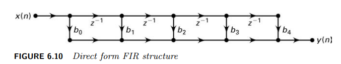
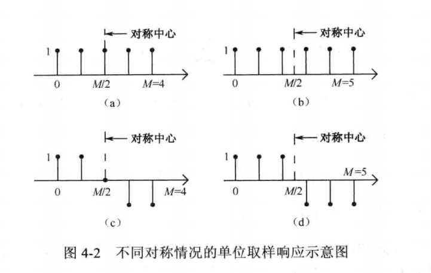
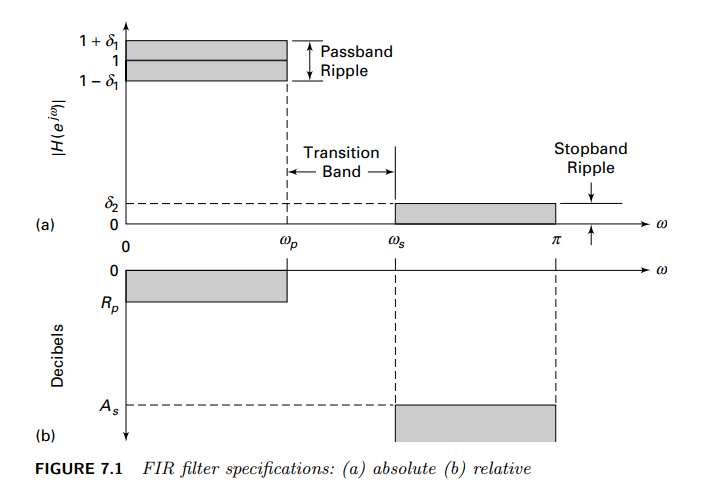
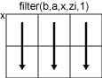
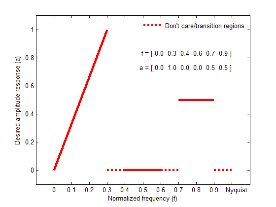
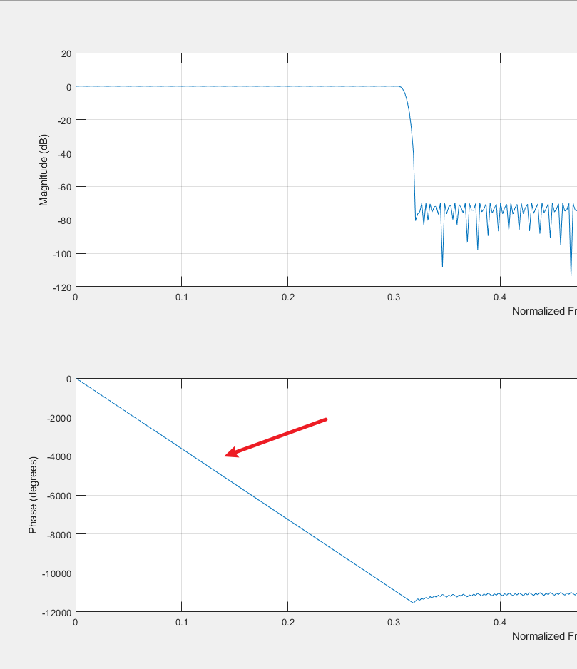
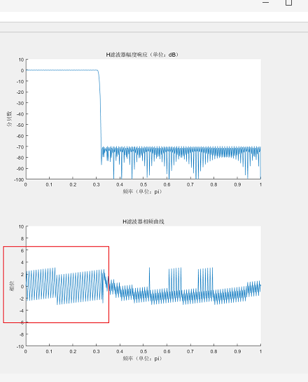

# FIR 滤波器设计

## 参考资料

1. 数字信号处理及其matlab实现
2. 数字滤波器的MATLAB与FPGA实现.pdf
3. Digital Signal Processing Using MATLAB®Third Edition Vinay K. Ingle John G. Proakis


## 为什么使用FIR滤波器

1. FIR滤波器可以设计成任意幅频特性的滤波器
2. FIR滤波器可以设计成**严格线性相位**的滤波器。
3. 硬件实现简单，使用MATLAB设计方便


## FIR 滤波器基本理论

### 系统函数

**系统函数：**有限冲激响应滤波器(FIR)的系统函数
$$
H(z)=\frac{B(z)}{A(z)}
$$
一般的当A(z) =1 时为FIR滤波器。

Z变换表示系统函数：
$$
H(z) = b_0 + b_1z^{-1}+\cdots +b_{M-1}z^{1-M}=\sum_{n=0}^{M-1}b_nz^{-n}
$$
因此它的冲激响应h(n)是
$$
h(n)=
\begin{cases}
b_n, & 0\leq n \leq M-1 \\
0,	 & else
\end{cases}
$$
**差分方程表达式：**
$$
y(n) = b_0x(n)+b_1x(n-1)+\cdots+b_{M-1}x(n-M+1)
$$

### FIR滤波器的结构

**直接型**



**转置型**1、交换输入输出；2、颠倒信号流向；使用差分放大器替代加法器


这其中$b_0,b_1\dots,b_{n-1}$是我们平常所说的抽头系数，可以使用matlab设计得到。

**线性相位**

当FIR滤波器的单位取样响应是偶对称或者是及对称时，系统均具有线性相位的特性。



上图中

（a）偶数的偶对称 （b）奇数的偶对称

（c）偶数的奇对称 （d）奇数的奇对称

注：在有些书中称“奇对称”为“反对称”

### 滤波器术语




## FIR 滤波器设计方法

### 窗函数

窗函数设计的基本思想为，首先选择一个适当的理想选频滤波器(它总是具有一个非因果，无限持续时间脉冲响应)，然后截取（或加窗）它的脉冲响应得到线性相位和因果FIR滤波器。因此这种方法的**重点**是选择一个合适的**窗函数**和**理想滤波器**。我们用 $H_d(e^{jw})$ 表示理想滤波器的选频滤波器，它在通带上具有单位增益和线性相位，在阻带上具有零响应。一个带宽 $w_c<\pi$ 的低通滤波器定义由下式给定:
$$
 H_d(e^{-jw}) = \begin{cases}

​    1*e^{-jw}, & |w|\leq w_c \\

​    0,  & w_c < |w|\leq \pi

  \end{cases}
$$


其中$w_c$也叫截止频率，$\alpha$为采样延迟。
$$
\begin{equation}

  \begin{split}

​    h_d &= F^{-1}[H_d(e^{jw})] = \frac{1}{2\pi}\int_{-\pi}^{\pi}{H_d(e^{jw})e^{jwn}dw}\\

​    &=\frac{1}{2\pi}\int_{-w_c}^{w_c}{1e^{-j\alpha w}e^{jwn}dw}\\ 

​    &=\frac{sin[w_c(n-\alpha)]}{\pi (n-\alpha)}

  \end{split}

\end{equation}
$$
注意$h_d(n)$关于$\alpha$对称，这一点对线性相位滤波器是有用的。

为了从$h_d(n)$得到一个FIR滤波器，必须同时在两边截取$h_d(n)$。而要得到一个因果的线性相位滤波器，它的他的$h(n)$长度必须为M，必须有：
$$
h(n) = \begin{cases}
h_d(n) &,	& 0\leq n \leq M-1 \\
0 &, 	& else
\end{cases} 
 &  \alpha=\frac{M-1}{2}
$$
“加窗”一般的讲，$h(n)$ 可以看作是$h_d(n)$与窗函数$w(n)$的乘积：
$$
h(n) = h_d(n)w(n)
$$
根据$w(n)$的不同定义，可以得到不同的窗结构。


<font color='red'>注意：</font> 对实际FIR滤波器幅频特性有影响的只是窗函数的幅频特性。

### 频率采样

待补充 $\cdots$

### 最优等波纹设计

在上面探讨的窗函数和频率采样技术比较容易实现，但是他们存在一些不足：

1. 在设计过程中，不能精确的指定通带和阻带频率$w_s,w_p$;
2. 不管是在窗函数设计法中使用的$\delta_1=\delta_2$还是在频率采样法中只优化$\delta_2$,均不能同时确定波动系数，$\delta_1$和 $\delta_2$。
3. 误差逼近，也就是理想响应和实际响应的差，在带区间上不是均匀分布的。靠近带边缘处误差较高，而远离边缘处较小。

那么有没有一种方法可以克服上面个的三个问题呢，那就是这一小节中提到的最优等波纹设计法。

对于线性相位FIR滤波器，有可能导出一组条件，使得在最小化最大逼近误差（有时也叫最大最小化或切比雪夫误差）的意义上说，设计是最优的。具有这种性质的滤波器叫做等波动滤波器，因为它在通带和阻带上的误差是均匀分布的，其阶次可以比较低。

## MATLAB 设计FIR滤波器

### 常见的函数 

fir1,fir2,filter,firpm,firpmord,kaiserord,freqz,remez,remezord等等。

<font color='red'>注意</font>:在新版的matlab中remez,remezord 函数被firpm,firpmord函数取代了。

### 函数设计法

#### fir1

可以用来设计低通、带通、高通、带阻等多种类型的具有严格线性相位特性的FIR滤波器。

```matlab
b = fir1(n,Wn)
b = fir1(n,Wn,ftype)
b = fir1(___,window)
b = fir1(___,scaleopt)
%描述:
% b :返回的FIR滤波器单位脉冲响应，脉冲响应为偶对称，长度为n+1;
% n :滤波器的阶数，需要注意的是设计出的滤波器长度为n+1
% wn:滤波器截至频率；需要注意的是，wn的取值范围为0<wn<1,1对应信号采样频率的1/2;如果wn为单个数值，且ftype为low,表示设计的是截至频率是wn的低通滤波器，if ftype为high,表示设计的是截至频率是wn的高通滤波器；如果wn是两个数组组成的向量[wn1 wn2] ,ftype为stop，表示设计带阻滤波器，ftype为bandpass，表示设计带通滤波器，如果由多个数组组成的向量，则根据ftype的值设计多个带通或者带阻范围的滤波器，ftype=DC-1表示第一个频带是带通，ftype为DC-0表示第一个频带是带阻
% windows : 指的是使用的窗函数向量，默认为海明窗。
%noscale:指的是是否归一化滤波器的幅度。

%% 实例1：4.1

%%实列二比较各个窗函数4.2

```

#### fir2

**fir2：**可以完成任意响应滤波器;实质是基于频率抽样的滤波器设计

```matlab
b = fir2(n,f,m)
b = fir2(n,f,m,npt,lap)
b = fir2(___,window)

```


**b :**返回的FIR滤波器单位脉冲响应，脉冲响应为偶对称，长度为n+1;

**n :**滤波器的阶数，需要注意的是设计出的滤波器长度为n+1

**f与m:**

- f 是从 0 到 1 范围内的频点向量，其中 1 对应于奈奎斯特频率。 f 的第一个点必须为 0，最后一个点必须为 1。 f 必须按升序排序。 重复频率点是允许的，并被视为频率响应中的阶跃。      

- m 是一个向量，包含在 f 中指定的每个点处的所需幅度响应。

**windows** : 指的是使用的窗函数向量，默认为海明窗。

**npt** - 网格点数 512（默认）

正整数标量  ，用于指定在对幅度响应进行插值时的插值点个数。 npt 必须大于过滤器阶数的二分之一：npt > n/2。

**lap** - 重复频率点周围的区域长度 25（默认）

​	正整数标量  用于指定幅度响应进行插值时，对于不连续点转变成连续时的点数。 

```matlab
%示例4.3
```

#### filter

```matlab
y = filter(b,a,x)
y = filter(b,a,x,zi)
y = filter(b,a,x,zi,dim)
[y,zf] = filter(___)
%y = filter(b,a,x) 使用由分子和分母系数 b 和 a 定义的有理传递函数 对输入数据 x 进行滤波。
%如果 a(1) 不等于 1，则 filter 按 a(1) 对滤波器系数进行归一化。因此，a(1) 必须是非零值。
```

- y：滤波后的数据，以向量、矩阵或大小与输入数组 `x` 相同的多维数组的形式返回。

  如果 `x` 的类型为 `single`，则 `filter` 本身以单精度进行计算，`y` 的类型也是 `single`。否则，`y` 以 `double` 类型返回。

- b: `b` - 有理传递函数的分子系数  向量有理传递函数的分子系数，指定为向量。

- a:`a` - 有理传递函数的分母系数  向量

- x:`x` - 输入数据待滤波的信号数据

- zi:`zi` - 滤波器延迟的初始条件

- dim： 沿其运算的维度，指定为正整数标量。如果未指定值，则默认值是大小不等于 1 的第一个数组维度。

  以一个二维输入数组 `x` 为例。

  - 如果 `dim = 1`，则 `filter(b,a,x,zi,1)` 沿着 `x` 的行进行计算并返回应用于每列的滤波器。

    

  - 如果 `dim = 2`，则 `filter(b,a,x,zi,2)` 沿 `x` 的列进行计算，并返回应用于每一行的滤波器。

    

  如果 `dim` 大于 `ndims(x)`，则 `filter` 返回 `x`。

```matlab
%示例
```

#### firpm

```matlab
b = firpm(n,f,a)
b = firpm(n,f,a,w)
b = firpm(n,f,a,'ftype')
b = firpm(n,f,a,w,'ftype')
b = firpm(...,{lgrid})
[b,err] = firpm(...)
```

`firpm` designs a linear-phase FIR filter using the Parks-McClellan algorithm [[1\]](https://ww2.mathworks.cn/help/releases/R2018a/signal/ref/firpm.html#bqih7pt-1). The Parks-McClellan algorithm uses the Remez exchange algorithm and Chebyshev approximation theory to design filters with an optimal fit between the desired and actual frequency responses. The filters are optimal in the sense that the maximum error between the desired frequency response and the actual frequency response is minimized. Filters designed this way exhibit an equiripple behavior in their frequency responses and are sometimes called *equiripple* filters. `firpm` exhibits discontinuities at the head and tail of its impulse response due to this equiripple nature.

`b = firpm(n,f,a)` returns row vector `b` containing the `n+1` coefficients of the order `n` FIR filter whose frequency-amplitude characteristics match those given by vectors `f` and `a`. 

The output filter coefficients (taps) in `b` obey the symmetry relation:
$$
b(k)=b(n+2−k),  k=1,...,n+1
$$


Vectors `f` and `a` specify the frequency-magnitude characteristics of the filter:

- `f` is a vector of pairs of normalized frequency points, specified in the range between 0 and 1, where 1 corresponds to the Nyquist frequency. The frequencies must be in increasing order.

- `a` is a vector containing the desired amplitudes at the points specified in f. 

  The desired amplitude at frequencies between pairs of points (*f*(*k*), *f*(*k*+1)) for *k* odd is the line segment connecting the points (*f*(*k*), *a*(*k*)) and (*f*(*k*+1), *a*(*k*+1)).

  The desired amplitude at frequencies between pairs of points (*f*(*k*), *f*(*k*+1)) for *k* even is unspecified. The areas between such points are transition or “don't care” regions.

- `f` and `a` must be the same length. The length must be an even number.

The relationship between the `f` and `a` vectors in defining a desired frequency response is shown in the illustration below.



b = firpm(n,f,a,w) 使用向量 w 中的权重来加权每个频带中的拟合。 w 的长度是 f 和 a 长度的一半，所以每条带正好有一个权重。

```matlab
%示例
```

#### firpmord

Parks-McClellan 最优 FIR 滤波器阶数估计

```matlab
[n,fo,ao,w] = firpmord(f,a,dev)
%[n,fo,ao,w] = firpmord(f,a,dev) 返回满足输入规范 f、a 和 dev 的近似阶数 n、归一化频带边缘 fo、频带幅度 ao 和权重 w。
```

- f : 频带边缘，指定为实值向量。参数必须在 [0, Fs/2] 范围内，其中 Fs 是奈奎斯特频率。向量中元素的数量始终是 2 的倍数。频率必须按升序排列。
- a: f 中包含的点处的所需幅度，指定为向量。 f 和 a 必须满足条件 length(f) = 2length(a)–2。所需的函数是分段常数。
- dev :最大允许偏差，指定为向量。 dev 的大小与 a 相同。它指定了频率响应与每个频带的输出滤波器所需幅度之间的最大允许偏差或纹波。
- n :滤波器阶数，以正整数形式返回。


```matlab
rp = 3;           % Passband ripple in dB 
rs = 40;          % Stopband ripple in dB
fs = 2000;        % Sampling frequency
f = [500 600];    % Cutoff frequencies
a = [1 0];        % Desired amplitudes

dev = [(10^(rp/20)-1)/(10^(rp/20)+1) 10^(-rs/20)]; 
[n,fo,ao,w] = firpmord(f,a,dev,fs);
b = firpm(n,fo,ao,w);
freqz(b,1,1024,fs)
title('Lowpass Filter Designed to Specifications')
```

#### kaiserord

**kaiserord**:根据过度带，纹波参数，等参数，计算凯塞窗的$\beta$值和滤波器的阶数

```matlab
[n,Wn,beta,ftype] = kaiserord(f,a,dev)
[n,Wn,beta,ftype] = kaiserord(f,a,dev,fs)

```


### filterDesigner 工具箱设计法

```matlab
%在命令行窗口钟输入：
fdatool%老版本命令
filterDesigner %新版本命令

```


## question

使用freqz(’抽头系数‘)；可以画出这个滤波器的幅频响应与相频响应曲线；


```matlab
%1、使用上面的集中方法随便设计一个滤波器；然后画出他的相频曲线幅频曲线：
% H parameter
f_h = [0.305 0.32]; % w_Gp w_Gs  % Cutoff frequencies 1 = fs/2 = pi
h_rp = 0.1;        % Passband ripple
h_rs = 70;         % Stopband ripple

a  = [1 0];        % Desired amplitudes
dev_h  = [(10^(h_rp/20)-1)/(10^(h_rp/20)+1)  10^(-h_rs/20)]; 
[n_h  ,fo_h  ,ao_h  ,w_h  ] = firpmord(f_h  ,a,dev_h  );
b_h   = firpm(n_h  ,fo_h  ,ao_h  ,w_h  );
[db_h  ,mag_h  ,hpa_h  ,grd_h  ,w1_h  ] = freqz_m(b_h  ,[1]);

figure()
freqz(b_h); %这可以画出相频曲线幅频曲线
figure()
[H,W] = freqz(b_h,1);
amp_H = abs(H)
pha_H = angle(H)
subplot(2,1,1)
plot(amp_H)
subplot(2,1,2)
plot(pha_H)

%问题，为什么使用下面这个angle()画出的相频曲线，为什么是一个折线
```







## 使用FPGA硬件实现FIR滤波器


