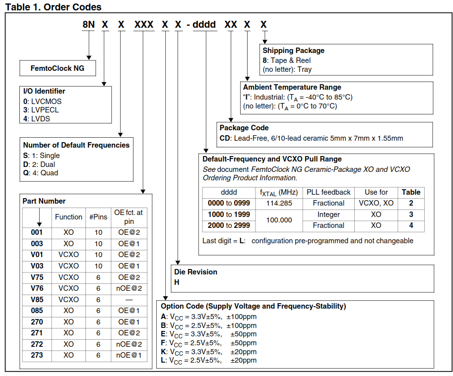
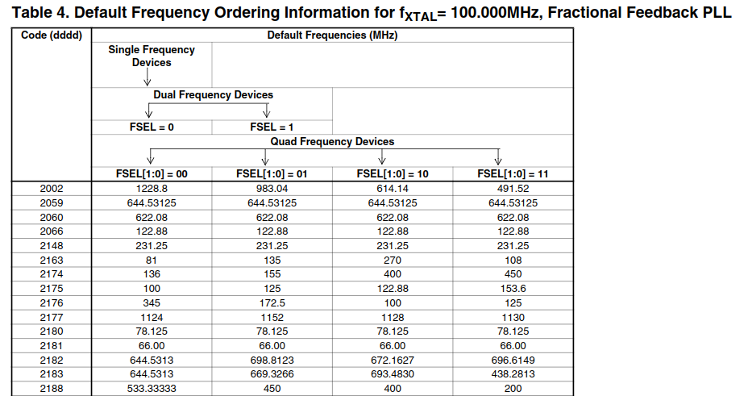
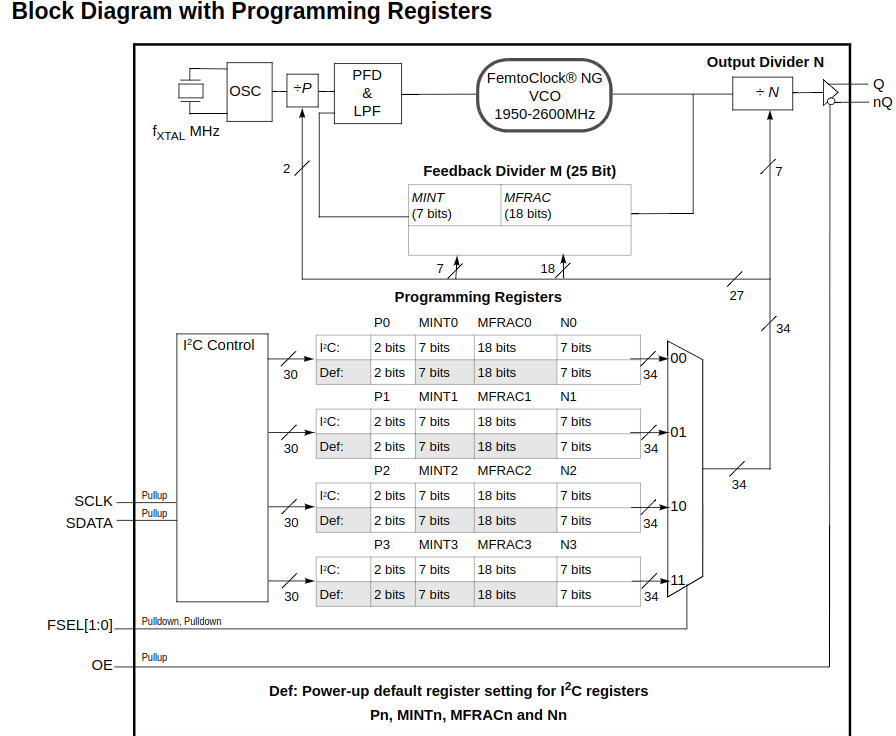
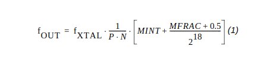

# IDT 时钟手册学习笔记

## 书目

- REN_8N3Q001-8N3QV01-8N4Q001-8N4QV0_MAU_20181030.pdf
  - 订购手册
  - 介绍关于IDT 8Nxxxxx系列晶振的型号手册
  - 命名规则
- REN_8N4Q001_DST_20120307_1.pdf
  - IDT8N4Q001系列的datasheet
  - 介绍IDT8N4Q001的详细参数
  - 电气特性，pcb特性
- REN_CER-5X7-PRG-GD_MAU_20120302_1.pdf
  - 编程手册
  - 对于IDT8N4Q001FG 只需要关注第一章、第二章的Part1和example即可

## IDT8N4Q001FG-2059CDI 参数

命名规则：

所以可以得到IDT8N4Q001FG-2059CDI  是

LVDS 型有4个默认的频率，10pins 的XO型，电压为VCC = 2.5V±5%, ±50ppm 的LVDS 差分电平，

2095：Fxtal(MHz)=100.00,使用分数型的pll 反馈。

工业级的

查看表4得到：该晶振的4个默认频率都是644.53125MHz.

注意：这个器件使用四组寄存器，可以配置四组不同的参数，通过FSEL1,FSEL0两个引脚的配置选择使用哪一组寄存器配置的频率输出。只有一组时钟输出引脚奥！！！！

编程寄存器框图：

IDT8N4Q001FG 使用的Fxtal = 100M。

最终输出的频率由P M N 还有Fxtal 决定。

其中反馈器的系数M是一个25bit的寄存器，

| 整数部分(7bit)MINT | 小数部分(18bit)MFRAC |
| ------------------ | -------------------- |
| 7bit               | 18bit                |

输出频率计算公式：

## 编程操作

### 官方推荐操作方法：

如果想要修改输出的频率值，官方推荐修改非当前FSEL选中的寄存器组，当使用IIC操作完成后再使用 FSEL来选择启用新的配置。

### 计算默认频率的初始 P M N的值

644.53125MHz * 4 = 2578.125MHz

假设P = 1

M = 2578.125/100 = 25.78125

所以MINT = 25

MFRAC = [0.78125 - 1/2^19] * 2^18 =204799.5 

MFRAC 取整得到 204799 0x31FFF

MFRAC 四舍五入得到204800 0x32000  通过FPGA通过IIC 读出的数据确实是0x32000

N=4

## 如何启用XO Integer-Feedback Programming 模式

使用Integer mode 可以使用官方提供的一些频率的参数见：REN_CER-5X7-PRG-GD_MAU_20120302_1.pdf P24

1. setting MFRAC to zero
2. disabling the DSM in the devices register for each pre-set frequency. 
