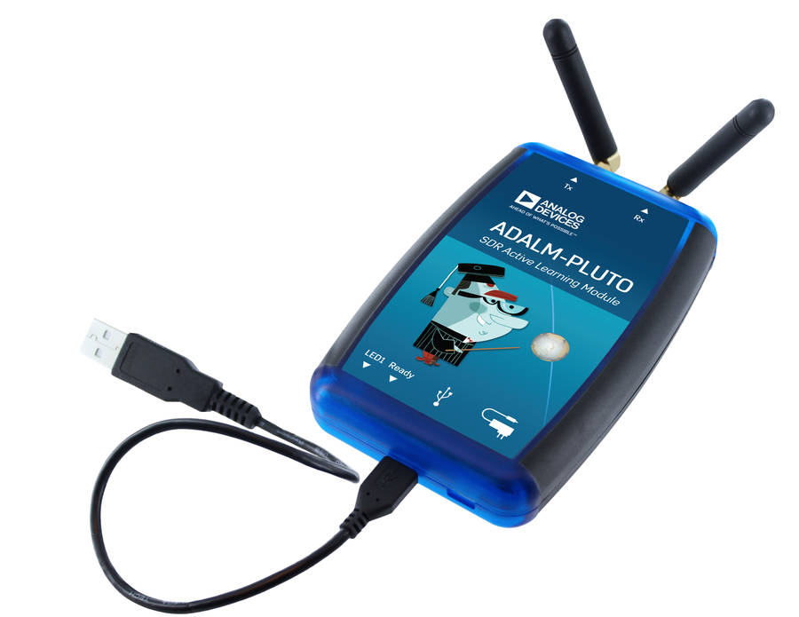
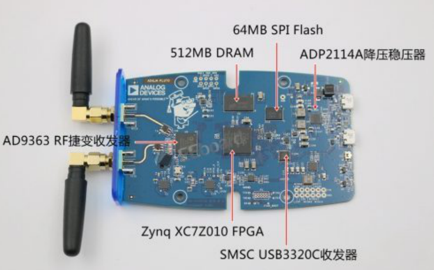
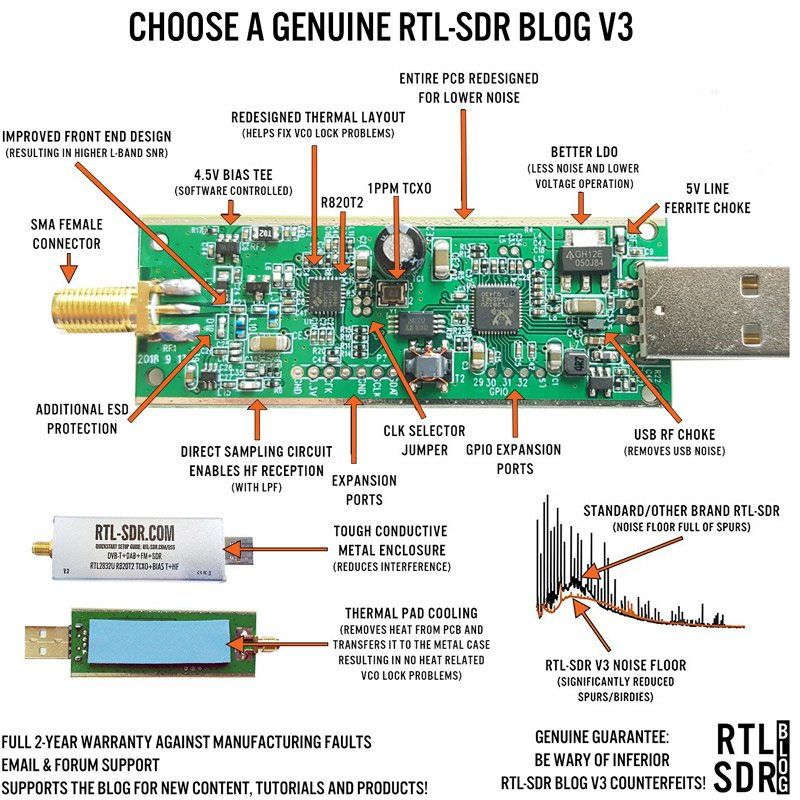

# 软件无线电

## 软件无线电平台

### Pluto SDR

可以将ad9363破解成9364

**相关资源：**

1. github上有固件
2. ADI的官方资料
3. 可以配合matlab使用
   - B站zero_idea大佬的[pluto-SDR使用培训](https://www.bilibili.com/video/BV1i4411z7ft?spm_id_from=333.999.0.0)
4. 936X相关资源
   - B站尤老师讲解的关于[936X的视频](https://www.bilibili.com/video/BV1Ff4y1B7RM?spm_id_from=333.337.search-card.all.click)
     - 注意第一节是一个整体的概括，包含了如何从github上移植工程的整体流程
     - 第二节使用iddr原语设计rx_data接收相关的clk,frame,data

### RTL-SDR

最初由电视棒改装而来，入门级的。建议买V3版的，那个银白色的版本

索取安装手册，想办法让卖家帮忙安装驱动。

**相关资源：**

1. 开源实验室有讲如何使用rtl-sdr与matlab结合
2. bilibili有相关的视频
3. matlab相关的包

[官网](https://www.rtl-sdr.com/)

### HackrF

驱动不好装，另外，建议做发射试验，接收较差。

原版（1000）不好买，国内的好多都是抄板的（500-600）。

带射频功能的，如果有可科学实验，和编程基础的话可以拿来学习测试。

### Airspy

1000左右

免驱，

专业的sdr平台。接收性能比较好。

### LimeSDR 

开源的sdr

### **[tinysdr](https://github.com/uw-x/tinysdr)**

GitHub上有相关的资源

### 圆盘ZX

接收AM,FM 天线

圆盘上有IPEX,买个IPEX头子的 那种收音机天线就行了

## SDR软件

1. [SDR#](https://airspy.com/download/)
2. HDSDR(闭源)
2. SDRuno
2. gnuradio

### SDR#

**相关资源：**

1. 哔哩哔哩上有关于sdr#的使用视频
2. csdn上有关于sdr#的源码讲解
3. github上有源码(不知是哪一版的)

#### radio

用于解调模式选项卡

- NFM :窄频调制
- WFM：宽频调制：可用于广播的收听
- AM :调幅
- LSB,USB:调幅单边带
- DSB:双边带
- CW:连续波调制
- RAW:用于记录和收听原始数据。

#### GnuRadio

**相关资源：**

1. B站tt大佬有讲解gnuradio入门
2. 开源实验室有讲gnuradio的视频
3. Github

