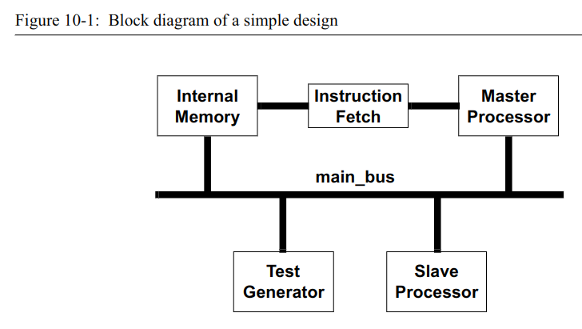

---

title: SystemVerilog_For_Design_note
date: 2022-01-19 05:46:01
tags:
---


# systemverilog  for design 学习笔记

## Preface

system verilog 相对于verilog 的扩展从广义上来说可以分为两个主要的分类：

- 增强主要解决硬件建模的需求，包括整体效率和抽象级别。
- 增强验证和断言 对于超大型复杂设计测试平台的高效编写

对于使用system Verilog 进行HDL 设计可以参考本书《system Verilog for design》，对于验证方面的书可以参考“SystemVerilog for Verification”。


## 问题

1. 什么是单文件编译？什么是多文件编译？？？
1. 第三章中的3.2节没有搞明白，system Verilog 中对于`define 的增强。？？？
1. 在verilog 中的$signed() 与 \$unsigned() 可以被综合吗？？？？
1. fpga 中锁存器的影响，什么是锁存器

## 第一章 system Verilog 简介

### package definitions

Example 2-1: A package definition

```verilog
package definitions;
parameter VERSION = "1.1";
typedef enum {ADD, SUB, MUL} opcodes_t;
typedef struct {
logic [31:0] a, b;
opcodes_t opcode;
} instruction_t;
function automatic [31:0] multiplier (input [31:0] a, b);
// code for a custom 32-bit multiplier goes here
return a * b; // abstract multiplier (no error detection)
endfunction
endpackage
```


Example 2-2: Explicit package references using the :: scope resolution operator

```verilog
module ALU
(input definitions::instruction_t IW,
input logic clock,
output logic [31:0] result
);
    
always_ff @(posedge clock) begin
    case (IW.opcode)
definitions::ADD : result = IW.a + IW.b;
definitions::SUB : result = IW.a - IW.b;
definitions::MUL : result = definitions::
multiplier(IW.a, IW.b);
endcase
end
endmodule
```


Example 2-3: Importing specific package items into a module

```verilog
module ALU
(input definitions::instruction_t IW,
input logic clock,
output logic [31:0] result
);

import definitions::ADD;
import definitions::SUB;
import definitions::MUL;
import definitions::multiplier;
always_comb begin
case (IW.opcode)
ADD : result = IW.a + IW.b;
SUB : result = IW.a - IW.b;
MUL : result = multiplier(IW.a, IW.b);
endcase
end
endmodule
```


Example 2-4: Using a package wildcard import

```verilog
module ALU
(input definitions::instruction_t IW,
input logic clock,
output logic [31:0] result
);
import definitions::*; // wildcard import
always_comb begin
case (IW.opcode)
ADD : result = IW.a + IW.b;
SUB : result = IW.a - IW.b;
MUL : result = multiplier(IW.a, IW.b);
endcase
end
endmodule

```


system Verilog允许使用时间单位作为时间的一部分比如：

在verilog中使用`timescale  编译器指令将时间单位指定为软件工具的命令  。

```verilog
//产生一个周期为10ns的时钟：
forever #5ns clock = ~clock;
```


Mixed declarations of time units and precision (not synthesizable)

```verilog
timeunit 1ns; // external time unit and precision
timeprecision 1ns;

module my_chip ( ... ); 
    timeprecision 1ps; // local precision (priority over external)
    always @(posedge data_request) begin
        #2.5 send_packet; // uses external units & local precision
        #3.75ns check_crc; // specific units take precedence
    end
    task send_packet();
		...
	endtask
	task check_crc();
		...
	endtask
endmodule

`timescale 1ps/1ps // directive takes precedence over external
module FSM ( ... );
	timeunit 1ns; // local units take priority over directive
    always @(State) begin
    	#1.2 case (State) // uses local units & timescale precision
    	WAITE: #20ps ...; // specific units take precedence
    	...
    end
endmodule
```


## 第三章

### 3.3 System Verilog 变量

在system Verilog中分为类型与数据类型：

**type：** variable types,net types

**data type：** 4state(logic) 2state(bit)


verilog 数据类型：variable type, net type

variable types：reg ，integer，time 都是4值类型

net types: wire,wor,wand etc也都是4值类型，但是每种值都有120个强度等级。


#### system Verilog data types

**Type** indicates if the signal is a net or variable. system verilog 使用了所有的verilog 变量类型，像 **reg**

, **integer** ,并且添加了几个variable types 像byte,int 等。在System verilog 中，并没有扩展verilog 的 net types.

**Data type** indicates the value system of the net or variable, which is 0 or 1 for 2-state data types, and 0, 1, Z or X for 4-state data types.System Verilog 使用关键字 **bit** 定义2 state date types;使用关键字**logic** 定义4state data types。变量可以是2 state 或者是4 state ,而net 只能是4 state。 


#####  SystemVerilog 4-state variables

variable type:

```verilog
//隐式表示4state 变量 与verilog 中的reg 等价

logic resetN; // a 1-bit wide 4-state variable
logic [63:0] data; // a 64-bit wide variable
logic [0:7] array [0:255]; // an array of 8-bit variable

//明确的表示 variable 
var logic [63:0] data;// a 64-bit wide variable
```

net type:

```verilog
wire logic [63:0] data; // a 64-bit wide net
```


##### SystemVerilog 2-state variables

-  bit — a 1-bit 2-state integer
-  byte — an 8-bit 2-state integer, similar to a C char
-  shortint — a 16-bit 2-state integer, similar to a C short
-  int — a 32-bit 2-state integer, similar to a C int
-  longint — a 64-bit 2-state integer, similar to a C longlong

The  keyword  bit  is  not  actually  a  variable  type,  it  is  a  data  type, indicating the variable can have 2-state values.

```verilog
//隐式表示
bit resetN; // a 1-bit wide 2-state variable
bit [63:0] data; // a 64-bit 2-state variable
bit [0:7] array [0:255]; // an array of 8-bit 2-state variables

//明确的表示 variable 
var bit [63:0] addr; // a 64-bit wide variable
```


##### simulation 

在仿真中，4 state types 的默认值是X;2-state types 的默认值是0。

当4-state types 转换成2-state types时，X,Z将被映射成0。


####  Explicit and implicit variable and net data types

在system verilog 中关键字**logic** 表示4-state data type，关键字**bit**表示2-state data type。当使用这些 4 状态或 2 状态数据类型而没有明确指定数据类型是**variable**或**net**时，会推断出隐式**variable**。

example：

```verilog
//隐式
logic [7:0] busA; 	// infers a variable that is
					// a 4-state data type
bit [31:0] busB; 	// infers a variable that is
					// a 2-state data type

//显式定义：
var logic [7:0] a; // 4-state 8-bit variable
var bit [31:0] b; // 2-state 32-bit variable
var int i; // 2-state 32-bit variable
```

var 关键字不影响变量在仿真或综合中的行为方式。它的用途是帮助使代码更加自文档化。当从用户定义的类型创建变量时，此明确的文档可以帮助使代码更具可读性和可维护性。例如：

```verilog
typedef enum bit {FALSE, TRUE} bool_t;
var bool_t c; // variable of user-defined type
```


可选地，可以使用网络类型和逻辑数据类型来声明网络：wire logic [31:0] busC;

```verilog
wire  [31:0] busC;
wire logic [31:0] busC;
```

#### 综合指南

2-state types synthesize the same as 4-state types

4 状态逻辑类型和 2 状态位、字节、shortint、int 和 longint 类型是可综合的。综合编译器以相同的方式处理 2-state 和 4-state 类型。 2 态类型的使用主要影响仿真。

synthesis ignores the default initial value of 2-state types

2 状态类型以逻辑值 0 的默认值开始仿真。综合忽略此默认初始值。通过综合实现的综合后设计不能保证以零上电，就像使用 2 态类型的综合前模型上电时一样。

### SystemVerilog relaxes restrictions on using variables
SystemVerilog 通过放宽可以使用变量的规则，极大地简化了确定模型中使用的正确类型的过程。使用 SystemVerilog，变量可以通过以下任何一种方式接收值，但不能超过以下一种方式（意思是不可以多重驱动同一个变量）：

- Be  assigned  a  value  from  any  number  of  initial  or  always procedural blocks (the same rule as in Verilog). 
-  Be assigned a value from a single always_comb, always_ff or always_latch  procedural  block.  These  SystemVerilog  proce- dural blocks are discussed in Chapter 6.
-  Be  assigned  a  value  from  a  single  continuous  assignment  state-ment.
-  Receive a value from a single module or primitive output or inout port.

**example:**

```verilog
module compare (output logic lt, eq, gt,
	input logic [63:0] a, b );
always @(a, b)
    if (a < b) 
        lt = 1'b1; // procedural assignments
    else 
        lt = 1'b0;
	assign gt = (a > b); // continuous assignments
	comparator u1 (eq, a, b); // module instance
    
endmodule

module comparator (output logic eq,
	input [63:0] a, b);
always @(a, b)
	eq = (a==b);
endmodule
```

#### 错误的使用情况：

**Restrictions on variables can prevent design errors**

**Variables cannot be driven by multiple sources.**

### system verilog 使用变量的限制

需要注意的是，虽然 SystemVerilog 允许在 Verilog 不允许的地方使用变量，但 SystemVerilog 对变量的使用仍然有一些限制。 

SystemVerilog 将多个输出端口或多个连续赋值写入同一个变量，或者将过程赋值与连续赋值或输出驱动程序组合在同一个变量上会导致错误。

这些限制的原因是当两个或多个设备驱动相同的输出时，变量没有内置的解析功能来解析最终值。只有 Verilog 网络类型，例如wire、wand (wire-and) 和 wor (wire-or)，具有内置解析函数来解析多驱动器逻辑。 （Verilog-2005 标准也有一个 uwire 网络类型，它将其使用限制为单个驱动程序，与变量相同。）

错误的使用：

```verilog
module add_and_increment (
    output logic [63:0] sum,
	output logic carry,
	input logic [63:0] a, b 
);
always @(a, b)
	sum = a + b; // procedural assignment to sum
assign sum = sum + 1; // ERROR! sum is already being
// assigned a value
look_ahead i1 (carry, a, b); // module instance drives carry
overflow_check i2 (carry, a, b); // ERROR! 2nd driver of carry

endmodule

module look_ahead (
    output wire carry,
	input logic [63:0] a, b);
	...
endmodule

module overflow_check (
    output wire carry,
	input logic [63:0] a, b);
	...
endmodule
```

**注意**：Use  variables  for  single-driver  logic,  and  use  nets  for  multi-driver logic.


###  Signed and unsigned modifiers

verilog 2001 中添加了有符号数的用法：

```verilog
reg [7:0]	u;			// unsigned 8-bit variable
reg signed [7:0] data;	// signed 8-bit variable
```


在systemverilog 中添加了新的有符号数： byte, shortint, int, and longint。并且sv 提供了无符号数的声明：unsigned。

```verilog
//使用unsigned 将有符号数变成无符号数
int s_int; // signed 32-bit variable
int unsigned u_int; // unsigned 32-bit variable
```


### 3.9 数据类型转换

**使用编译时强制转换运算符进行综合。**

#### 静态编译时强制转换

**usag**

```verilog
//1、type casting

<type>‘(<expression>)  //将值转换为任何类型，包括用户定义的类型。例如

7+ int’(2.0 * 3.0); // cast result of 
					// (2.0 * 3.0) to int,
					// then add to 7 
//2、size casting
<size>’(<expression>) //— casts a value to any vector size. For example:
logic [15:0] a, b, y;
	y = a + b**16'(2); // cast literal value 2  to be 16 bits wide

//3、sign casting
<sign>’(<expression>) //— casts a value to signed or unsigned. For example:
shortint a, b;
int y;
y = y - signed'({a,b}); // cast concatenation // result to a signed value
```


#### 综合指南

静态的编译时强制转换运算符是可综合的。综合编译器可能不支持动态 $cast 系统函数。


### 3.10 常量

在seystem Verilog 中添加了一个关键字**const** 常量类型。

const 常量的声明必须包含一个type。

**常量的声明：**

```verilog
const logic [23:0] C1 = 7; 	// 24-bit constant
const int C2 = 15; 			// 32-bit constant
const real C3 = 3.14; 		// real constant
const C4 = 5; 				// ERROR, no type
```


**const 可用于自动任务和函数**

const 常量本质上是一个只能被初始化的变量。因为常量的 const 形式在运行时而不是细化时接收它的值，所以 const 常量可以在自动任务或函数中声明，也可以在模块或静态任务和函数中声明。在 begin...end 或 fork...join 块中声明的变量也可以声明为 const 常量。

```verilog
task automatic C;
	const int N = 5; // N is a constant
    ...
endtask
```


## 第四章 User-Defined and Enumerated Types


### 4.1 User-defined types

typedef defines a user-defined type

example:

```verilog
typedef int unsigned unit;
……
unit a,b;	//two variable of type unit
```

用户定义的类型可以在本地、包中或外部在编译单元范围内定义。

#### Local typedef definitions

using typedef locally

example:

```verilog
module alu (...);
	typedef logic [3:0] nibble;
    nibble opA, opB; 	// variables of the
    					// nibble type
    nibble [7:0] data; 	// a 32-bit vector made
    					// from 8 nibble types
    ...
endmodule
```


#### Shared typedef definitions

当一个用户定义类型被很多不同的模块使用时，typedef 定义可以在包中声明。

#####  typedef definitions in packages

```verilog
package definitions;
	parameter VERSION = "1.1";
    typedef enum {ADD, SUB, MUL} opcodes_t;
    typedef struct {
        logic [31:0] a, b;
        opcodes_t opcode;
    } instruction_t;
    function automatic [31:0] multiplier (input [31:0] a, b);
    	// code for a custom 32-bit multiplier goes here
    	return a * b; // abstract multiplier (no error detection)
    endfunction
endpackage
```

**example2**

Directly referencing typedef definitions from a package 

```verilog
package chip_types; 
	`ifdef TWO_STATE
    	typedef bit dtype_t;
    `else
    	typedef logic dtype_t;
    `endif
endpackage

module counter
(output chip_types::dtype_t [15:0] count,
input chip_types::dtype_t clock, resetN);

	always @(posedge clock, negedge resetN)
		if (!resetN) count <= 0;
		else count <= count + 1;
endmodule
```


##### typedef definitions in  $unit

typedef 定义也可以在外部声明，在编译单元范围内。

**注意:**外部编译单元范围声明不是全局的

```verilog
/******************* External declarations *******************/
parameter VERSION = "1.2a"; // external constant
reg resetN = 1; // external variable (active low)
    typedef struct packed { // external user-defined type
        reg [31:0] address;
        reg [31:0] data;
        reg [ 7:0] opcode;
    } instruction_word_t;
function automatic int log2 (input int n); // external function
    if (n <=1) return(1);
    log2 = 0;
    while (n > 1) begin
        n = n/2;
        log2++;
    end
    return(log2);
endfunction
/********************* module definition *********************/
// external declaration is used to define port types

module register (output instruction_word_t q,
				input instruction_word_t d,
				input wire clock );
always @(posedge clock, negedge resetN)
    if (!resetN) q <= 0; // use external reset
    else q <= d;
endmodule

```

**example2：**

Importing package typedef definitions into $unit


```verilog
package chip_types; 
	`ifdef TWO_STATE
    	typedef bit dtype_t;
    `else
    	typedef logic dtype_t;
    `endif
endpackage


import chip_types::dtype_t; // import definition into $unit

module counter
(output dtype_t [15:0] count,
 input  dtype_t clock, resetN);

	always @(posedge clock, negedge resetN)
		if (!resetN) count <= 0;
		else count <= count + 1;
endmodule
```

**注意** 如果package 中含有多个typedefs,可以使用通配符导入：

```verilog
import chip_types::*; // wildcard import
```


####  user-defined types 命名惯例

为了使源代码更易于阅读和维护，一个常见的命名约定是以字符“_t”结束所有typedef的type。

### Enumerated types 枚举类型

```verilog
//vari-able RGB can have the values of red, green and blue:
enum {red,green,blue} RGB;
```


example

```verilog
package chip_types;
	typedef enum {FETCH, WRITE, ADD, SUB,
				  MULT, DIV, SHIFT, NOP } instr_t;
endpackage

import chip_types::*; // import package definitions into $unit

module controller (	output logic read, write,
					input instr_t instruction,
					input wire clock, resetN);
	enum {WAITE, LOAD, STORE} State, NextState;

    always_ff @(posedge clock, negedge resetN)
    	if (!resetN) State <= WAITE;
    	else State <= NextState;
    always_comb begin
        case (State)
            WAITE: NextState = LOAD;
            LOAD: NextState = STORE;
            STORE: NextState = WAITE;
        endcase
    end
    always_comb begin
    	read = 0; write = 0;
    if (State == LOAD && instruction == FETCH)
    	read = 1;
    else if (State == STORE && instruction == WRITE)
    	write = 1;
    end
endmodule

```


#### Importing enumerated types from packages

**注意：** 导入一个枚举类型定义的名字并不会自动导入枚举标签值。

example: 下面的这个例子并不工作：

```verilog
package chip_types;
	typedef enum {WAITE, LOAD, READY} states_t;
endpackage

module chip (...);
    import chip_types::states_t; 	// imports the
                                    // typedef name,
                                    // only
    states_t state, next_state;
    
    always_ff @(posedge clk, negedge resetN)
        if (!resetN)
        	state <= WAITE; // ERROR: "WAITE" has not been imported!
        else
        	state <= next_state;
    ... 
endmodule
```

为了使枚举类型标签可见，有两种方法可以实现：

1. 必须显示的导入每一个标签；
2. 或者这个包使用通配符导入：使用通配符导入可以确保枚举type name 与enumerated value lables 在导入的作用范围内是可见的。

example：

```verilog
import chip_types::*; // wildcard import
```

#### Enumerated type label sequences

The  following  example  creates  an  enumerated  list  with  the  labels RESET, S0 through S4, and W6 through W9:

```verilog
enum {RESET, S[5], W[6:9]} state;
```

#### enumerated labels must be unique

枚举类型列表中的标签在该范围内必须是唯一的。可以包含枚举类型声明的范围是编译单元、模块、接口、程序、begin...end 块、fork...join 块、任务和函数

**example**

```verilog
module FSM (...);
	enum {GO, STOP} fsm1_state;
...
    enum {WAITE, GO, DONE} fsm2_state; // ERROR GO
...
```

修改上面的错误:可以使用在两个begin end 中声明

```verilog
module FSM (...);
...
    always @(posedge clock)
    begin: fsm1
        enum {STOP, GO} fsm1_state;
    	...
    end
    
    always @(posedge clock)
    begin: fsm2
    	enum {WAITE, GO, DONE} fsm2_state;
    	...
    end
...
```

#### Enumerated type values

默认的：枚举中的标签实际是一个int type的值,枚举体中的标签值从0依次递增：

```verilog
//example
enum {a,b,c,d} state; //a-d 依次表示0-3
```

users can specify the label’s value

枚举体中的标签的值可以被用户指定：

```verilog
enum {ONE	= 1,
      FIVE  = 5,
      TEN   = 10} dtate;
```

example2

```verilog
enum {A=1, B, C, X=24, Y, Z} list1;//A=1,B=2,C=3,X=24,Y=25,Z=26
```

枚举体中标签的值只能是唯一的：

```verilog
enum {A=1, B, C, D=3} list2; // ERROR
```

#### 基于type 的枚举体类型

枚举体默认是基于int(32bit 2-state)类型的。

system verilog 允许显式的指明枚举体基于的类去声明。

for example 

```verilog
// enumerated type with a 1-bit wide,
// 2-state base type
enum bit {TRUE, FALSE} Boolean; 

// enumerated type with a 2-bit wide,
// 4-state base type
enum logic [1:0] {WAITE, LOAD, READY} state;
```

如果为显式类型枚举类型的枚举标签赋值，则其大小必须与基本类型的大小匹配。

for example 

```verilog
enum logic [2:0] {WAITE = 3’b001,
                  LOAD 	= 3’b010,
                  READY = 3’b100} state;

//enum variable defaults to an int base type. An error will result from assigning a 3-bit value to the labels.

enum {WAITE = 3’b001, // ERROR! 
	  LOAD 	= 3’b010,
      READY = 3’b100} state;
//枚举列表中的标签多于基本类型大小可以表示的标签也是错误的。
enum logic {A=1’b0, B, C} list5; // ERROR: too many labels for 1-bit size
```

如果枚举值的基类型是 4 状态类型，则将 X 或 Z 的值分配给枚举标签是合法的。

```verilog
enum logic {ON=1’b1, OFF=1’bz} out; //正确的

enum logic [1:0]
{WAITE, ERR=2’bxx, LOAD, READY} state;	//如果有一个标签被分配成了X或者Z,那么后面的标签的值需要明确指定。
// ERROR: cannot determine a value for LOAD
```

#### 枚举类型可以声明为typedef

```verilog
typedef enum {WAITE, LOAD, READY} states_t;
states_t state, next_state;
```


#### 枚举类型的操作

枚举类型是半强类型的。只能分配枚举类型：

- A label from its enumerated type list
- Another enumerated type of the same type (that is, declared with the same typedef definition) 
- A value cast to the typedef type of the enumerated type

当对枚举类型值执行操作时，枚举值会自动转换为表示枚举类型列表中标签的基本类型和内部值。如果未显式声明枚举类型的基类型，则基类型和标签将默认为 int 类型。

In the following example:

```verilog
typedef enum {WAITE, LOAD, READY} states_t;
states_t state, next_state;
int foo;
```

WAITE will be represented as an int with a value of 0, LOAD as an int with a value of 1, and READY as an int value of 2.
以下对枚举类型的赋值操作是合法的：

```verilog
state = next_state; // legal operation
```

The **state** and **next_state** are both enumerated type variables of the  same  **type**  (**states_t**).  A  value  in  one  enumerated  type  vari-able  can  be  assigned  to  another  enumerated  **type**  variable  of  the
same type.
The assignment statement below is also legal. The enumerated type of state is represented as a base type of **int**, which is added to the literal integer 1. The result of the operation is an **int** value, which is assigned to a variable of type **int**.

```verilog
foo = state + 1; // legal operation
```

The  converse  of  the  preceding  example  is  illegal.  An  error  will result if a value that is not of the same enumerated type is assigned to an enumerated type variable. For example: 

```verilog
state = foo + 1; // ERROR: illegal assignment
```

在这个例子中，foo + 1 的结果类型是一个 int，它与 state 不同，state 是一个 states_t 类型。

下面的例子也是非法的，并且会导致错误：

```verilog
state = state + 1; 		// illegal operation
state++; 				// illegal operation
next_state += state; 	// illegal operation
```

The enumerated type of **state** is represented as a base type of **int**, which is added to the literal integer 1. The result of the operation is an **int**  value.  It  is  an  error  to  directly  assign  this  **int**  result  to  a variable of the enumerated type **state**, which is a **states_t** type. 

#### 将表达式转换为枚举类型

```verilog
typedef enum {WAITE, LOAD, READY} states_t;
states_t state, next_state;
next_state = states_t’(state++); // legal
$cast(next_state, state + 1); // legal
```


注意：转换运算符可能会导致超出范围。转换运算符将始终执行转换操作和赋值。没有检查要分配的值是否在枚举类型集的合法范围内。使用前面关于 state 和 next_state 的枚举类型示例，如果 state 的值为 READY，表示为值 2，则将其递增 1 将导致整数值 3。将此值分配给 next_state 超出了next_state 的枚举类型列表中的值范围。

动态的转换$cast(next_state, state + 1); // legal 可能会无法综合。


SystemVerilog 提供了几个内置函数（称为方法）来遍历枚举类型列表中的值。这些方法会自动处理枚举类型的半强类型特性，从而可以轻松地执行诸如递增到枚举类型列表中的下一个值、跳转到列表开头或跳转到列表末尾等操作。 使用这些方法，不必知道枚举列表中的标签或值。

这些处理枚举列表的特殊方法以类似于 C++ 类方法的方式调用。也就是说，方法的名称附加在枚举类型名称的末尾，并以句点作为分隔符。

<enum_variable_name>.first — 返回指定变量枚举列表中第一个成员的值。

 <enum_variable_name>.last — 返回枚举列表中最后一个成员的值。

<enum_variable_name>.next(<N>)

<enum_variable_name>.prev(<N>)

<enum_variable_name>.num — 返回给定变量的枚举列表中的标签数。

<enum_variable_name>.name — 返回给定枚举类型中值的标签的字符串表示形式。如果该值不是枚举的成员，则 name 方法返回一个空字符串。枚举类型方法使用 C++ 语法

```verilog
Example  4-5  illustrates  a  state  machine  model  that  sequences through  its  states,  using  some  of  the  enumeration  methods  listed above. The example is a simple 0 to 15 confidence counter, where:
• The  in_sync  output  is  initially  0;  it  is  set  when  the  counter reaches 8; in_sync is cleared again if the counter goes to 0.
• If  the  compare  and  synced  input  flags  are  both  false,  the counter stays at its current count.
• If  the  compare  flag  and  the  synced  flag  are  both  true,  the counter increments by 1 (but cannot go beyond 15).
• If  the  compare  flag  is  true  but  the  synced  flag  is  false,  the counter decrements by 2 (but cannot go below 0).
//Using special methods to iterate through enumerated type lists

module confidence_counter(input logic synced, compare, 	resetN, clock,
						  output logic in_sync);
	enum {cnt[0:15]} State, Next;

    always_ff @(posedge clock, negedge resetN)
     	if (!resetN) State <= cnt0;
    	else State <= Next;
    
    always_comb begin
    	Next = State; // default NextState value
        case (State)
            cnt0 : if (compare && synced) Next = State.next;
            cnt1 : begin
                if (compare && synced) Next = State.next;
                if (compare && !synced) Next = State.first;
            end
            cnt15: if (compare && !synced) Next = State.prev(2);
            
            default begin
                if (compare && synced) Next = State.next;
                if (compare && !synced) Next = State.prev(2);
            end
        endcase
    end
    always_ff @(posedge clock, negedge resetN)
        if (!resetN) in_sync <= 0;
        else begin
            if (State == cnt8) in_sync <= 1;
            if (State == cnt0) in_sync <= 0;
        end
```


#### 打印枚举类型

枚举类型值可以打印为标签的内部值，也可以打印为标签的名称。直接打印枚举类型会打印枚举类型的内部值。使用枚举类型名称方法访问表示当前值的标签**name**。此方法返回一个包含名称的字符串。然后可以将此字符串传递给 $display 以进行打印。

```verilog
module FSM (input logic clock, resetN,
    		output logic [3:0] control);
    		enum logic [2:0] {WAITE=3'b001,
    LOAD =3'b010,
    READY=3'b010} State, Next;
    
    always @(posedge clock, negedge resetN)
        if (!resetN) State <= WAITE;
        else State <= Next;
    
    always_comb begin
    	$display("\nCurrent state is %s (%b)", State.name, State);
    	case (State)
            WAITE: Next = LOAD;
            LOAD: Next = READY;
            READY: Next = WAITE;
        endcase
    	$display("Next state will be %s (%b)", Next.name, Next);
    end
    
    assign control = State;
endmodule

```


## 第五章 SystemVerilog Arrays,Structures and Unions
### 5.1 Structures 结构体

**定义：** 结构体使用**struct**关键字来定义，结构体的成员可以是任意变量类型，包括typpedef 用户自定义类型，和任何的常量类型。for example：

```verilog
struct {
    int a, b; 				// 32-bit variables
    opcode_t opcode; 		// user-defined type
    logic [23:0] address; 	// 24-bit variable
    bit error; 				// 1-bit 2-state var.
} Instruction_Word;
```

访问结构体成员的方法与C类似：

```verilog
<structure_name>.<variable_name>
```

给结构体成员赋值：

```verilog
Instruction_Word.address = 32’hF000001E;
```


#### Structure declartions

结构体可以是变量或者nets：

如果不使用var,或者nets类型的声明，隐式为var型。

```verilog
//将结构体整体声明成一个变量
var struct { // structure variable
    logic [31:0] a, b;
    logic [ 7:0] opcode;
    logic [23:0] address;
} Instruction_Word_var;

//将结构体整体声明成一个线网
wire struct { // structure net
    logic [31:0] a, b;
    logic [ 7:0] opcode;
    logic [23:0] address;
} Instruction_Word_net;
```

#### structures can be user-defined types

用户定义的结构体类型是不占用存储空间的。在对用户定义的结构体类型变量进行赋值之前，需要首先进行声明。

```verilog
typedef struct { // structure definition
    logic [31:0] a, b;
    logic [ 7:0] opcode;
    logic [23:0] address;
} instruction_word_t;

//变量声明
instruction_word_t IW; // structure allocation
```

当一个结构被声明而不使用 typedef 时，它被称为匿名结构。

for example：

```verilog
struct {
    logic [31:0] a, b;
    logic [ 7:0] opcode;
    logic [23:0] address;
} instruction;
```

#### 共享结构体的定义： using packages or $unit

结构类型可以在模块或接口中定义，允许在整个设计块中使用。如果一个结构类型定义需要在多个设计块中使用，或者作为模块或接口的一个端口，那么结构定义应该放在一个包中，并导入到设计块或\$unit 编译单元空间.结构体类型也可以直接在\$unit 编译单元空间中定义。

example1：package

```verilog
package definitions;
	parameter VERSION = "1.1";
    typedef enum {ADD, SUB, MUL} opcodes_t;
    typedef struct {
        logic [31:0] a, b;
        opcodes_t opcode;
    } instruction_t;
    function automatic [31:0] multiplier (input [31:0] a, b);
    	// code for a custom 32-bit multiplier goes here
    	return a * b; // abstract multiplier (no error detection)
    endfunction
endpackage
```

example2：  $unit

```verilog
/******************* External declarations *******************/
parameter VERSION = "1.2a"; // external constant
reg resetN = 1; // external variable (active low)
    typedef struct packed { // external user-defined type
        reg [31:0] address;
        reg [31:0] data;
        reg [ 7:0] opcode;
    } instruction_word_t;
function automatic int log2 (input int n); // external function
    if (n <=1) return(1);
    log2 = 0;
    while (n > 1) begin
        n = n/2;
        log2++;
    end
    return(log2);
endfunction
/********************* module definition *********************/
// external declaration is used to define port types

module register (output instruction_word_t q,
				input instruction_word_t d,
				input wire clock );
always @(posedge clock, negedge resetN)
    if (!resetN) q <= 0; // use external reset
    else q <= d;
endmodule
```

#### 结构体赋值

##### 初始化结构体

````verilog
typedef struct {
    logic [31:0] a, b;
	logic [ 7:0] opcode;
	logic [23:0] address;
} instruction_word_t;

instruction_word_t IW = ’{100, 3, 8’hFF, 0};
````

##### 结构体成员赋值

三种方法实现结构体的赋值：

方法一：结构体成员赋值

```verilog
typedef struct { 
    logic [31:0] a, b;
    logic [ 7:0] opcode;
    logic [23:0] address;
} instr_t;

instr_t IW;

always @(posedge clock, negedge resetN)
	if (!resetN) begin
        IW.a = 100; // reference structure member
        IW.b = 5;
        IW.opcode = 8’hFF;
        IW.address = 0;
    end
    else begin 
    	...
    end
```


方法二：将结构表达式分配给结构体

example1:

a structure expression is enclosed within ’{ ... }

```verilog
always @(posedge clock, negedge resetN)
	if (!resetN) IW = ’{100, 5, 8’hFF, 0};
	else begin 
	...
end
```

example2：

a structure expression  can be listed by order or by member name

```verilog
IW = ’{address:0, opcode:8’hFF, a:100, b:5}; //legal
//It is illegal to mix listing by name and listing by order in the same structure expression.
IW = ’{address:0, 8’hFF, 100, 5}; // ERROR 
```

方法三：Default values in structure expressions

```verilog
IW = ’{default:0}; // set all members of IW to 0
```

```verilog
typedef struct {
    real r0, r1;
    int i0, i1;
    logic [ 7:0] opcode;
    logic [23:0] address;
} instruction_word_t;
    instruction_word_t IW;
    always @(posedge clock, negedge resetN)
    if (!resetN)
    	IW = ’{ real:1.0, default:0 };
    	// assign all real members a default of 1.0
    	// and all other members a default of 0
    else begin
    	...
    end
```


default value precedence

结构成员如何赋值是有优先顺序的。 default 关键字的优先级最低，将被任何特定于类型的默认值覆盖。特定类型的默认值将被任何显式命名的成员值覆盖。下面的结构表达式将为 r0 赋值 1.0，为 r1 赋值 3.1415，并将结构的所有其他成员赋值为 0。

```verilog
typedef struct {
    real r0, r1;
    int i0, i1;
    logic [ 7:0] opcode;
    logic [23:0] address;
} instruction_word_t;

instruction_word_t IW;

	IW = ’{ real:1.0, default:0, r1:3.1415 };
```

#### 打包和解包结构

> unpacked structures can have padding

默认情况下，结构体是解包的。这意味着结构体的成员被视为独立变量或常量，它们以共同的名称组合在一起。 SystemVerilog 未指定软件工具应如何存储解压缩结构体的成员。存储的布局可能因一种软件工具而异。


> packed structures are stored without padding

可以使用 packed 关键字将结构体显式声明为打包结构体。压缩结构体以指定的顺序将结构体的所有成员存储为连续位。压缩结构存体储为向量，结构体的第一个成员是向量的最左侧字段。结构体中最后一个成员的最右边位是向量的最低有效位，编号为第 0 位。如图 5-1 所示。

```verilog
struct packed {
    logic valid;
    logic [ 7:0] tag;
    logic [31:0] data;
} data_word;
```

Figure 5-1: Packed structures are stored as a vector

| valid |  tag |        data |
| ----: | ---: | ----------: |
| 40-39 |   31 | 15        0 |

压缩结构的成员可以通过成员的名称或使用结构表示的向量的部分选择来引用。以下两个赋值都将赋值给 data_word 结构体的tag成员：

```verilog
data_word.tag    = 8’hf0;
data_word[39:32] = 8’hf0; // same bits as tag
```

**Packed structures can only contain integral values**

> packed structures must contain packed variables

压缩结构的所有成员必须是整数值。整数值是可以表示为向量的值，例如字节、整数和使用位或逻辑类型创建的向量。如果结构的任何成员不能表示为向量，则该结构不能被打包。这意味着压缩结构不能包含**real**或**shortreal**变量、unpacked结构体、unpacked联合体或unpacked数组。

##### 包装结构的操作

> packed structures are seen as vectors

因为打包结构存储为向量，所以对完整结构的操作被视为向量操作。因此，可以对向量执行的数学运算、逻辑运算和任何其他运算也可以在压缩结构上执行。

```verilog
typedef struct packed {
    logic valid;
    logic [ 7:0] tag;
    logic [31:0] data;
} data_word_t;

data_word_t packet_in, packet_out;

always @(posedge clock)
	packet_out <= packet_in << 2;
```

##### signed packed 结构体

> a packed structures used as a vector can be signed or unsigned

压缩结构体可以用有**signed**或**unsigned**关键字声明。当在数学或关系运算中用作向量时，这些修饰符会影响整个结构的感知方式。它们不影响结构成员的感知方式。根据该成员的类型声明，结构的每个成员都被视为有符号或无符号。压缩结构的部分选择始终是无符号的，与 Verilog 中向量的部分选择相同。

```verilog
typedef struct packed signed {
    logic valid;
    logic [ 7:0] tag;
    logic signed [31:0] data;
} data_word_t;

	data_word_t A, B;

	always @(posedge clock)
		if ( A < B ) // signed comparison
...
```


#### 通过端口传递结构

> ports can be declared as a structure type

结构体可以通过模块和接口端口传递。必须首先使用 **typedef** 将结构体定义为用户定义的类型，然后才能将模块或接口端口声明为结构体类型。

```verilog
package definitions;
    typedef enum {ADD, SUB, MULT, DIV} opcode_t;
        typedef struct { 
        logic [31:0] a, b;
        opcode_t opcode;
        logic [23:0] address;
        logic error;
    } instruction_word_t;
endpackage

module alu (
    input definitions::instruction_word_t IW,
	input wire clock
);
	...
endmodule
```

将包含 typedef 定义的包显式命名为模块端口的一部分的另一种样式是将包导入 $unit 编译单元声明空间。也可以直接在 $unit 空间中定义用户定义的类型。第 2 章讨论了导入包和使用 $unit 编译单元空间。

当一个解压的结构体通过模块端口传递时，必须在端口的每一侧连接一个完全相同类型的结构。在两个不同模块中声明的匿名结构，即使它们具有完全相同的名称、成员和成员名称，也不是同一类型的结构体。

#### 将结构作为参数传递给任务和函数

```verilog
module processor (...);
	...
    typedef enum {ADD, SUB, MULT, DIV} opcode_t;
    
    typedef struct { // typedef is local
        logic [31:0] a, b;
        opcode_t opcode;
        logic [23:0] address;
        logic error;
    } instruction_word_t;
    
    function alu (input instruction_word_t IW);
   	 	...
    endfunction
endmodule
```

当调用具有解压缩结构作为形式参数的任务或函数时，必须将完全相同类型的结构传递给任务或函数。匿名结构，即使它具有完全相同的成员和成员名称，也不是同一类型的结构。

#### 综合指南

解压缩和压缩结构都是**可综合**的。综合支持通过module port 传递结构，以及 in/out  of
tasks  and  functions。支持按成员名称和值列表为结构分配值。


### 5.2Unions 联合体

> 声明：

```verilog
union（
	int i;
	int unsigned u;
） data;
	...
data.i = -5;
$display("data is %d",data.i);

data.u = -5;
$display("now data is %d",data.u);
```

**联合体减少存储并可能提高性能**

虽然声明语法相似，但联合与结构有很大不同。一个结构可以存储多个值。它是单一名称下的变量集合。一个联合只能存储一个值。联合的典型应用是当一个值可以表示为几种不同的类型，但在任何特定时刻仅作为一种类型。

**Typed and anonymous unions**

可以使用 typedef 将联合定义为类型，就像结构一样。定义为用户定义类型的联合称为类型化联合。如果不使用 typedef，则联合称为匿名联合。

```verilog
typedef union { // typed union 
	int i;
	int unsigned u;
} data_t;

data_t a, b; // two variables of type data_t
```

#### Unpacked unions

**Unpacked  unions  are  not  synthesizable.**   对于系统级和传输级是有用的。

#### Packed unions

packed unions are syntheiszable。

  A  packed  union cannot contain real or shortreal variables, unpacked structures,
unpacked unions, or unpacked arrays.

#### An example of using structures and unions

```verilog
package definitions;
    typedef enum {ADD, SUB, MULT, DIV, SL, SR} opcode_t;
    typedef enum {UNSIGNED, SIGNED} operand_type_t;
    
    typedef union packed {
        logic [31:0] u_data;
        logic signed [31:0] s_data;
    } data_t;
    
    typedef struct packed {
        opcode_t opc;
        operand_type_t op_type;
        data_t op_a;
        data_t op_b;
    } instr_t;
    
endpackage

import definitions::*; // import package into $unit space

module alu 
(input instr_t IW,
output data_t alu_out);
    always @(IW) begin
        if (IW.op_type == SIGNED) begin
            case (IW.opc)
                ADD : alu_out.s_data = IW.op_a.s_data + IW.op_b.s_data;
                SUB : alu_out.s_data = IW.op_a.s_data - IW.op_b.s_data;
                MULT: alu_out.s_data = IW.op_a.s_data * IW.op_b.s_data;
                DIV : alu_out.s_data = IW.op_a.s_data / IW.op_b.s_data;
                SL  : alu_out.s_data = IW.op_a.s_data <<< 2;
                SR  : alu_out.s_data = IW.op_a.s_data >>> 2;
            endcase
        end
        else begin
            case (IW.opc)
                ADD : alu_out.u_data = IW.op_a.u_data + IW.op_b.u_data;
                SUB : alu_out.u_data = IW.op_a.u_data - IW.op_b.u_data;
                MULT: alu_out.u_data = IW.op_a.u_data * IW.op_b.u_data;
                DIV : alu_out.u_data = IW.op_a.u_data / IW.op_b.u_data;
                SL  : alu_out.u_data = IW.op_a.u_data << 2;
                SR  : alu_out.u_data = IW.op_a.u_data >> 2;
            endcase
        end
    end
endmodule
```


### 5.3 Arrays

#### unpacked arrays

verilog-1995 标准中：支持数组：

```verilog
<data_type> <vector_size> <array_name> <array_dimensions>
For example:
reg [15:0] RAM [0:4095]; // memory array
```

verilog-2001 对数组的支持进行了增强：

- 支持任何变量或者net 类型，不支持event 类型。
- 支持3维数组的使用

```verilog
// a 1-dimensional unpacked array of
// 1024 1-bit nets
wire n [0:1023];
// a 1-dimensional unpacked array of
// 256 8-bit variables
reg [7:0] LUT [0:255];
// a 1-dimensional unpacked array of 
// 1024 real variables
real r [0:1023];
// a 3-dimensional unpacked array of
// 32-bit int variables
integer i [7:0][3:0][7:0];
```

> Verilog 一次限制数组访问一个元素

Verilog 限制对数组同一时间只能访问数组的一个元素，或者单个元素的位选择或部分选择。对数组的多个元素的任何读取或写入都是错误的。

```verilog
integer i [7:0][3:0][7:0]; 
integer j;
j = i[3][0][1]; // legal: selects 1 element
j = i[3][0]; // illegal: selects 8 elements
```


system verilog 允许未打包的数组可以是任意类型：

- 支持event
- 支持logic，bit,byte, int , longint,shortreal,real。
- typedef
- struct,enum

example:

```verilog
bit [63:0] d_array [1:128]; // array of vectors
shortreal cosines [0:89]; 	// array of floats
typedef enum {Mo, Tu, We, Th, Fr, Sa, Su} Week;
Week Year [1:52]; 			// array of Week types
```

> SystemVerilog 可以引用数组的全部或切片

SystemVerilog 还为 Verilog 添加了引用整个解压缩数组或解压缩数组中多个元素的切片的能力。切片是数组的一维内的一个或多个连续编号的元素。这些增强功能可以将整个数组的内容或数组的特定维度复制到另一个数组中。

> 拷贝多个元素到未打包的数组中

为了将多个元素直接复制到一个解包数组中，赋值左侧的数组或数组切片的布局和元素类型必须与右侧的布局和元素类型完全匹配。即元素类型和大小以及复制的维数必须相同。

```verilog
int a1 [7:0][1023:0]; 	// unpacked array
int a2 [1:8][1:1024]; 	// unpacked array
a2 = a1; 				// copy an entire array
a2[3] = a1[0]; 			// copy a slice of an array
```


> 简化的解包数组声明


verilog array declarations

```verilog
int array [64:83]; 	//a Verilog array with addresses from 64 to 83
```


system verilog array declarations 


```verilog
// C-style array declarations 
logic [31:0] data[1024];
// is equivalent to the declaration:
logic [31:0] data [0:1023];
```

简化的 C 样式数组声明不能与向量声明（压缩数组）一起使用。以下示例是语法错误。

```verilog
logic [32] d; // illegal vector declaration
```


#### Packed arrays

Verilog 语言允许从单个位类型（例如 reg 和 wire）创建向量。向量范围在信号名称之前，而unpacked的数组范围在信号名称之后。

1D

```verilog
wire [3:0] select;  // 4-bit "packed array"
reg  [63:0] data; 	// 64-bit "packed array"
```

SystemVerilog 允许多维打包数组

M-D

```verilog
logic [3:0][7:0] data; // 2-D packed array
```


**Only bit-wise types can be packed**

Packed arrays must be formed using bit-wise types (logic, bit or reg),  other  packed  arrays,  packed  structures,  and  packed  unions. Packed arrays can also be formed from any of the Verilog net data types  (wire, uwire, wand, tri, triand, trior, tri0, tri1  or
trireg).

```verilog
typedef struct packed {
    logic [7:0] crc	;
    logic [63:0] data;
} data_word;

data_word [7:0] darray; //1D packed array of packed structures
```


##### 引用打包数组

打包数组可以作为一个整体、位选择或部分选择来引用。多维打包数组也可以在切片中引用。切片是数组的一个或多个连续维度。

```verilog
logic [3:0][7:0] data; 			// 2-D packed array
wire [31:0] out = data;	 		// whole array
wire sign = data[3][7]; 		// bit-select
wire [3:0] nib = data [0][3:0]; // part-select
byte high_byte;
assign high_byte = data[3]; 	// 8-bit slice
logic [15:0] word;
assign word = data[1:0]; 		// 2 slices
```

#### Using packed and unpacked arrays

将多维数组声明为打包数组或解包数组的能力为如何表示大量复杂数据提供了极大的灵活性。以下是关于何时使用每种类型的数组的一些一般准则。

> 使用解包数组建模：

- Arrays  of  byte, int, integer, real,  unpacked  structures,unpacked unions, and other types that are not bit-wise types
- Arrays where typically one element at a time is accessed, such as with RAMs and ROMs

```verilog
module ROM (...);
    byte mem [0:4095]; // unpacked array of bytes
    assign data = select? mem[address]: ’z;
    ...
```

> 使用打包数组建模:

- Vectors made up of 1-bit types (the same as in Verilog)
- Vectors where it is useful to access sub-fields of the vector

```verilog
logic [39:0][15:0] packet; 	// 40 16-bit words
packet = input_stream; 		// assign to all words
data = packet[24]; 			// select 1 16-bit word
tag = packet[3][7:0]; 		// select part of 1 word
```

 #### 声明数组时初始化

##### Packed 数组初始化

```verilog
logic [3:0][7:0] a = 32’h0; // vector assignment
logic [3:0][7:0] b = {16’hz,16’h0}; // concatenate operator
logic [3:0][7:0] c = {16{2’b01}}; // replicate operator
```

##### Unpacked 数组初始化

解压数组可以在声明时初始化，使用包含在每个数组维度的 '{ 和 } 大括号之间的值列表。此语法类似于将值列表分配给 C 中的数组，但在左大括号之前添加了撇号。使用 '{ 作为开始分隔符表明封闭的值是表达式列表，而不是表达式的 Verilog 连接。请注意，省略内括号的 C 快捷方式在 SystemVerilog 中是不允许的。该赋值需要嵌套的大括号集，它们与数组的维度完全匹配。

```verilog
int d [0:1][0:3] = ’{ ’{7,3,0,5}, ’{2,0,1,6} };
// d[0][0] = 7 
// d[0][1] = 3 
// d[0][2] = 0 
// d[0][3] = 5 
// d[1][0] = 2 
// d[1][1] = 0 
// d[1][2] = 1 
// d[1][3] = 6 
```

SystemVerilog 提供了声明值列表的快捷方式。数组的一维内部列表可以使用类似 Verilog 的复制因子重复任意次数。复制因子后面没有撇号。

```verilog
int e [0:1][0:3] = ’{ 2{7,3,0,5} };
// e[0][0] = 7 
// e[0][1] = 3 
// e[0][2] = 0 
// e[0][3] = 5 
// e[1][0] = 7 
// e[1][1] = 3 
// e[1][2] = 0 
// e[1][3] = 5
```

**注意**：The ’{ } list and ’{n{ }}  replicated list operators are not the same  as  the  Verilog  { }   concatenate  and  {n{ }}   replicate operators.

#### 数组赋值

##### Unpacked arrays 赋值

Verilog 语言支持两种给解压数组赋值的方法：

- 单个元素的赋值方法
- 可以为单个元素的位选择或部分选择分配一个值（作为 Verilog-2001 标准的一部分添加）。可以将数组初始化为默认值

SystemVerilog 扩展了 Verilog，增加了两种将值分配给解包数组的方法

- 可以为整个数组分配一个值列表。 
- 可以为数组的一个切片分配一个值列表

The  list  of  values  is  specified  between  ’{ }  braces,  the  same  as with  initializing  unpacked  arrays,  as  discussed  in  section  5.3.4  on page 119.

```verilog
byte a [0:3][0:3];
a[1][0] = 8’h5; // assign to one element
a = ’{’{0,1,2,3},
    ’{4,5,6,7},
    ’{7,6,5,4},
    ’{3,2,1,0}};
// assign a list of values to the full array
a[3] = ’{’hF, ’hA, ’hC, ’hE};
// assign list of values to slice of the array
```

example2：

```verilog
//using  the  default  keyword
always @(posedge clock, negedge resetN)
    if (!resetN) begin
        a = ’{default:0};    // init entire array
        a[0] = ’{default:4}; // init slice of array
    end
    else begin
        //...
    end
```

##### Packed arrays 赋值

压缩数组是向量（可能恰好有子字段），并且可以赋值，就像 Verilog 向量一样。可以为打包数组分配一个值：

- 到数组的一个元素
-  到整个数组（向量）

- To a part select of the array
- To a slice (multiple contiguous sub-fields) of the array

```verilog
logic [1:0][1:0][7:0] a; 	// 3-D packed array
a[1][1][0] = 1’b0; 			// assign to one bit
a = 32’hF1A3C5E7; 			// assign to full array
a[1][0][3:0] = 4’hF; 		// assign to a part select
a[0] = 16’hFACE; 			// assign to a slice
a = {16’bz, 16’b0}; 		// assign concatenation 
```

#### 数组复制

assigning packed array to packed array is allowed：

```verilog
bit [1:0][15:0] a; // 32 bit 2-state vector
logic [3:0][ 7:0] b; // 32 bit 4-state vector
logic [15:0] c; // 16 bit 4-state vector
logic [39:0] d; // 40 bit 4-state vector
b = a; // assign 32-bit array to 32-bit array
c = a; // upper 16 bits will be truncated
d = a; // upper 8 bits will be zero filled
```

assigning unpacked array to unpacked array is allowed

```verilog
logic [31:0] a [2:0][9:0];
logic [0:31] b [1:3][1:10]; 
a = b; // assign unpacked array to unpacked array
```

assigning unpacked arrays of different sizes requires casting

assigning unpacked arrays to packed arrays requires casting

assigning packed arrays to unpacked arrays requires casting


#### 将用户定义的类型与数组一起使用

用户定义的类型可以用作数组的元素。下面的例子定义了一个无符号整数的用户类型，并声明了一个由 128 个无符号整数组成的解压数组。

```verilog
typedef int unsigned uint;
uint u_array [0:127]; // array of user types
```

User-defined  types  can  also  be  defined  from  an  array  definition. These user types can then be used in other array definitions, creating a compound array.

```verilog
typedef logic [3:0] nibble; // packed array
nibble [31:0] big_word; // packed array

//The preceding example is equivalent to:
logic [31:0][3:0] big_word;
```

Another  example  of  a  compound  array  built  up  from  user-defined types is:
```verilog
typedef logic [3:0] nibble; // packed array
typedef nibble nib_array [0:3]; // unpacked
nib_array compound_array [0:7]; // unpacked
This last example is equivalent to:
logic [3:0] compound_array [0:7][0:3];
```


#### 综合指南

数组和涉及数组的赋值是可综合的。具体来说：数组可以包含结构或联合 结构和联合可以包含数组：

- Arrays declarations — Both unpacked and packed arrays are synthesizable. The arrays can have any number of dimensions.
- Assigning values to arrays — synthesis supports assigning values to individual elements of an array, bit-selects or part-selects of an array element, array slices, or entire arrays. Assigning lists of literal values to arrays is also synthesizable, including literals using the **default** keyword. 
- Copying  arrays  —  Synthesis  supports  packed  arrays  directly assigned  to  packed  arrays.  Synthesis  also  supports  unpacked arrays  directly  assigned  to  unpacked  arrays  of  the  same  layout. Assigning any type of array to any type of array using bit-stream casting is also synthesizable.
- Arrays in structures and unions — The use of arrays within structures and unions is synthesizable. **Unions** must be **packed**, which means arrays within the union must be packed).
- Arrays of structures or unions — Arrays of structures and arrays of unions are synthesizable (unions must be packed). A structure or  union  must  be  typed  (using  **typedef**)  in  order  to  define  an array of the **structure** or **union**.
- Passing  arrays  —  Arrays  passed  through  **module  ports**,  or  as arguments to a **task** or **function**, is **synthesizable**

#### 使用数组的示例

以下示例使用 32 条指令的压缩数组对指令寄存器进行建模。每条指令都是一个复合值，表示为一个压缩结构。指令中的操作数可以是有符号或无符号的，它们表示为两种类型的并集。该指令寄存器的输入是单独的操作数、操作码和指示操作数是有符号还是无符号的标志。该模型将这些单独的信息加载到指令寄存器中。模型的输出是 32 条指令的数组

```verilog
package definitions;
    typedef enum {ADD, SUB, MULT, DIV, SL, SR} opcode_t;
    typedef enum {UNSIGNED, SIGNED} operand_type_t;
    typedef union packed {
        logic [31:0] u_data;
		logic signed [31:0] s_data;
	} data_t;
    
    typedef struct packed {
        opcode_t opc;
        operand_type_t op_type;
        data_t op_a;
        data_t op_b;
    } instr_t;
endpackage

import definitions::*; // import package into $unit space

module instruction_register (
        output instr_t [0:31] instr_reg, // packed array of structures
        input data_t operand_a,
        input data_t operand_b,
        input operand_type_t op_type,
        input opcode_t opcode,
        input logic [4:0] write_pointer
    );
    always @(write_pointer) begin
        instr_reg[write_pointer].op_type = op_type;
        instr_reg[write_pointer].opc     = opcode;
        // use op_type to determine the operand type stored
        // in the input operand union
        if (op_type == SIGNED) begin
            instr_reg[write_pointer].op_a.s_data = operand_a.s_data;
            instr_reg[write_pointer].op_b.s_data = operand_b.s_data;
        end
        else begin
            instr_reg[write_pointer].op_a.u_data = operand_a.u_data;
            instr_reg[write_pointer].op_b.u_data = operand_b.u_data;
        end
    end
endmodule
```

### foreach 数组循环结构


## 第六章 SystemVerilog 程序块、任务和函数

### Verilog 中的always块


### system verilog 中的  procedural  block


#### always_comb

always_comb 可以推断信号敏感列表:

SystemVerilog 还在敏感列表中包括由从程序块调用的函数读取的任何信号，除了仅在函数内分配和读取的临时变量。

always_comb 对于仿真的增强：

always_comb 程序块也不同于一般的 always 程序块，因为 always_comb 程序块将在仿真时间为零时自动触发一次，在所有初始和 always 程序块都被激活之后。无论推断的灵敏度列表中的信号是否有任何变化，都会发生这种自动评估。 always_comb 的这种特殊语义可确保组合逻辑的输出与仿真时间为零时逻辑的输入值一致。在使用 2 态变量建模时，默认情况下，以逻辑 0 开始仿真，这种在零时间的自动评估可能尤其重要。复位可能不会导致组合逻辑灵敏度列表中的信号发生事件。如果没有事件，则不会触发通用的始终过程块，因此不会更新输出变量。

以下示例说明了 always_comb 和通用 always 程序块之间的这种差异。该模型表示使用枚举类型建模的简单有限状态机。三种可能的状态是等待、加载和存储。当状态机复位时，它返回到等待状态。状态机的组合逻辑对当前状态进行解码，如果当前状态为 WAITE，则将下一个状态设置为 LOAD。在时钟的每个上升沿，状态序列逻辑将 State 变量设置为 NextState 变量的值。

verilog always block 6-1

```verilog
//simulation have problem
module controller (output logic read, write,
                   input instr_t instruction,
                   input logic clock, resetN);
    
    enum {WAITE, LOAD, STORE} State, NextState;
    
    always @(posedge clock, negedge resetN)
        if (!resetN) State <= WAITE;
        else State <= NextState;
    
    always @(State) begin	//Only triggers when state changes value
        case (State)
            WAITE: NextState = LOAD;
            LOAD: NextState = STORE;
            STORE: NextState = WAITE;
        endcase
    end
    
    always @(State, instruction) begin
        read = 0; write = 0;
        if (State == LOAD && instruction == FETCH) read = 1;
        else if (State == STORE && instruction == WRITE) write = 1;
    end
endmodule
```

示例 6-1 中有一个模拟的细微之处。在仿真时间为零时，枚举类型默认为枚举类型的基类型的默认值。除非另有明确声明，否则基本类型是 2 状态 int 类型。 int 开始模拟时的初始值为 0，这也是枚举值列表中的 WAITE 值。因此，State 变量和 NextState 变量都默认为 WAITE 的值。在时钟的上升沿，状态序列逻辑将 State 设置为 NextState。但是，由于两个变量具有相同的值，因此状态实际上并没有改变。由于 State 没有更改，因此始终 @(State) 程序块不会触发，并且 NextState 变量不会更新为新值。该模型的模拟被锁定，因为 State 和 NextState 变量具有相同的值。即使应用了重置，此问题仍然存在。重置会将 State 设置为 WAITE 的值，该值与其当前值相同。由于 State 没有改变，因此始终 @(State) 程序块不会触发，从而使 State 和 NextState 具有相同值的问题持续存在。

由于 Verilog 敏感度列表的工作方式，这个锁定状态问题是一个模拟异常。这个问题在实际硬件中不存在，甚至硬件的门级模型也不存在。在实际硬件中，组合逻辑的输出将反映该逻辑的输入值。如果硬件解码器的输入具有 WAITE 的值，则输出 NextState 将是 LOAD 的值。然而，在抽象的 RTL 模拟中，NextState 不能正确反映组合解码器逻辑的输入，因为在模拟时间为零时，没有任何东西触发程序块导致 NextState 从其默认初始值更新。

下面的示例 6-2 对该示例进行了一个简单的更改。总是 @(State) 被替换为 always_comb。 always_comb 程序块将推断块读取的所有外部变量的敏感度列表，在本例中为状态。因此，always_comb 推断出与示例 6-1 中相同的敏感度列表：

即使敏感度列表相同，always_comb 和使用 always @(State) 之间也有重要区别。在激活所有程序块之后，always_comb 程序块会在仿真时间为零时自动执行一次。在此示例中，这意味着在仿真时间为零时，NextState 将被更新以反映在时间为零时的状态值。 当时钟的第一个上升沿出现时，State 将转换为 NextState 的值，这是一个不同的值。 这将触发 always_comb 过程，然后更新 NextState 以反映 State 的新值。 使用 always_comb，就不会出现示例 6-1 中所示的模拟锁定问题。

system veriog  always_comb  6-2

```verilog
//this modle not have above problem
module controller (output logic read, write,
    input instr_t instruction,
    input logic clock, resetN);
    
    enum {WAITE, LOAD, STORE} State, NextState;
    
    always @(posedge clock, negedge resetN)
        if (!resetN) State <= WAITE;
        else State <= NextState;
    
    always_comb begin //infers @(State) — the block automatically executes once at time zero, even if not triggered
        case (State)
            WAITE: NextState = LOAD;
            LOAD: NextState = STORE;
            STORE: NextState = WAITE;
        endcase
    end
    always_comb begin
        read = 0; write = 0;
        if (State == LOAD && instruction == FETCH) read = 1;
        else if (State == STORE && instruction == WRITE) write = 1;
    end
endmodule

```


#### always_ff

always_ff 专用程序块表明设计者的意图是对可综合的时序逻辑行为进行建模。

```verilog
always_ff @(posedge clock, negedge resetN)
    if (!resetN) q <= 0;
    else q <= d;
```

通过使用 always_ff 对时序逻辑进行建模，软件工具无需检查程序块的内容来尝试推断预期的逻辑类型。通过专用程序块类型清楚地表明意图，软件工具可以改为检查程序块的内容，并在内容不能合成为顺序逻辑时发出警告。与 always_comb 和 always_latch 一样，这些对 always_ff 程序块内容的附加语义检查是可选的。

**顺序逻辑灵敏度列表**

always_ff 程序块要求灵敏度列表中的每个信号都必须使用 posedge 或 negedge 进行限定。这是时序逻辑灵敏度列表的综合要求。将此规则作为句法要求有助于确保仿真结果与综合结果相匹配。 always_ff 程序块还禁止在程序块开头以外的任何地方使用事件控件。程序块内的事件控件不代表程序块的敏感度列表，因此是不允许的。这也是时序逻辑 RTL 模型的综合要求。

#### always_latch

**使用 always_latch 程序块的示例**


```verilog
module register_reader (input clk, ready, resetN,
						output logic [4:0] read_pointer);

    logic enable; // internal enable signal for the counter
    logic overflow; // internal counter overflow flag
    
    always_latch begin // latch the ready input
        if (!resetN)
        	enable <= 0;
        else if (ready)
        	enable <= 1;
        else if (overflow)
        	enable <= 0;
        end
    
        always @(posedge clk, negedge resetN) begin // 5-bit counter
            if (!resetN)
           	 	{overflow,read_pointer} <= 0;
            else if (enable)
            	{overflow,read_pointer} <= read_pointer + 1;
            end
endmodule
```

#### 综合指南

专用的 always_comb、always_latch 和 always_ff 程序块是可合成的。 无论何时打算将模型与仿真和综合工具一起使用，这些专用程序块都是比 Verilog 的通用始终程序块更好的建模选择。 专用程序块需要模拟器和其他软件工具来检查综合编译器所需的规则。 使用 always_comb、always_latch 和 always_ff 程序块有助于在模型准备好合成之前，在设计过程的早期消除潜在的建模错误。。

### 增强的tasks 与 functions

#### 隐式的任务和函数语句组

**begin...end groups multiple statements** 

在 Verilog 中，任务或函数中的多个语句必须使用 begin...end 进行分组。任务还允许使用 fork...join 对多个语句进行分组。

**SystemVerilog infers begin...end**

SystemVerilog 简化了任务和函数定义，不需要对多个语句进行 begin...end 分组。如果省略分组，则任务或函数中的多个语句将按顺序执行，就像在 begin...end 块中一样。

```verilog
function states_t NextState(states_t State);
    NextState = State; // default next state
    case (State)
        WAITE: if (start) NextState = LOAD;
        LOAD: if (done) NextState = STORE;
        STORE: NextState = WAITE;
    endcase
endfunction
```


#### 函数返回值

**functions create an implied variable of the same name and type**

在 Verilog 中，函数名本身是一个推断变量，与函数的类型相同。函数的返回值是通过为函数的名称赋值来设置的。当执行流程到达函数末尾时，函数退出。写入函数名称的推断变量的最后一个值是函数返回的值。

```verilog
function [31:0] add_and_inc (input [31:0] a,b);
    begin
    	add_and_inc = a + b + 1;
    end
endfunction
```

SystemVerilog adds a **return** statement, which allows functions to return a value using **return**, as in C.

```verilog
function int add_and_inc (input int a, b);
	return a + b + 1;
endfunction
```

**return 优先于返回函数名中的值**

为了保持与 Verilog 的向后兼容性，可以使用 return 语句或分配给函数名称来指定函数的返回值。 return 语句优先。如果执行了 return 语句，那就是返回的值。如果在没有执行 return 语句的情况下到达函数的末尾，那么分配给函数名的最后一个值就是返回值，就像在 Verilog 中一样。即使在使用return语句时，函数名仍然是一个推断变量，可以在执行return语句之前作为临时存储。例如：

```verilog
function int add_and_inc (input int a, b);
    add_and_inc = a + b;
    return ++add_and_inc;
endfunction
```

#### 在任务和功能结束前返回

**Verilog 必须到达任务或函数的末尾才能退出**

在 Verilog 中，任务或函数在执行流程到达结束时退出，用 endtask 或 endfunction 表示。为了在使用 Verilog 到达任务或函数结束之前退出，必须使用 if...else 等条件语句来强制执行流程跳转到任务或函数的末尾。也可以使用 disable 关键字强制任务跳转到其末尾，但这会影响所有当前正在运行的重入任务调用。**以下示例**需要额外编码以防止在函数的输入小于或等于 1 时执行该函数

```verilog
function automatic int log2 (input int n);
    if (n <=1)
    	log2 = 1;
	else begin // skip this code when n<=1
        log2 = 0;
        while (n > 1) begin
            n = n/2;
            log2 = log2+1;
        end
     end
endfunction
```

**return 语句可用于在结束前退出 Verilog 函数必须返回值 void 函数不返回值**

SystemVerilog **return** 语句可用于在执行流程中随时退出任务或函数，而不必到达任务或函数的末尾。使用**return**，上面的例子可以简化如下：

```verilog
function automatic int log2 (input int n);
    if (n <=1) return 1; // abort function
    	log2 = 0;
    while (n > 1) begin
    	n = n/2;
    	log2++;
    end
endfunction
```

使用 return 在到达结束之前退出任务或函数可以简化任务或函数内的编码，并使执行流程更加直观和可读。


## 第十章 system Verilog Interfaces

SystemVerilog 使用强大的接口结构扩展了 Verilog 语言。接口为建模抽象提供了一种新的范式。使用接口可以简化大型复杂设计的建模和验证任务。

本章包含许多小示例，每个示例都显示了接口的特定功能。这些示例故意保持相对较小和简单，以便专注于界面的特定功能。然后第 11 章展示了一个更大的示例，该示例在更完整的设计环境中使用接口

### 接口概念

Verilog 语言通过模块端口将模块连接在一起。这是一种表示设计块之间连接的详细方法，该设计直接映射到实际硬件中的物理连接。然而，对于大型设计，使用模块端口将设计块连接在一起可能会变得乏味和冗余。考虑以下示例，该示例使用称为 main_bus 的基本总线架构将设计的五个模块连接在一起，以及一些设计模块之间的一些附加连接。图 10-1 显示了这个简单设计的框图，示例 10-1 列出了涉及的模块声明的 Verilog 源代码。



Example10-1  Verilog module interconnections for a simple design

```verilog
/********************** Top-level Netlist ********************/
module top (input wire clock, resetN, test_mode);
    wire [15:0] data, address, program_address, jump_address;
    wire [ 7:0] instruction, next_instruction;
    wire [ 3:0] slave_instruction;
    wire slave_request, slave_ready;
    wire bus_request, bus_grant;
    wire mem_read, mem_write;
    wire data_ready;
    
    processor proc1 ( 
        // main_bus ports			//signals for main_bus must be individually connected  to each module instance
        .data(data),
        .address(address),
        .slave_instruction(slave_instruction),
        .slave_request(slave_request),
        .bus_grant(bus_grant),
        .mem_read(mem_read),
        .mem_write(mem_write),
        .bus_request(bus_request),
        .slave_ready(slave_ready),
        // other ports
        .jump_address(jump_address),
        .instruction(instruction),
        .clock(clock),
        .resetN(resetN),
        .test_mode(test_mode)
    );
    
    slave slave1 (
        // main_bus ports  main_bus connections
        .data(data),
        .address(address),
        .bus_request(bus_request),
        .slave_ready(slave_ready),
        .mem_read(mem_read),
        .mem_write(mem_write),
        .slave_instruction(slave_instruction),
        .slave_request(slave_request),
        .bus_grant(bus_grant),
        .data_ready(data_ready),
        // other ports
        .clock(clock),
        .resetN(resetN)
    );   

    dual_port_ram ram (
        // main_bus ports main_bus connections
        .data(data),
        .data_ready(data_ready),
        .address(address),
        .mem_read(mem_read),
        .mem_write(mem_write),
        // other ports
        .program_address(program_address),
        .data_b(next_instruction)
    );

    test_generator test_gen(
        // main_bus ports //main_bus connections
        .data(data),
        .address(address),
        .mem_read(mem_read),
        .mem_write(mem_write),
        // other ports
        .clock(clock),
        .resetN(resetN),
        .test_mode(test_mode)
    );   
  
    instruction_reg ir (
        .program_address(program_address),
        .instruction(instruction),
        .jump_address(jump_address),
        .next_instruction(next_instruction),
        .clock(clock),
        .resetN(resetN)
    );
endmodule
    
/********************* Module Definitions ********************/
module processor (
    // main_bus ports
    inout wire [15:0] data,
    output reg [15:0] address,
    output reg [ 3:0] slave_instruction,
    output reg slave_request,
    output reg bus_grant,
    output wire mem_read,
    output wire mem_write,
    input wire bus_request,
    input wire slave_ready,
    // other ports
    output reg [15:0] jump_address,
    input wire [ 7:0] instruction,
    input wire clock,
    input wire resetN,
    input wire test_mode
);
	... // module functionality code
endmodule

module slave (
    // main_bus ports
    inout wire [15:0] data,
    inout wire [15:0] address,
    output reg bus_request,
    output reg slave_ready,
    output wire mem_read,
    output wire mem_write,
    input wire [ 3:0] slave_instruction,
    input wire slave_request,
    input wire bus_grant,
    input wire data_ready,
    // other ports
    input wire clock,
    input wire resetN
    );
    ... // module functionality code
endmodule


module dual_port_ram (
    // main_bus ports
    inout wire [15:0] data,
    output wire data_ready,
    input wire [15:0] address,
    input tri0 mem_read,
    input tri0 mem_write,
    // other ports
    input wire [15:0] program_address,
    output reg [ 7:0] data_b
);
    ... // module functionality code
endmodule

module test_generator (
    // main_bus ports
    output wire [15:0] data,
    output reg [15:0] address,
    output reg mem_read,
    output reg mem_write,
    // other ports
    input wire clock,
    input wire resetN,
    input wire test_mode
);
    ... // module functionality code
endmodule

module instruction_reg (
    output reg [15:0] program_address,
    output reg [ 7:0] instruction,
    input wire [15:0] jump_address,
    input wire [ 7:0] next_instruction,
    input wire clock,
    input wire resetN
);
	... // module functionality code
endmodule
```

#### Verilog模块端口的缺点

Verilog 的模块端口提供了一种简单直观的方式来描述设计块之间的互连。然而，在大型、复杂的设计中，Verilog 的模块端口有几个缺点。其中一些是：

- 声明必须在多个模块中重复。 
- 通信协议必须在多个模块中重复。 
- 不同模块中存在不匹配声明的风险。 
- 设计规范的更改可能需要对多个模块进行修改

**在网表中连接模块需要冗余端口声明**

使用 Verilog 的模块端口将设计的主要模块连接在一起的一个缺点在上面的示例代码中很明显。必须在使用总线的每个模块以及将设计连接在一起的顶级网表中声明构成上例中的 main_bus 的信号。在这个简单的例子中，main_bus 中只有少数几个信号，所以多余的声明大多只是一种不便。然而，在大型、复杂的设计中，这种冗余不仅仅是一种不便。一个大型设计可能有几十个模块连接到同一条总线，每个模块中有几十个重复的声明。如果一个模块的端口无意中被声明为与设计的其余部分不同，则可能会出现难以发现的功能错误。

复制的端口声明还意味着，如果总线规范在设计过程中或在下一代设计中发生变化，因此，必须更改共享总线的每个模块。 还必须更改用于使用总线连接模块的所有网表。 hange 的这种广泛传播效果与良好的编码风格背道而驰。 编码的一个目标是以这样一种方式构建代码，即一个地方的微小变化不应该需要改变代码的其他区域。 Verilog 语言的一个弱点是对一个模块中的端口的更改通常需要对其他模块进行更改。 

**协议必须在每个模块中重复**

Verilog 模块端口的另一个缺点是，必须在每个模块中复制通信协议，以利用模块之间的互连信号。例如，如果三个模块从共享存储设备读取和写入，则必须在每个模块中复制读取和写入控制逻辑。

**模块端口抑制抽象的自上而下设计**

使用模块端口将设计块连接在一起的另一个缺点是，必须在设计周期的早期确定设计的详细互连。这与自上而下的设计范式背道而驰，在这种范式中，模型首先是在抽象级别编写的，没有广泛的设计细节。在抽象层面上，互连总线不应该需要定义构成总线的每个信号。事实上，在设计规范的早期，我们所知道的只是设计的块将共享某些信息。在第 264 页的图 10-1 所示的框图中，main_bus 表示为单个连接。然而，使用 Verilog 的模块端口将设计块连接在一起，不允许在同一抽象级别进行建模。在对设计的任何模块进行建模之前，必须首先将总线分解为单独的信号。

#### SystemVerilog 接口的优点

**接口是一种抽象端口类型**

SystemVerilog 为 Verilog 添加了一个强大的新端口类型，称为**interface**。interface允许将多个信号组合在一起并表示为单个端口。构成接口的信号声明包含在一个位置。然后，使用这些信号的每个模块都有一个interface类型的端口，而不是许多带有离散信号的端口。

例 10-2 显示了 SystemVerilog 的**interfaces**如何减少为图 10-1 所示的简单设计建模所需的代码量。通过将构成 **main_bus** 的信号封装为接口，消除了每个模块中这些信号的冗余声明。

```verilog
//Example 10-2: SystemVerilog module interconnections using interfaces

/******************* Interface Definitions *******************/
interface main_bus;	//signals for main_bus are  defined in just one place
    wire [15:0] data;
    wire [15:0] address;
    logic [ 7:0] slave_instruction;
    logic slave_request;
    logic bus_grant;
    logic bus_request;
    logic slave_ready;
    logic data_ready;
    logic mem_read;
    logic mem_write;
endinterface


/********************** Top-level Netlist ********************/
module top (input logic clock, resetN, test_mode);
    logic [15:0] program_address, jump_address;
    logic [ 7:0] instruction, next_instruction;
    main_bus bus ( ); // instance of an interface (instance name is bus)
    
    
    processor proc1 (
        // main_bus ports	
        //each module instance has a single connection for main_bus
        .bus(bus), // interface connection
        // other ports 
        .jump_address(jump_address),
        .instruction(instruction),
        .clock(clock),
        .resetN(resetN),
        .test_mode(test_mode)
    );
    
    slave slave1 (
        // main_bus ports
        //    main_bus connections
        .bus(bus), // interface connection
        // other ports
        .clock(clock),
        .resetN(resetN)
    );
    dual_port_ram ram (
        // main_bus ports
        //    main_bus connections
        .bus(bus), // interface connection
        // other ports
        .program_address(program_address),
    	.data_b(next_instruction)
    );
    
    test_generator test_gen(
        // main_bus ports
        .bus(bus), // interface connection   main_bus connections
        // other ports
        .clock(clock),
        .resetN(resetN),
        .test_mode(test_mode)
    );
    instruction_reg ir (
        .program_address(program_address),
        .instruction(instruction),
        .jump_address(jump_address),
        .next_instruction(next_instruction),
        .clock(clock),
        .resetN(resetN)
    );
endmodule

/********************* Module Definitions ********************/
module processor (
    // main_bus interface port
    main_bus bus, // interface port  each module definition has a single port for main_bus
    // other ports
    output logic [15:0] jump_address,
    input logic [ 7:0] instruction,
    input logic clock,
    input logic resetN,
    input logic test_mode
);
    ... // module functionality code
endmodule

module slave (
    // main_bus interface port
    main_bus bus, // interface port     main_bus port declaration
    // other ports
    input logic clock,
    input logic resetN
    );
    ... // module functionality code
endmodule

module dual_port_ram (
    // main_bus interface port
    main_bus bus, // interface port  main_bus port declaration
    // other ports
    input logic [15:0] program_address,
    output logic [ 7:0] data_b
    );
    ... // module functionality code
endmodule
module test_generator (
    // main_bus interface port
    main_bus bus, // interface port main_bus port declaration
    // other ports
    input logic clock,
    input logic resetN,
    input logic test_mode
    );
    ... // module functionality code
endmodule
module instruction_reg (
    output logic [15:0] program_address,
    output logic [ 7:0] instruction,
    input logic [15:0] jump_address,
    input logic [ 7:0] next_instruction,
    input logic clock,
    input logic resetN
    );
    ... // module functionality code
endmodule

```

在上面的示例 10-2 中，设计的主要模块之间共有的所有信号都被封装到一个位置——称为 main_bus 的接口声明。顶层模块和构成这些块的所有模块不会重复声明这些公共信号。相反，这些模块只是使用接口作为它们之间的连接。

将通用信号封装到单个位置消除了 Verilog 模块的冗余声明。事实上，在前面的例子中，由于clock和resetN 对所有模块都是通用的，这些信号也可以被带入接口。 这种进一步的简化将在本章后面的第 274 页的示例 10-3 中显示。

#### SystemVerilog interface 内容

**接口可以包含功能**

SystemVerilog 接口不仅仅是一束电线。接口可以封装设计块之间通信的全部细节。使用接口：

- 用于通信的离散信号和端口可以在一个位置定义，即接口。
- 可以在接口中定义通信协议。 
- 协议检查和其他验证例程可以直接内置到接口中。

**接口消除了多余的声明**

使用 Verilog，必须在共享总线或其他通信架构的每个模块中复制通信细节。 SystemVerlog 允许在单个公共位置定义有关通信架构和架构使用的所有信息。接口可以包含类型声明、任务、函数、过程块、程序块和断言。 SystemVerilog 接口还允许定义接口的多个视图。例如，对于连接到接口的每个模块，data_bus 信号可以定义为输入、输出或双向端口。 SystemVerilog 接口的所有这些功能在本章的以下部分中进行了更详细的描述

#### 模块和接口的区别

**接口与模块不同**

接口与模块存在三个根本区别:

- 首先，界面不能包含设计层次结构。与模块不同，接口不能包含会创建新的实现层次结构的模块或原语的实例。
- 其次，接口可以用作模块端口，它允许接口表示模块之间的通信通道。在端口列表中使用模块是非法的。
- 第三，接口可以包含 modports，它允许连接到接口的每个模块以不同的方式查看接口。 Modports 在第 281 页的 10.6 节中有详细描述。

### 接口声明

**接口的定义方式与模块类似**

从语法上讲，接口的定义与模块的定义非常相似。一个接口可以有端口，就像一个模块一样。这允许将接口外部的信号（例如时钟或复位线）引入接口并成为接口表示的信号束的一部分。接口还可以包含任何 Verilog 或 SystemVerilog 类型的声明，包括所有变量类型、所有网络类型和用户定义类型。

例 10-3 显示了一个名为 main_bus 的接口的定义，三个外部信号进入该**interface**：clock、resetN 和 test_mode。这些外部信号现在可以通过接口连接到每个模块，而无需明确地将信号连接到每个模块。请注意，在此示例中，接口 main_bus 的实例如何将时钟、resetN 和 test_mode 信号连接到它，使用与将信号连接到模块实例相同的语法。

Example 10-3: The interface definition for main_bus, with external inputs

```verilog
/******************* Interface Definitions *******************/
interface main_bus (input logic clock, resetN, test_mode);
    wire [15:0] data; 
    wire [15:0] address;
    logic [ 7:0] slave_instruction;
    logic slave_request;
    logic bus_grant;
    logic bus_request;
    logic slave_ready;
    logic data_ready;
    logic mem_read;
    logic mem_write;
endinterface
/********************** Top-level Netlist ********************/
module top (input logic clock, resetN, test_mode);
    logic [15:0] program_address, jump_address;
    logic [ 7:0] instruction, next_instruction;
	
    main_bus bus ( // instance of an interface
        			//discrete signals are connected to the interface instance
		.clock(clock), 
        .resetN(resetN),
        .test_mode(test_mode) 
    );
processor proc1 (
    // main_bus ports
    .bus(bus), // interface connection
    // other ports
    //discrete signals do not need to be connected to each design block instance
    .jump_address(jump_address),
    .instruction(instruction) 
    );
    ...
/*** remainder of netlist and module definitions are not ***/
/*** listed — they are similar to example 10-2, but ***/
/*** clock and resetN do not need to be passed to each ***/
/*** module instance as discrete ports. ***/


```

**接口实例可以使用 .name 和 .* 连接**

SystemVerilog 简化的 .name 和 .* 端口连接样式也可用于接口端口连接。这些结构在第 233 页的第 9.4 节中进行了介绍。通过将接口的使用与 .* 端口连接的使用结合起来，可以使前面的示例更加简洁。这在下面的示例 10-4 中进行了说明。

Example 10-4: Using interfaces with  .* connections to simplify complex netlists

```verilog
/******************* Interface Definitions *******************/
interface main_bus (input logic clock, resetN, test_mode);
    wire [15:0] data;
    wire [15:0] address;
    logic [ 7:0] slave_instruction;
    logic slave_request;
    logic bus_grant;
    logic bus_request;
    logic slave_ready;
    logic data_ready;
    logic mem_read;
    logic mem_write;
endinterface


/********************** Top-level Netlist ********************/
module top (input logic clock, resetN, test_mode);
    logic [15:0] program_address, jump_address;
    logic [ 7:0] instruction, next_instruction, data_b;
   
    //.* port connections can significantly reduce a netlist (compare to netlist in  example 10-2 on page 270).
    main_bus bus ( .* );
    processor proc1 ( .* ); 
    slave slave1 ( .* );
    instruction_reg ir ( .* );
    test_generator test_gen ( .* ); 
    dual_port_ram ram ( .*, .data_b(next_instruction) );
endmodule
/*** remainder of netlist and module definitions are not ***/
/*** listed — they are similar to example 10-2, but ***/
/*** clock and resetN do not need to be passed to each ***/
/*** module instance as discrete ports.
```

**SystemVerilog 极大地简化了网表**

在第 264 页的示例 10-1 中列出的这个简单示例的 Verilog 版本中，顶层网表模块顶部需要 65 行代码，不包括空白行和注释。使用 SystemVerilog 接口和 .*，上面的示例 10-4，只需要 10 行代码（不包括空白行和注释）来模拟相同的连接性。

#### 源代码声明顺序

**接口名称可以在定义之前使用**

接口的名称可以在两种上下文中引用：

- 在模块的端口中，
- 在接口的实例中。

接口可以用作模块端口，而无需考虑文件顺序依赖性。与模块一样，在软件工具读入包含接口定义的源代码之前，可以引用接口的名称。这意味着任何模块都可以将接口用作模块端口，而无需考虑源代码的编译顺序。

#### 全局和本地接口定义

**接口可以是全局声明**

可以使用关键字 **interface** 和 **endinterface** 将接口与模块定义分开定义。接口的名称将在全局模块定义名称范围内，就像模块名称一样。这允许接口定义被设计层次结构中的任何模块用作端口。

**接口可以限制在特定的层次结构范围内**

接口定义可以嵌套在模块中，使接口的名称成为该模块的本地名称。只有包含模块才能实例化本地声明的接口。这允许接口的使用仅限于设计层次结构的一部分，例如仅限于 IP 模型内。

### 使用接口作为模块端口

使用 SystemVerilog，可以将模块的端口声明为**interface**类型，而不是 Verilog  **input**、**output**或**inout**端口方向

#### 显式命名的接口端口

**模块端口可以是接口的名称**

模块端口可以显式声明为特定类型的接口。这是通过使用接口名称作为端口类型来完成的。语法是：

```verilog
//module <module_name> (<interface_name> <port_name>);
//For example:
interface chip_bus;
	...
endinterface

module CACHE (chip_bus pins, // interface port
input clock);
...
endmodule

```

显式命名的接口端口只能连接到同名的接口。如果任何其他接口定义连接到端口，则会发生错误。明确命名的接口端口可确保永远不会无意中将错误的接口连接到该端口。明确命名可以连接到端口的接口类型还可以在端口声明中直接记录端口的使用方式。

#### 通用接口端口

**可以使用 interface 关键字声明端口**

通用接口端口使用关键字 interface 定义端口类型，而不是使用特定接口类型的名称。语法是：

```verilog
module <module_name> (interface <port_name>);
```

当模块被实例化时，任何接口都可以连接到通用接口端口。这提供了灵活性，因为同一模块可以以多种方式使用，不同的接口连接到模块。在以下示例中，模块 RAM 使用通用接口端口定义：

```verilog
module RAM (interface pins,
			input clock);
	... 
endmodule
```


#### 综合指南

两种将接口连接到模块的方式都是可以综合的。

### 实例化和连接接口

**接口的实例化方式与模块相同**

接口实例使用端口连接连接到模块实例的端口，就像离散网络连接到模块实例的端口一样。这要求接口和它所连接的模块都被实例化。

Interface实例的语法与模块实例的语法相同。如果接口的定义有端口，那么可以使用端口顺序连接样式或命名端口连接样式将信号连接到接口实例，就像使用模块实例一样。

**接口连接规则**

**注意**：It is illegal to leave an interface port unconnected.

**interface ports must be connected**

module **input**、**output**或**inout**端口可以在模块实例上保持未连接状态。对于**interface**端口，情况并非如此。声明为**interface**的端口，无论是通用的还是显式的，都必须连接到**interface**实例或另一个**interface**端口。如果**interface**端口未连接，则会发生错误。

在模块实例上，已声明为接口类型的端口必须连接到接口实例或层次结构中更高的另一个接口端口。如果端口声明具有显式命名的接口类型，则它必须连接到相同类型的接口实例。如果端口声明具有通用接口类型，则它可以连接到任何类型的接口实例。

SystemVerilog **.name** 和 **.*** 端口连接样式也可用于**interface**实例，如第 275 页的示例 10-4 所示。这些端口连接样式在第 233 页的第 9.4 节中讨论。

**连接到接口实例的接口**

一个接口的端口可以连接到另一个接口

接口的端口也可以定义为接口。此功能允许一个接口连接到另一个接口。例如，设计的主总线可能有一个或多个子总线。主总线及其子总线都可以建模为接口。子总线接口可以表示为主接口的端口。

### 在接口内引用信号

**使用端口名称引用接口中的信号**

在具有接口端口的模块中，必须使用端口名称访问接口内的信号，使用以下语法：

```verilog
<port_name>.<internal_interface_signal_name>
```

在第 274 页的示例 10-3 中，main_bus 的接口定义包含时钟和 resetN 的声明。从模块有一个接口端口，端口名称为bus。从模型可以通过将其引用为 bus.clock 来访问接口内的时钟变量。例如：

```verilog
always @(posedge bus.clock, negedge bus.resetN)
	... 
```

示例 10-5 列出了模块从站的部分代码。该模型包含几个对 main_bus 接口中信号的引用。

Example 10-5: Referencing signals within an interface

```verilog
module slave (
    // main_bus interface port
    main_bus bus
    // other ports
    );
    
    // internal signals 
    logic [15:0] slave_data, slave_address;
    logic [15:0] operand_A, operand_B;
    logic mem_select, read, write;
    
    assign bus.address = mem_select? slave_address: ’z;
    assign bus.data = bus.slave_ready? slave_data: ’z;
    
    enum logic [4:0] {	RESET = 5'b00001,
                    	START = 5'b00010,
                        REQ_DATA = 5'b00100,
                        EXECUTE = 5'b01000,
                        DONE = 5'b10000} State, NextState;
    
    always_ff @(posedge bus.clock, negedge bus.resetN) begin: FSM
        if (!bus.resetN) State <= START;
        else State <= NextState;
    end
    
    always_comb begin : FSM_decode
    	unique case (State)
    		START: if (!bus.slave_request) begin
                        bus.bus_request = 0;
                        NextState = State;
                    end
                    else begin
                        operand_A = bus.data;
                        slave_address = bus.address;
                        bus.bus_request = 1;
                        NextState = REQ_DATA;
                    end
    	... // decode other states
    endcase
    end: FSM_decode
endmodule
```

**注意： Use short names for the names of interface ports.**

由于interface中的信号是通过将interface端口名称附加到信号名称来访问的，因此使用短名称作为interface端口名称很方便。这使对interface信号名称的引用保持简短且易于阅读。与任何 Verilog 模块中一样，interface中的名称可以是描述性的和有意义的。


### Interface modports

**interface**提供了一种实用且直接的方式来简化模块之间的连接。但是，连接到接口的每个模块可能需要查看接口内连接的稍微不同的视图。例如，对于总线上的从机， Interrupt_request 信号可能是从机的输出，而对于同一总线上的处理器，interrupt_request 可能是输入。

**modports 从模块的角度定义接口连接**

SystemVerilog 接口提供了一种方法来定义每个模块在其接口端口上看到的接口信号的不同视图。使用 **modport** 关键字在接口内进行定义。 **Modport** 是模块端口的缩写。 modport 定义描述了由接口表示的模块端口。一个接口可以有任意数量的 modport 定义，每一个都描述一个或多个其他模块如何查看接口内的信号。

modport 定义了模块在接口中看到的信号的端口方向。两个 **modport** 声明的示例是：

```verilog
interface chip_bus (input logic clock, resetN);
                    logic interrupt_request, grant, ready;
                    logic [31:0] address;
                    wire [63:0] data;
    
    modport master (input interrupt_request,
                    input address,
                    output grant, ready,
                    inout data,
                    input clock, resetN);
    modport slave (output interrupt_request,
                    output address,
                    input grant, ready,
                    inout data,
                    input clock, resetN);
endinterface
```

**modport** 定义不包含向量大小或类型。此信息被定义为接口中信号类型声明的一部分。 **modport** 声明仅定义连接模块是否将信号视为**input**, **output**,  bidirectional **inout**, or **ref** port。

#### 指定要使用的 modport 视图

SystemVerilog 提供了两种方法来指定模块接口端口应该使用哪个 modport 视图：

- 作为与模块实例的接口连接的一部分
- 作为模块定义中模块端口声明的一部分

这两种规范风格都是可综合的。

##### 在模块实例中选择 modport

modport 可以在模块实例中选择

当一个模块被实例化并且一个接口的实例连接到一个模块实例端口时，可以指定该接口的具体modport。与 modport 的连接指定为：

```verilog
<interface_instance_name>.<modport_name>
```

For example:

```verilog
chip_bus bus; // instance of an interface
primary i1 (bus.master); // use master modport
```

以下代码片段说明了将两个模块与一个名为 chip_bus 的**interface**连接在一起。名为primary的模块连接到接口的master视图，名为secondary的模块连接到同一个接口的slave视图：

Example 10-6: Selecting which modport to use at the module instance

```verilog
interface chip_bus (input logic clock, resetN);
    modport master (...);
    modport slave (...);
endinterface

module primary (interface pins); // generic interface port
	... 
endmodule
    
module secondary (chip_bus pins); // specific interface port
... 
endmodule
    
module chip (input logic clock, resetN);
    chip_bus bus (clock, resetN); 	// instance of an interface
    primary i1 (bus.master); 		// use the master modport view
    secondary i2 (bus.slave); 		// use the slave modport view
endmodule
```

当在模块实例中指定要使用的 **modport** 时，模块定义可以使用通用接口端口类型或显式命名的接口端口类型，如第 278 页的 10.3.2 节和第 277 页的 10.3.1 节所述. 前面的示例显示了主模块的通用接口端口定义，以及辅助模块的明确命名的端口类型。

##### 在模块端口声明中选择 modport

**modport 可以在模块定义中选择**

要使用的接口的特定 modport 可以直接指定为模块端口声明的一部分。要连接到接口的 modport 指定为：

```verilog
<interface_name>.<modport_name>
```

For example:

```verilog
module secondary (chip_bus.slave pins);
...
endmodule
```

当要使用的 modport 被指定为模块定义的一部分时，必须在端口类型中指定显式接口名称。模块实例只是将接口实例连接到模块端口，而不指定模块端口的名称。以下代码片段显示了指定将哪个 modport 连接到模块的更完整上下文，作为模块定义的一部分。

Example 10-7: Selecting which modport to use at the module definition

```verilog
interface chip_bus (input logic clock, resetN);
    modport master (...);
    modport slave (...);
endinterface

module primary (chip_bus.master pins); // use master modport
	... 
endmodule

module secondary (chip_bus.slave pins); // use slave modport
	... 
endmodule

module chip (input logic clock, resetN);
    chip_bus bus (clock, resetN); // instance of an interface
    primary i1 (bus); // will use the master modport view
    secondary i2 (bus); // will use the slave modport view
endmodule
```

**注意：可以在模块实例或模块定义中选择 modport，但不能同时选择两者。**
