[TOC]


## Master SPI Configuration Mode

### 7 Series FPGA SPI x1/x2 Configuration Interface


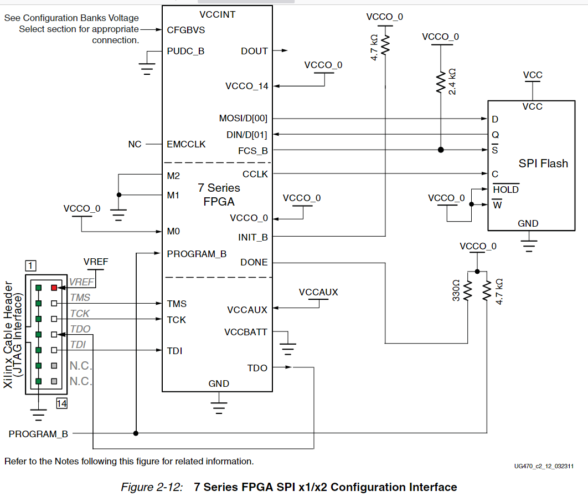

### Master SPI Quad (x4)

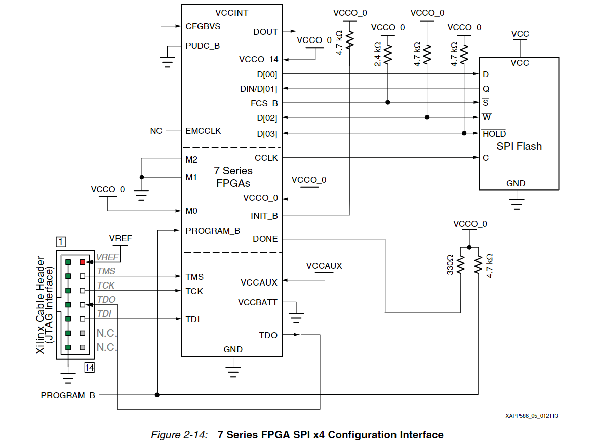


## 烧录文件的格式：

下表是关于Xilinx 配置文件的格式总结

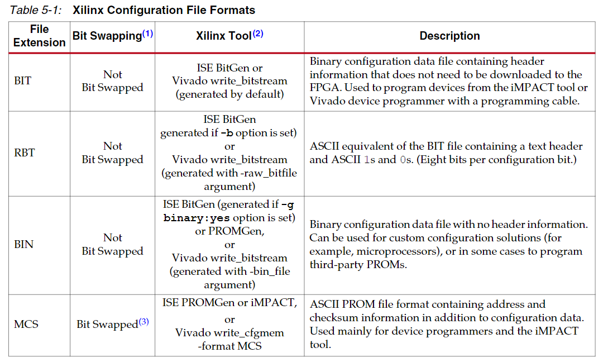

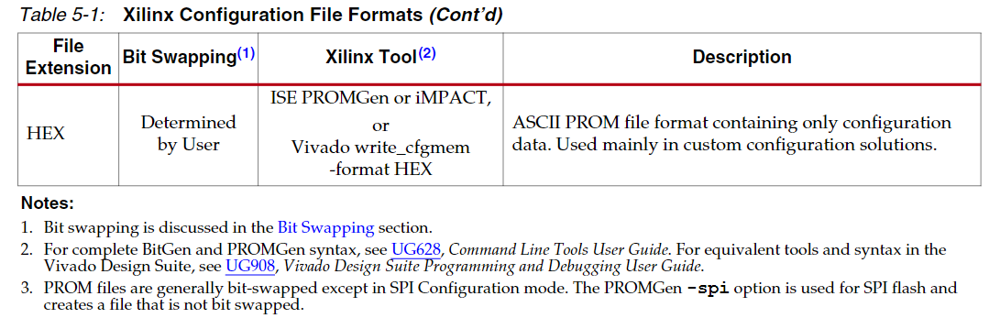


### Bit Swapping 

比特交换是在一个字节内进行bit交换。MCS格式的编程文件总是位交换的，对于SPI 配置模式的标称文件除外。对于BIT,RBT,BIN格式的编程文件是从来不进行位交换的。HEX格式的编程文件，是否位交换取决于用户的操作。

下图展示了如何将两个字节(0xABCD)进行位交换。

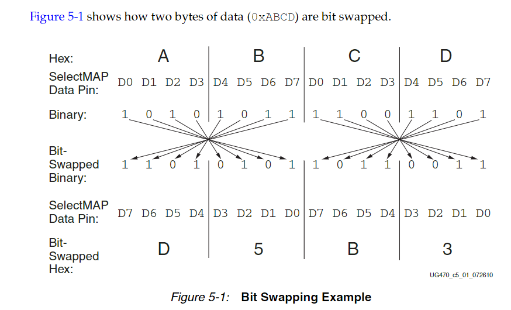

无论数据的方向如何对于每个数据MSB bit 都是D0 pin:

- 数据位交换，D0 是最右边的bit位；
- 数据不进行位交换，D0 是最左边的bit位

**何时进行bit swapped**

是否进行位交换取决于用户的应用场景。需要bit交换的应用有Serial, SelectMAP, or BPI PROM files, 和

ICAPE2的接口。

sync word bit swap 举例

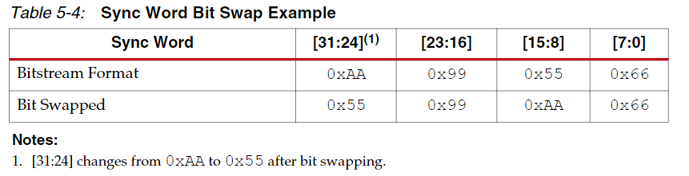

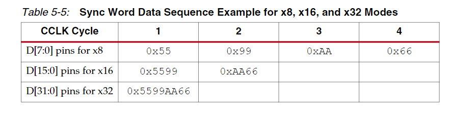

## 配置包

### Packet Types

- type1 
- Type2

#### Type 1 Packet

Type 1 Packet 用来读写寄存器。

在Type 1 包类型的包头后跟随的是Type 1 的32bit数据，具体有几个要看在头中的定义。

**Type 1 Packet 头格式**

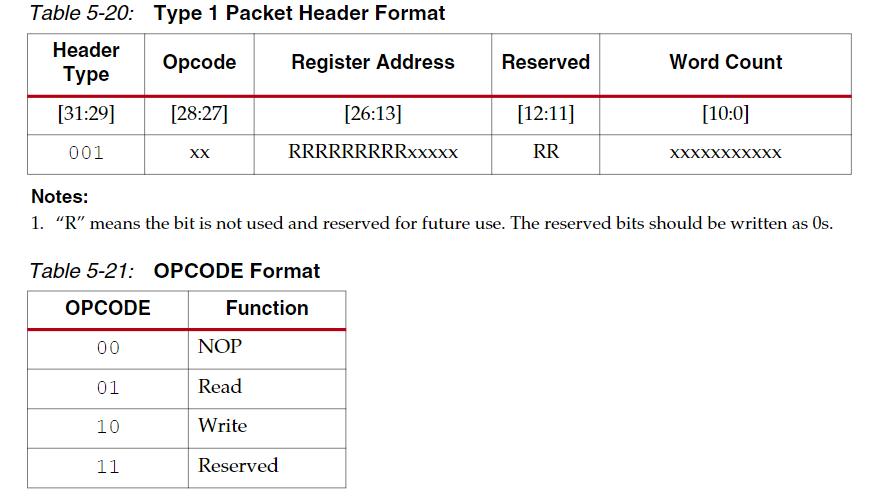

#### Type 2 Packet 

类型 2 数据包必须跟在类型 1 数据包之后，用于写入长块。此处不显示地址是因为它使用以前的类型 1 数据包地址。标题 部分始终是 32 位 的word

**Type 2 Packet 头**

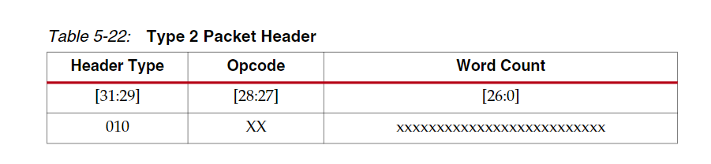

## 配置寄存器

关于配置寄存器的细节请参考UG470 Configuration Refisters 部分。


## 重配置与多引导启动

重配置与多引导启动为FPGA的远程更新提供了条件，回退特性为远程更新提供了一个安全保障。

### 回退与多引导启动

#### 概述

7 系列 FPGA 的 MultiBoot 和回退功能支持现场更新系统。bitstream镜像可以在现场动态升级。MulitBoot 可以使FPGA在运行中进行多个镜像切换。当多引导启动配置的过程中如果检测到错误，会触发FPGA回退功能，重新加载一个golden design。

**触发fallback FPGA 会做什么？？**

当回退发生时，在内部会产生一个脉冲复位整个配置逻辑，除了MulitBoot逻辑，warm boot start address (WBSTAR), and the boot status (BOOTSTS) registers不会被复位。这个复位脉冲拉低INIT_B和DONE,清除配置存储器，并且重新从地址0开始配置FPGA。在复位后，FPGA会忽略WBSTAR的起始地址。

##### 触发回退的情况

在配置期间下面的错误会触发回退功能：

- 一个IDCODE错误
- 一个CRC错误
- 一个Watchdog 时间超时错误
- 一个BPI 地址 wraparound 错误

#### Golden Image Initial System Setup

下图展示了golden 镜像启动的初始化

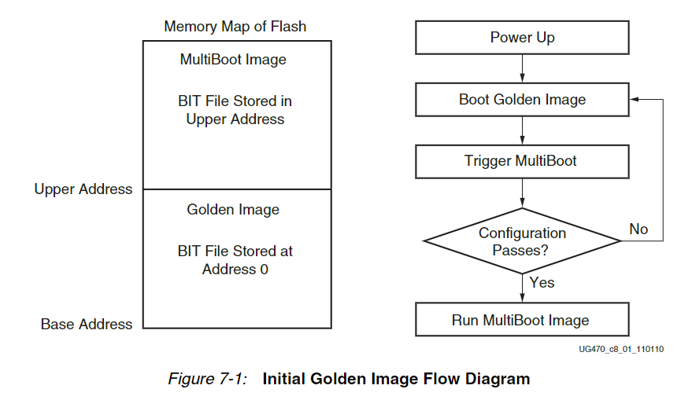

#### Initial MultiBoot Image System Setup

多重启动镜像初始化流程图

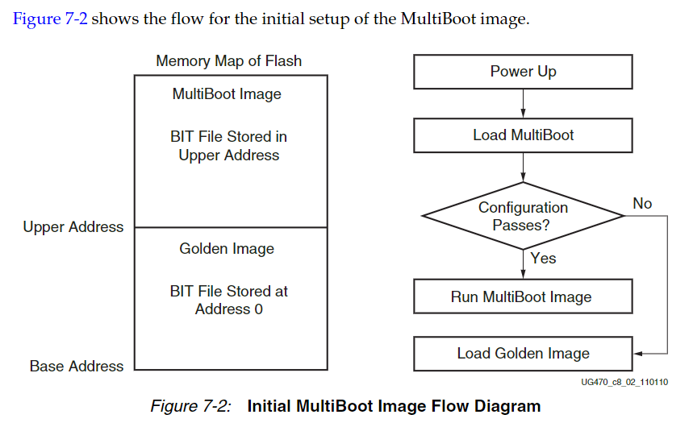

#### MultiBoot 和 Fallback 的过程详细信息

##### IPROG

Internal PROGRAM(IPROG)命令的功能是PROGRAM_B 引脚脉冲的一个子集，功能的不同之处是在触发回退时，IPROG命令不会擦除 WBSTAR, TIMER, BSPI, and BOOTSTS registers。IPROG 命令触发初始化， INIT 和 DONE 都变低 当发出 IPROG 命令并随后尝试去配置。

命令有两种途径

1. IPROG命令通过在用户逻辑中嵌入ICAPE2原语。
2. 将IPROG命令嵌入到比特流中。

##### WBSTAR Register

WBSTAR (Warm Boot Start Address)寄存器存放IPROG命令用来配置的地址。这个寄存器的设置可以来自比特流，也可以通过ICAPE2进行设置。如果这个寄存器在比特流中没有设置，默认的值是0。所以从从gloden 比特跳转到multiboot 镜像，默认的这个mulitboot将会复位WBSTAR为0，

##### Watchdog Timer

看门狗有两种模式(配置监控和用户逻辑监控)

在配置监控模式下，计时器的值在bit 文件中设置，计时器用来监控配置的时间，当IPROG命令触发一个加载命令时，计时器开始工作。

从开始加载bitstream 计时器开始倒计时，当配置完成时，禁用计时器。如果计时器到达了0，将会触发一个回退设置。

**定时器的运行频率：**

看门狗使用专用内部时钟 CFGMCLK 的分频版本，它具有 标称频率为 65 MHz。时钟被256分频，这样看门狗时钟 周期约为 4,000 ns。鉴于看门狗计数器是 30 位宽，最大可能的看门狗值约为 4,230 秒。时间值可以通过比特流设置 选项。

##### RS Pins

详细信息请参考UG470

### IPROG Reconfiguration

Internal PROGRAM_B pin 与IPROG命令有相同的效果，除了IPROG命令不会复位专用重配置逻辑。

IPROG命令有两种途径发送，一个是使用ICAPE2另一个是使用bitstream。注意ICAPE2原语接口的输入总线需要进行bit swapped。

#### 使用ICAPE2的IPROG

**使用ICAPE2原语干什么？？**

使用ICAPPE2原语主要完成两件事：

1. 发送Sync word
2. 通过ICAPE2设置WBSTAR寄存器的值，WBSTAR寄存器存放的是接下来要配置的bitstream在flash中的地址。
3. 发送IPROG命令，开始配置WBSTAR寄存器中指定地址的bitstream。

表 7-1 显示了使用 ICAPE2 发送 IPROG 命令的示例比特流

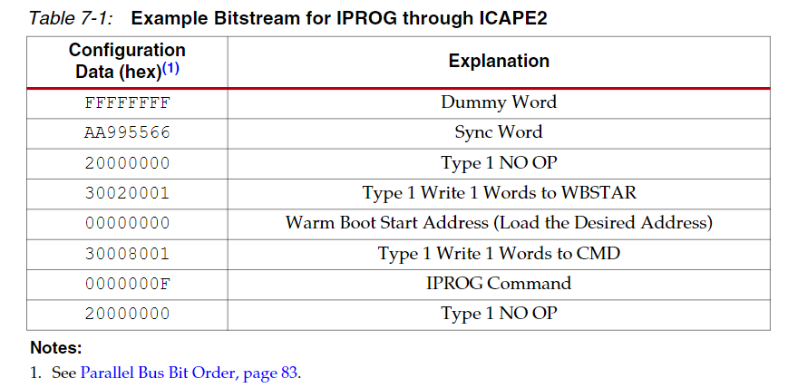

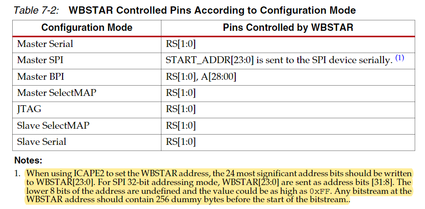

**注意：**

注意上面黄色的标记之前的重配置不成功可能是 在WBSTAR地址之前没有填充256个虚假的填充字节。


在除 SPI 模式之外的所有配置模式下，RS[1:0] 由 WBSTAR 控制。这 START_ADDR 字段仅对 BPI 和 SPI 模式有意义

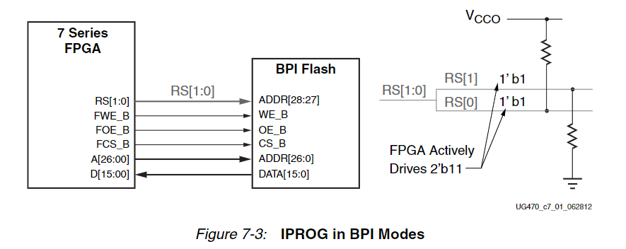

与图7-3相关的笔记：

1. 除 CCLK 引脚外，所有 BPI 引脚都是多功能 I/O。配置完成后 完成（DONE 引脚变为高电平），这些引脚成为用户 I/O 并且可以被控制 通过用户逻辑访问 BPI 闪存以进行用户数据存储和编程
2. 在本例中，RS[1:0] 设置为 2'b11。在 IPROG 重配置期间，RS[1:0] 引脚覆盖外部上拉和下拉电阻。用户可以指定任何 WBSTAR 寄存器中的 RS[1:0] 值。

#### 嵌入在Bitdtream 的IPROG

WBSTAR和IPROG 命令可以嵌入在bitstream 中，举个简单的例子说明一下，在存储在0地址的golden image 镜像中嵌入这两个命令，当配置完golden iamge  时会开始重新执行嵌入的这两个命令，使得跳转到update 镜像。如果配置中出现错误，触发回退。回退的详细细节请关注前面的内容。

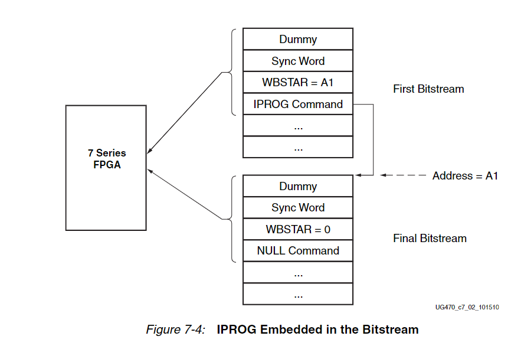

### 回退和 IPROG 重新配置的状态寄存器

7系列设备包含一个存储配置历史的 BOOTSTS。其中Status_0存储最近一次的配置状态，Status_1由Status_0转移而来，Status_1存储的是上一次的配置状态。

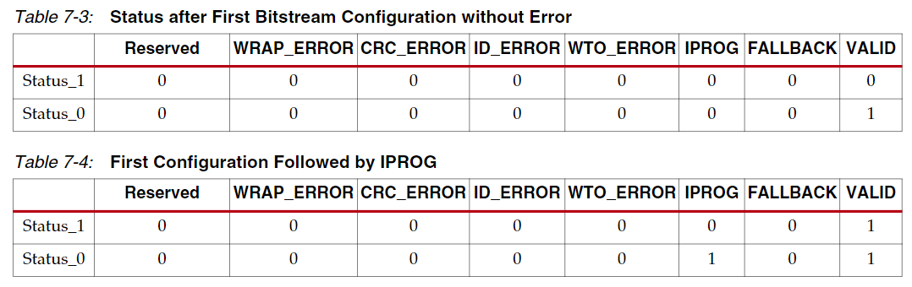


**笔记：** 

1. Status_1 显示已尝试 IPROG，并且检测到该比特流的 CRC_ERROR。 
2. Status_0 显示已成功加载回退比特流。在这种情况下还设置了 IPROG 位，因为回退比特流 包含一个 IPROG 命令。虽然在回退过程中忽略了 IPROG 命令，但状态仍然记录了这一事件。 表 7-5：嵌入在第一个比特流中的 IPROG，第二个比特流 CRC 错误，成功回退 保留 WRAP_ERROR CRC_ERROR ID_ERROR WTO_ERROR IPROG FALLBACK VALID发送反馈

### 看门狗

- Configuration Monitor Mode

- User Monitor Mode

  具体的请参考UG470 第7章看门狗部分。

## 多FPGA配置

请参考UG470 第9章


# 远程更新

# Critical Switch Word

- bus width auto detection word
- Sync word
- Packet header word
- Packet command or data word

### BPI 与SPI配置模式下的关键字

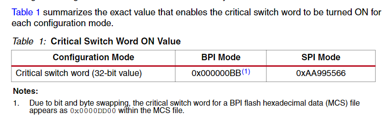


### bus width auto detection word

- 首先这个关键字在串行配置模式中被忽略。
- 在并行配置模式时，这个关键字自动的检测配置总线的宽度，并且这个关键字出现在sync word之前。

关于bus width auto detection关键字的更多信息请参考UG470的第5章Configuration Details。

#### SPI mode 

&ensp; &ensp;&ensp;&ensp;在SPI模式下，FPGA不使用总线宽度检测逻辑。

&ensp; &ensp;&ensp;&ensp;当FPGA从SPI flash 存储器中读取数据时，FPGA的配置逻辑一直处于第一阶段，直到从读取的数据中检测到sync word 0xAA995566。在检测到sync word 之前的数据视为无效数据。

### Sync word(0XAA995566)

​	使用指定的sync word 实现以32bit为边界的对齐。在FPGA检测到sync word 之前的数据不会被处理。对于并行配置，总线宽度检测关键字必须在sync word 之前被检测。


## NOR Flash简介

NOR flash 由字或字节的线性阵列组成，线性的存储阵列由可以擦除的blocks 或者 sectors组成。sectors 可以由更小的 subsectors 组成。

### 重新编程NOR Flash的过程：

1. 擦除操作：复位所有的选择部分的bits作为1；
2. 编程操作：改变数据bits,只能从1变成0。

### 关于SPI的容量与位宽

​	7系列FPGA支持大于128Mb容量32bit地址的SPI flash。

​	当spi flash的容量大于128Mb，并且启用了FPGA的Mulitboot时，必须在所有的配置镜像中设置spi_32bit_addr

## General Mapping of QuickBoot Components Within Flash Memory
Because modification of the flash memory requires an erase operation and because an erase 
operation affects an entire flash memory segment, the flash memory segment architecture 
dictates the placement of the QuickBoot components within a flash memory:

1. The QuickBoot header is placed in this sequence:
   a. QuickBoot header part 1, the critical switch word, is placed in its own erasable segment.
   b. QuickBoot header part 2 follows part 1 but in a different flash segment than part 1.

2. The golden bitstream image follows the QuickBoot header in the flash memory array.

3.  The update bitstream image is placed in its own erasable segments. The update image does not share any erasable segments with the golden bitstream image.

   The critical switch word is placed within its own erasable segment such that the destruct process, which is an erase operation, affects only the critical switch word. Similarly, the update image is placed in its own set of segments such that the reprogramming process does not affect the golden bitstream image.


### Detailed Mapping of QuickBoot Components to SPI Flash Memory

SPI模式快速引导flash映射关系图如下图，在图中第一个子扇区0-0xFFC，是可擦除的，存放关键字（sync word 0xAA995566）的区域，

黄色区域对应的存储区域是"golden"bitstream 。绿色的区域对应存储区域存放"UPDATE BITSTREAM"。

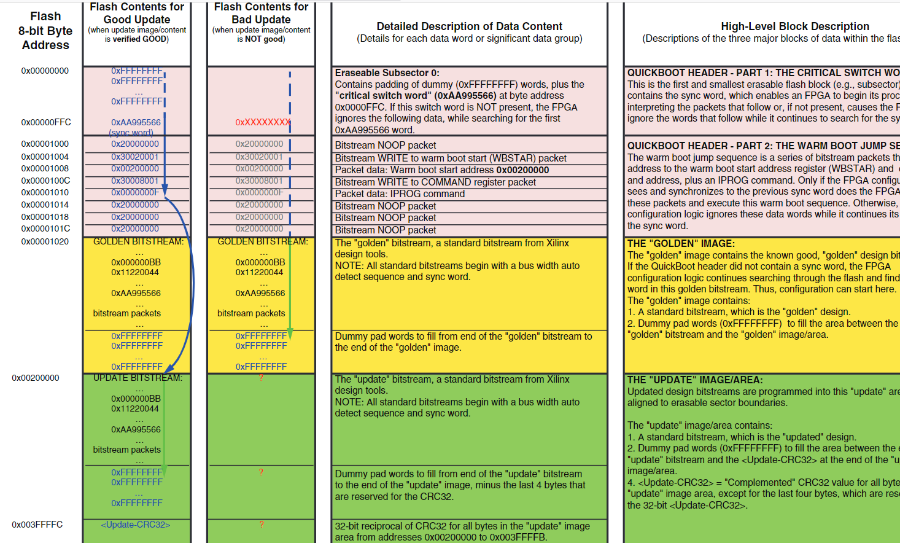


## 多引导配置FPGA SPI mode

### 多引导基础

FPGA的多引导启动特性为FPGA的远程更新提供了基础。当FPGA进行配置镜像切换出现错误时，FPGA可以触发一个回退特性，确保一个golden image可以被成功的配置。这种解决方案需要将多个配置镜像存储在同一块配置flash中。

- Fallback or "golden bitstream"
- MultiBoot or  "update bitstream"


MultiBoot 功能使FPGA可以选择加载一个在flash中指定地址的bitstream。一个内部生成脉冲（IPROG）启动配置逻辑跳转到WBSTAR寄存器中指定地址的update bitstream 。如果在配置中检测到错误，FPGA将会触发回退加载golden bitstream。


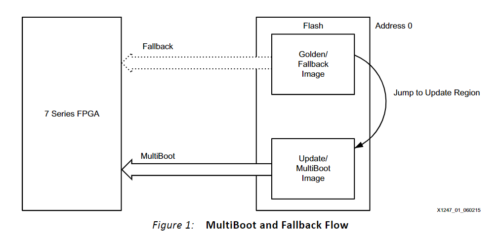

## 两种实现MulitBoot的方法：

1. PROG嵌入在bitstream 中：使用 NEXT_CONFIG_ADDR 在bitstream 中启用IPROG 。
2. IPORG 使用ICAPE2：使用ICAPE2原语实现对寄存器的读写操作。

&ensp;&ensp;注意：将IPROG嵌入到bitstream中是一个自动的操作；而是用ICAPE2原语是通过在rtl设计中通过一些事件的触发实现重新引导FPGA的配置。


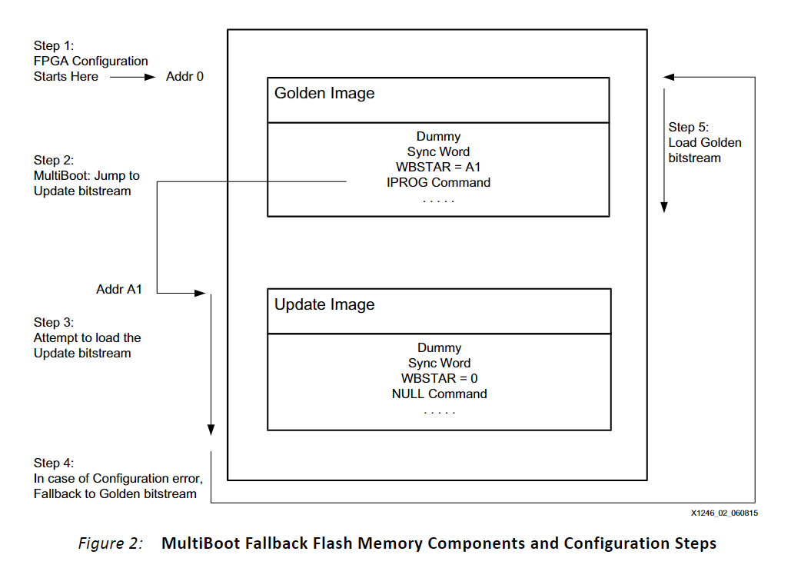

## PROG嵌入比特流的Mulitboot实现方式

### golden bitstream 和 update bitstream  XDC设置

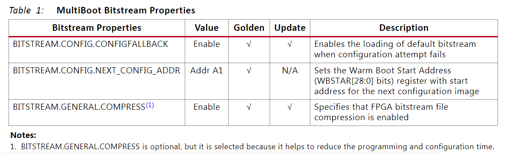

#### Golden design XDC 设置

打开golden design 的.XDC文件，添加以下设置：

```tcl

set_property BITSTREAM.CONFIG.CONFIGFALLBACK ENABLE [current_design]
set_property BITSTREAM.CONFIG.NEXT_CONFIG_ADDR 0x0400000 [current_design]
set_property BITSTREAM.GENERAL.COMPRESS TRUE [current_design]
set_property BITSTREAM.CONFIG.TIMER_CFG <Timer Value> [current_design]
set_property BITSTREAM.CONFIG.SPI_BUSWIDTH 1 [current_design]

```

**Note:** BITSTREAM.CONFIG.NEXT_CONFIG_ADDR 0x0400000 这一条约束指的的是下一个镜像的地址，需要根据自己的设计进行做出适当的修改。

**Note:** 默认的SPI_BUSWIDTH 是X1的，在实际的工程设计中需要根据实际的硬件设计做出调整。

**Note:** 建议在实际的设计中添加看门狗，如果NEXT_CONFIG_ADDR 地址之后没有找到sync word (有效的Update bitstream），那么FPGA将扫描整个flash需要花费超长时间,关于超时计时器的计数值的计算请参考UG470。

#### Update design XDC 设置

打开update design 的.XDC文件，添加以下设置：

```tcl
set_property BITSTREAM.CONFIG.CONFIGFALLBACK ENABLE [current_design]
set_property BITSTREAM.GENERAL.COMPRESS TRUE [current_design]
set_property BITSTREAM.CONFIG.SPI_BUSWIDTH 1 [current_design]

```

**Note:** 默认的SPI_BUSWIDTH 是X1的，在实际的工程设计中需要根据实际的硬件设计做出调整。

#### 约束解释	

```tcl
CONFIGFALLBACK ENABLE #打开回退设置
NEXT_CONFIG_ADDR 0x0400000 #Update 镜像在flash中的地址是0x0400000
COMPRESS TRUE #使能烧录文件的压缩设置，可以减少烧录文件的大小，缩短固化的时间，配置的时间
SPI_BUSWIDTH 1 #设置配置FPGA时的接口宽度 x1 x2 x4
```

#### 使用tcl指令生成SPI FLASH 编程文件

这里使用tcl指令生成的是.mcs文件，也可以生成.bin 文件

```tcl
write_cfgmem -format mcs -interface SPIX1 -size 16 -loadbit "up 0 <path>/golden.bit up 0x0400000 <path>/update.bit"  <path>/filename.mcs

```

**Note:**  Address value 0x0400000 is an example, as used in the reference design. The Addr A1 value 
set in the golden image (start address of update image) should be used (see Table 1).


#### Debug 

我们可以通过检查BOOT_STATUS 寄存器的INTERNAL_PROG的值，可以验证MulitBoot是否成功跳转到update bitstream 。关于BOOT_STATUS的更多细节请参考UG470。


##### 成功跳转：

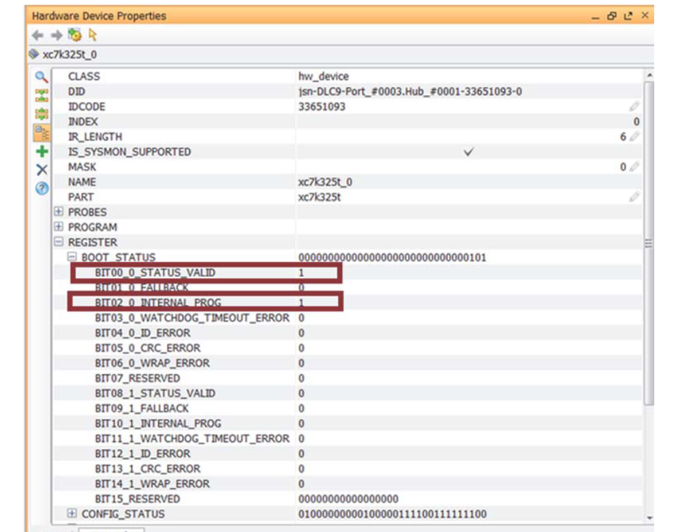 

##### 由CRC错误触发的回退

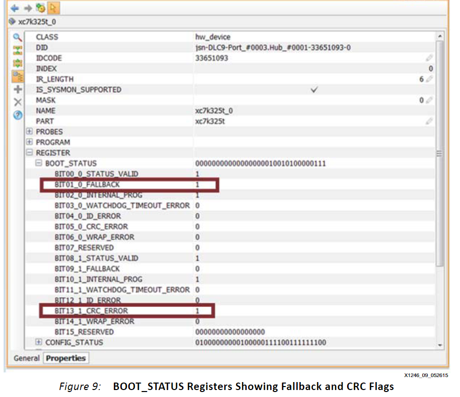


## 问题

1. 使用warm boot start address 跳转的存储区域还有一个sync,这怎么处理
2. 在测试mulitboot时可以仿照UG470 的第5章bitstream composition 中的325T的比特流来编写ICAPE2


## 参考文档：

1. ug470_7Series_Config.pdf
2. xapp1247
3. xapp1081


