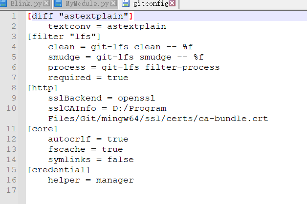
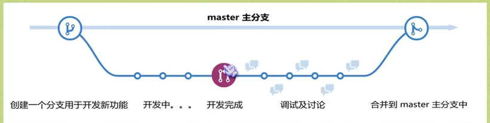
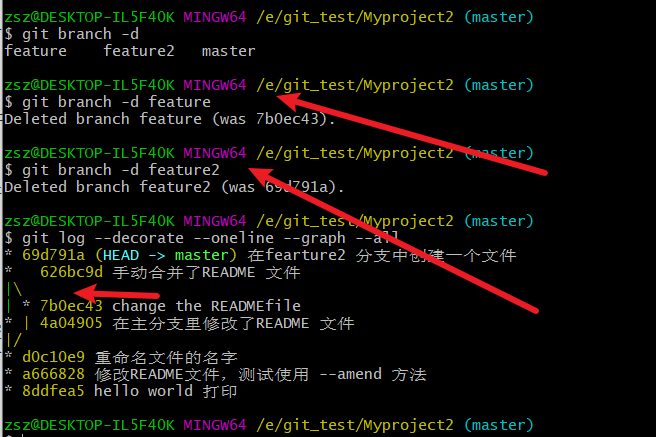

> 目录

[TOC]

# Git 笔记 1 基础篇

## Git 相关学习网站

GitHub: https://github.com/

Gitee:https://gitee.com/

GitLab:https://about.gitlab.com/


学习网站：**[Pro Git book](https://git-scm.com/book)**

​	开源项目网站：


Git:

GitHub:


## 版本控制

>  什么是版本控制

版本控制（Revision control）是一种在开发的过程中用于管理我们对文件、目录或工程等内容的修改历史，方便查看更改历史记录，备份以便恢复以前的版本的软件工程技术。

- 实现跨区域多人协同开发
- 追踪和记载一个或者多个文件的历史记录
- 组织和保护你的源代码和文档
- 统计工作量
- 并行开发、提高开发效率
- 跟踪记录整个软件的开发过程
- 减轻开发人员的负担，节省时间，同时降低人为错误

简单说就是用于管理多人协同开发项目的技术。

没有进行版本控制或者版本控制本身缺乏正确的流程管理，在软件开发过程中将会引入很多问题，如软件代码的一致性、软件内容的冗余、软件过程的事物性、软件开发过程中的并发性、软件源代码的安全性，以及软件的整合等问题。

无论是工作还是学习，或者是自己做笔记，都经历过这样一个阶段！我们就迫切需要一个版本控制工具！

多人开发就必须要使用版本控制！

> 常见的版本控制工具

我们学习的东西，一定是当下最流行的！

主流的版本控制器有如下这些：

- **Git**
- **SVN**（Subversion）
- **CVS**（Concurrent Versions System）
- **VSS**（Micorosoft Visual SourceSafe）
- **TFS**（Team Foundation Server）
- Visual Studio Online

版本控制产品非常的多（Perforce、Rational ClearCase、RCS（GNU Revision Control System）、Serena Dimention、SVK、BitKeeper、Monotone、Bazaar、Mercurial、SourceGear Vault），现在影响力最大且使用最广泛的是Git与SVN

> 版本控制分类

**1、本地版本控制**

记录文件每次的更新，可以对每个版本做一个快照，或是记录补丁文件，适合个人用，如RCS。

**2、集中版本控制  SVN**

所有的版本数据都保存在服务器上，协同开发者从服务器上同步更新或上传自己的修改

所有的版本数据都存在服务器上，用户的本地只有自己以前所同步的版本，如果不连网的话，用户就看不到历史版本，也无法切换版本验证问题，或在不同分支工作。而且，所有数据都保存在单一的服务器上，有很大的风险这个服务器会损坏，这样就会丢失所有的数据，当然可以定期备份。代表产品：SVN、CVS、VSS

**3、分布式版本控制 	Git**

每个人都拥有全部的代码！安全隐患！

所有版本信息仓库全部同步到本地的每个用户，这样就可以在本地查看所有版本历史，可以离线在本地提交，只需在连网时push到相应的服务器或其他用户那里。由于每个用户那里保存的都是所有的版本数据，只要有一个用户的设备没有问题就可以恢复所有的数据，但这增加了本地存储空间的占用。

不会因为服务器损坏或者网络问题，造成不能工作的情况！

> Git与SVN的主要区别

SVN是集中式版本控制系统，版本库是集中放在中央服务器的，而工作的时候，用的都是自己的电脑，所以首先要从中央服务器得到最新的版本，然后工作，完成工作后，需要把自己做完的活推送到中央服务器。集中式版本控制系统是必须联网才能工作，对网络带宽要求较高。


SVN是集中式版本控制系统，版本库是集中放在中央服务器的，而工作的时候，用的都是自己的电脑，所以首先要从中央服务器得到最新的版本，然后工作，完成工作后，需要把自己做完的活推送到中央服务器。集中式版本控制系统是必须联网才能工作，对网络带宽要求较高。

## Git 历史

同生活中的许多伟大事物一样，Git 诞生于一个极富纷争大举创新的年代。

Linux 内核开源项目有着为数众广的参与者。绝大多数的 Linux 内核维护工作都花在了提交补丁和保存归档的繁琐事务上(1991－2002年间)。到 2002 年，整个项目组开始启用一个专有的分布式版本控制系统 BitKeeper 来管理和维护代码。

Linux社区中存在很多的大佬！破解研究 BitKeeper ！

到了 2005 年，开发 BitKeeper 的商业公司同 Linux 内核开源社区的合作关系结束，他们收回了 Linux 内核社区免费使用 BitKeeper 的权力。这就迫使 Linux 开源社区(特别是 Linux 的缔造者 Linus Torvalds)基于使用 BitKeeper 时的经验教训，开发出自己的版本系统。（2周左右！） 也就是后来的 Git！

**Git是目前世界上最先进的分布式版本控制系统。**

Git是免费、开源的，最初Git是为辅助 Linux 内核开发的，来替代 BitKeeper！

Linux和Git之父李纳斯·托沃兹（Linus Benedic Torvalds）1969、芬兰


## Git 环境配置

>软件下载

打开 [git官网] https://git-scm.com/，下载git对应操作系统的版本。

所有东西下载慢的话就可以去找镜像！

官网下载太慢，我们可以使用淘宝镜像下载：http://npm.taobao.org/mirrors/git-for-windows/


> 先卸载

直接反安装即可，然后清理环境变量，环境变量只是为了全局使用而以！

下载对应的版本即可安装！

安装：无脑下一步即可！安装完毕就可以使用了！

> 启动Git

安装成功后在开始菜单中会有Git项，菜单下有3个程序：任意文件夹下右键也可以看到对应的程序！


**Git Bash：**Unix与Linux风格的命令行，使用最多，推荐最多

**Git CMD：**Windows风格的命令行

**Git GUI**：图形界面的Git，不建议初学者使用，尽量先熟悉常用命令


> 常用的Linux命令

平时一定要多使用这些基础的命令！

1）、cd : 改变目录。

2）、cd . . 回退到上一个目录，直接cd进入默认目录

3）、pwd : 显示当前所在的目录路径。

4）、ls(ll):  都是列出当前目录中的所有文件，只不过ll(两个ll)列出的内容更为详细。

5）、touch : 新建一个文件 如 touch index.js 就会在当前目录下新建一个index.js文件。

6）、rm:  删除一个文件, rm index.js 就会把index.js文件删除。

7）、mkdir:  新建一个目录,就是新建一个文件夹。

8）、rm -r :  删除一个文件夹, rm -r src 删除src目录

```
rm -rf /  切勿在Linux中尝试！删除电脑中全部文件！
```

9）、mv 移动文件, mv index.html src index.html 是我们要移动的文件, src 是目标文件夹,当然, 这样写,必须保证文件和目标文件夹在同一目录下。

10）、reset 重新初始化终端/清屏。

11）、linux:clear 清屏。windows:cls

12）、history 查看命令历史。

13）、help 帮助。

14）、exit 退出。

15）、#表示注释


> Git 配置

所有的配置文件，其实都在本地！

查看胚配置 git config -l

```shell
zsz@DESKTOP-IL5F40K MINGW64 /e/my_test (master)
$ git config -l
diff.astextplain.textconv=astextplain
filter.lfs.clean=git-lfs clean -- %f
filter.lfs.smudge=git-lfs smudge -- %f
filter.lfs.process=git-lfs filter-process
filter.lfs.required=true
http.sslbackend=openssl
http.sslcainfo=D:/Program Files/Git/mingw64/ssl/certs/ca-bundle.crt
core.autocrlf=true
core.fscache=true
core.symlinks=false
credential.helper=manager
user.name=<U+0083><U+0096>Taurus-ZSZ
user.nemail=taurus_aries@163.com
user.email=<U+0083>taurus_aries@163.com
core.repositoryformatversion=0
core.filemode=false
core.bare=false
core.logallrefupdates=true
core.symlinks=false
core.ignorecase=true


```

查看不同级别的配置文件：

```shell
#查看系统的配置
git config --system --list

#查看当前用户(global)配置
git config --global --list
```

```shell
zsz@DESKTOP-IL5F40K MINGW64 /e/my_test (master)
$git config --system --list
diff.astextplain.textconv=astextplain
filter.lfs.clean=git-lfs clean -- %f
filter.lfs.smudge=git-lfs smudge -- %f
filter.lfs.process=git-lfs filter-process
filter.lfs.required=true
http.sslbackend=openssl
http.sslcainfo=D:/Program Files/Git/mingw64/ssl/certs/ca-bundle.crt
core.autocrlf=true
core.fscache=true
core.symlinks=false
credential.helper=manager

```

### Git 相关的配置文件

1）、Git\etc\gitconfig  ：Git 安装目录下的 gitconfig   --system 系统级

2）、C:\Users\Administrator\ .gitconfig   只适用于当前登录用户的配置  --global 全局

系统配置



用户配置


这里可以直接编辑配置文件，通过命令设置后会响应到这里。


> 设置用户名与邮箱（用户标识，必要）

当你安装Git后首先要做的事情是设置你的用户名称和e-mail地址。这是非常重要的，因为每次Git提交都会使用该信息。它被永远的嵌入到了你的提交中：

```shell
git config --global user.name "Taurus-ZSZ"

git config --global user.email "taurus_aries@163.com"
```

只需要做一次这个设置，如果你传递了--global 选项，因为Git将总是会使用该信息来处理你在系统中所做的一切操作。如果你希望在一个特定的项目中使用不同的名称或e-mail地址，你可以在该项目中运行该命令而不要--global选项。总之--global为全局配置，不加为某个项目的特定配置。


## Git 基本理论基础

> 三个区域

Git本地有三个工作区域：工作目录（Working Directory）、暂存区(Stage/Index)、资源库(Repository或Git Directory)。如果在加上远程的git仓库(Remote Directory)就可以分为四个工作区域。文件在这四个区域之间的转换关系如下：


- Workspace：工作区，就是你平时存放项目代码的地方
- Index / Stage：暂存区，用于临时存放你的改动，事实上它只是一个文件，保存即将提交到文件列表信息
- Repository：仓库区（或本地仓库），就是安全存放数据的位置，这里面有你提交到所有版本的数据。其中HEAD指向最新放入仓库的版本
- Remote：远程仓库，托管代码的服务器，可以简单的认为是你项目组中的一台电脑用于远程数据交换

本地的三个区域确切的说应该是git仓库中HEAD指向的版本：


- Directory：使用Git管理的一个目录，也就是一个仓库，包含我们的工作空间和Git的管理空间。
- WorkSpace：需要通过Git进行版本控制的目录和文件，这些目录和文件组成了工作空间。
- .git：存放Git管理信息的目录，初始化仓库的时候自动创建。
- Index/Stage：暂存区，或者叫待提交更新区，在提交进入repo之前，我们可以把所有的更新放在暂存区。
- Local Repo：本地仓库，一个存放在本地的版本库；HEAD会只是当前的开发分支（branch）。
- Stash：隐藏，是一个工作状态保存栈，用于保存/恢复WorkSpace中的临时状态。

> 工作流程

git的工作流程一般是这样的：

１、在工作目录中添加、修改文件；

２、将需要进行版本管理的文件放入暂存区域；git add filexxx

３、将暂存区域的文件提交到git仓库。 git commit -m " 这里是注释"

因此，git管理的文件有三种状态：已修改（modified）,已暂存（staged）,已提交(committed)


## Git 项目搭建

> 创建工作目录，与常用指令

工作目录（WorkSpace)一般就是你希望Git帮助你管理的文件夹，可以是你项目的目录，也可以是一个空目录，建议不要有中文。

日常使用只要记住下图6个命令：


> 本地仓库搭建

创建本地仓库的方法有两种：一种是创建全新的仓库，另一种是克隆远程仓库

1、创建全新的仓库，需要用GIT管理的项目的根目录执行：

```shell
#在当前目录新建一个Git代码库
git init
```

2、执行后可以看到，仅仅在项目目录多出了一个.git目录，关于版本等的所有信息都在这个目录里面。

> 克隆远程仓库

1、另一种方式是克隆远程目录，由于是将远程服务器上的仓库完全镜像一份至本地！

```shell
# 克隆一个项目和它的整个代码历史(版本信息)
git clone git@192.168.1.200:xx01_fpga/xx01_fpga_proj.git

```

2、去gitee 或者github上克隆一个测试！

## Git 文件操作

> 文件的四种状态

版本控制就是对文件的版本控制，要对文件进行修改、提交等操作，首先要知道文件当前在什么状态，不然可能会提交了现在还不想提交的文件，或者要提交的文件没提交上。

- Untracked: 未跟踪, 此文件在文件夹中, 但并没有加入到git库, 不参与版本控制. 通过git add 状态变为Staged.
- Unmodify: 文件已经入库, 未修改, 即版本库中的文件快照内容与文件夹中完全一致. 这种类型的文件有两种去处, 如果它被修改, 而变为Modified. 如果使用git rm移出版本库, 则成为Untracked文件
- Modified: 文件已修改, 仅仅是修改, 并没有进行其他的操作. 这个文件也有两个去处, 通过git add可进入暂存staged状态, 使用git  checkout 则丢弃修改过, 返回到unmodify状态, 这个git checkout即从库中取出文件, 覆盖当前修改 !
- Staged: 暂存状态. 执行git commit则将修改同步到库中, 这时库中的文件和本地文件又变为一致, 文件为Unmodify状态. 执行git reset HEAD filename取消暂存, 文件状态为Modified


> 查看文件状态

上面说文件有4种状态，通过如下命令可以查看到文件的状态：

```shell
#查看指定文件状态
git status [filename]

#查看所有文件状态
git status

# git add .                  添加所有文件到暂存区
# git commit -m "消息内容"    提交暂存区中的内容到本地仓库 -m 提交信息
```


> 忽略文件

有些时候我们不想把某些文件纳入版本控制中，比如数据库文件，临时文件，设计文件等

在主目录下建立".gitignore"文件，此文件有如下规则：

1. 忽略文件中的空行或以井号（#）开始的行将会被忽略。
2. 可以使用Linux通配符。例如：星号（*）代表任意多个字符，问号（？）代表一个字符，方括号（[abc]）代表可选字符范围，大括号（{string1,string2,...}）代表可选的字符串等。
3. 如果名称的最前面有一个感叹号（!），表示例外规则，将不被忽略。
4. 如果名称的最前面是一个路径分隔符（/），表示要忽略的文件在此目录下，而子目录中的文件不忽略。
5. 如果名称的最后面是一个路径分隔符（/），表示要忽略的是此目录下该名称的子目录，而非文件（默认文件或目录都忽略）。

```shell
#为注释
*.txt        #忽略所有 .txt结尾的文件,这样的话上传就不会被选中！
!lib.txt     #但lib.txt除外
/temp        #仅忽略项目根目录下的TODO文件,不包括其它目录temp
build/       #忽略build/目录下的所有文件
doc/*.txt    #会忽略 doc/notes.txt 但不包括 doc/server/arch.txt
```


## 使用码云

> github 是有墙的，比较慢，在国内的话，我们一般使用 gitee ，公司中有时候会搭建自己的gitlab服务器

这个其实可以作为大家未来找工作的一个重要信息！

1、注册登录码云，完善个人信息


2、设置本机绑定SSH公钥，实现免密码登录！（免密码登录，这一步挺重要的，码云是远程仓库，我们是平时工作在本地仓库！)

```shell
# 进入 C:\Users\Administrator\.ssh 目录
# 生成公钥
ssh-keygen
```


3、将公钥信息public key 添加到码云账户中即可！


4、使用码云创建一个自己的仓库！

许可证：开源是否可以随意转载，开源但是不能商业使用，不能转载，   限制。


克隆远程仓库到本地


本地跟远程的仓库就一样的


测试：

- 添加到暂存区
- commit 提交
- push到远程仓库


## Git 分支

分支在GIT中相对较难，分支就是科幻电影里面的平行宇宙，如果两个平行宇宙互不干扰，那对现在的你也没啥影响。不过，在某个时间点，两个平行宇宙合并了，我们就需要处理一些问题了！


git分支中常用指令：

```
# 列出所有本地分支
git branch
# 列出所有远程分支
git branch -r
# 新建一个分支，但依然停留在当前分支
git branch [branch-name]
# 新建一个分支，并切换到该分支
git checkout -b [branch]
# 合并指定分支到当前分支
$ git merge [branch]
# 删除分支
$ git branch -d [branch-name]
# 删除远程分支
$ git push origin --delete [branch-name]
$ git branch -dr [remote/branch]
```

如果同一个文件在合并分支时都被修改了则会引起冲突：解决的办法是我们可以修改冲突文件后重新提交！选择要保留他的代码还是你的代码！

master主分支应该非常稳定，用来发布新版本，一般情况下不允许在上面工作，工作一般情况下在新建的dev分支上工作，工作完后，比如上要发布，或者说dev分支代码稳定后可以合并到主分支master上来。

作业练习：找一个小伙伴，一起搭建一个远程仓库，来练习Git！

1、不要把Git想的很难，工作中多练习使用就自然而然的会了！

2、Git的学习也十分多，看完Git教程之后，可以多去思考，总结到自己博客！


# Git 学习笔记 - 进阶篇


## Git 理论基础


### 初次使用Git前的配置

```shell

git config --global user.name "zsz"
git config --global user.email "zsz2668838984@qq.com"

#查看配置信息：
git config --list
#下面会显示你的配置
……
```


### 命令行与GUI

Git 有Git 原生态的命令行模式，也有GUI界面，但是大多数界面只是实现Git常用的命令，而命令行模式拥有Git的所有命令。熟悉命令行模式后，GUI自然也就会了。


### 理论基础

#### Git 记录的是什么


SVN 记录的是每一次版本的变动内容


Git 则是将每个版本独立保存。


#### 三棵树 ：

工作区域、暂存区域和Git仓库

工作区域：

暂存区域

Git仓库


#### Git 的工作流程

Git 的工作流程一般是这样的：

1. 在工作目录中添加、修改文件
2. 将需要进行版本管理的文件放入暂存区域
3. 将暂存区域的文件提交到Git仓库

#### Git 管理的文件有三种状态

- 已修改（modified）
- 已暂存（staged)
- 已提交（committed）


### 实战演练

#### 创建一个文件夹

​	E:\my_test

​	打开文件夹my_test

####  初始化创建一个本地仓库

1、右键点击git bash here 进入一个小的黑框框


2、输入命令初始化

```shell
git init 
#初始化空的仓库
```


3、 创建README.md

建议使用utf-8 无BOM 格式 兼容性设置


4、添加文件

```shell
 git add README.md
 #将文件添加到暂存区
 #添加到暂存区的操作时比较频繁的所以没有报告状态
 #而git commit 是一个版本的最后议题提交，所以报告一下状态。
```

5、将暂存区的文件提交到Git仓库

```shell
$ git commit -m "add a readme file"
[master (root-commit) dac16cc] add a readme file
 1 file changed, 2 insertions(+)
 create mode 100644 README.md

-m 参数为添加注释

```

#### 小结

> 将工作目录的文件放到Git仓库只需要两步：

1. 创建初始化仓库使用 git inint 
2. 将工作区中文件添加到暂存区使用:git add 文件名
3. 将暂存区的文件提交到本地仓库使用:git commit -m "这里填写你的注释"


## 查看工作状态和历史提交

### 查看状态 git status

```shell
$ git status
On branch master		#提示所在的分支，master
nothing to commit, working tree clean #提示 说你的工作目录是干净的，你的工作目录在上次提交后没有改动。

```

协议：

MIT 协议：协议里最开放的一个。

> 被许可人权利

特此授予任何人免费获得本软件和相关文档文件（“软件”）副本的许可，不受限制地处理本软件，包括但不限于使用、复制、修改、合并 、发布、分发、再许可的权利， 被许可人有权利使用、复制、修改、合并、出版发行、散布、再许可和/或贩售软件及软件的副本，及授予被供应人同等权利，惟服从以下义务。

> 被许可人义务

在软件和软件的所有副本中都必须包含以上著作权声明和本许可声明

```shell
Copyright (C) <year> <copyright holders>


Permission is hereby granted, free of charge, to any person obtaining a copy of this software and associated documentation files (the "Software"), to deal in the Software without restriction, including without limitation the rights to use, copy, modify, merge, publish, distribute, sublicense, and/or sell copies of the Software, and to permit persons to whom the Software is furnished to do so, subject to the following conditions:

The above copyright notice and this permission notice shall be included in all copies or substantial portions of the Software.

THE SOFTWARE IS PROVIDED "AS IS", WITHOUT WARRANTY OF ANY KIND, EXPRESS OR IMPLIED, INCLUDING BUT NOT LIMITED TO THE WARRANTIES OF MERCHANTABILITY, FITNESS FOR A PARTICULAR PURPOSE AND NONINFRINGEMENT. IN NO EVENT SHALL THE AUTHORS OR COPYRIGHT HOLDERS BE LIABLE FOR ANY CLAIM, DAMAGES OR OTHER LIABILITY, WHETHER IN AN ACTION OF CONTRACT, TORT OR OTHERWISE, ARISING FROM, OUT OF OR IN CONNECTION WITH THE SOFTWARE OR THE USE OR OTHER DEALINGS IN THE SOFTWARE.
```

#### 在工作目录创建一个MIT的LICENSE

再次查看状态:

```shel
$git status
On branch master
Untracked files:	#提示未追踪的文件
  (use "git add <file>..." to include in what will be committed)
        LICENSE

nothing added to commit but untracked files present (use "git add" to track)#提示的推荐命令


```


#### 添加文件到暂存区


#### 将暂存区的文件取消暂存

```shell
git restore --staged <file>
```


```shell

$ git commit -m "add a LICENSE file"
[master 0c533b6] add a LICENSE file
 1 file changed, 8 insertions(+)
 create mode 100644 LICENSE

zsz@DESKTOP-IL5F40K MINGW64 /e/my_test (master)
$ git status
On branch master
nothing to commit, working tree clean

zsz@DESKTOP-IL5F40K MINGW64 /e/my_test (master)
$

```

#### 修改LICENSE文件后查看状态

```shell
#修改LICENSE文件
$ git status
On branch master
Changes not staged for commit:
  (use "git add <file>..." to update what will be committed)
  (use "git restore <file>..." to discard changes in working directory)
        modified:   LICENSE

no changes added to commit (use "git add" and/or "git commit -a")

zsz@DESKTOP-IL5F40K MINGW64 /e/my_test (master)

```


#### 从暂存区回退工作区git restore file

这个命令会将我们工作区的修改给覆盖掉

```shell
zsz@DESKTOP-IL5F40K MINGW64 /e/my_test (master)
$git restore LICENSE

zsz@DESKTOP-IL5F40K MINGW64 /e/my_test (master)
$git status
On branch master
nothing to commit, working tree clean

zsz@DESKTOP-IL5F40K MINGW64 /e/my_test (master)

```

原文件


执行 git restore LICENSE 后修改被覆盖


再次修改原文件，


添加到暂存区：


```shell
zsz@DESKTOP-IL5F40K MINGW64 /e/my_test (master)
$ git add LICENSE
zsz@DESKTOP-IL5F40K MINGW64 /e/my_test (master)
$ git status
On branch master
Changes to be committed:
  (use "git restore --staged <file>..." to unstage)
        modified:   LICENSE

```

暂时先不提交，再次修改


再次查看状态：

```shell
zsz@DESKTOP-IL5F40K MINGW64 /e/my_test (master)
$ git status
On branch master
Changes to be committed:#等待被提交到仓库
  (use "git restore --staged <file>..." to unstage)
        modified:   LICENSE#在暂存区

Changes not staged for commit:
  (use "git add <file>..." to update what will be committed)
  (use "git restore <file>..." to discard changes in working directory)
        modified:   LICENSE	##在工作目录中，等待添加到暂存区


zsz@DESKTOP-IL5F40K MINGW64 /e/my_test (master)
$
#上面这个情况是这样的：
上面第一个是在暂存区中的文件，下面的这个是在工作目录中的文件 

#如果这个时候直接使用git commit -m "" 这个时候是只将暂存区中的文件提交到本地仓库。
#如果这个时候使用git add LICENSE 这时是将工作目录中的LICENSE覆盖暂存区中的文件，然后再使用git commit -m "  "就是将之前工作目录中的最新修改提交到了git仓库中了。

```

### 查看历史提交 git log

```shell
zsz@DESKTOP-IL5F40K MINGW64 /e/my_test (master)
$ git log
commit 0c533b6c3f50773947d28f884d1cfce0431fc251 (HEAD -> master)
Author: <U+0083><U+0096>Taurus-ZSZ <<U+0083>taurus_aries@163.com>#作者 #邮箱
Date:   Thu Oct 14 20:42:24 2021 +0800

    add a LICENSE file  #注释

commit dac16cca7dc9bcea305f7c873633b3d2511a7cb2#ID 这是唯一的
Author: <U+0083><U+0096>Taurus-ZSZ <<U+0083>taurus_aries@163.com>
Date:   Thu Oct 14 18:01:56 2021 +0800

    add a readme file

 
```


## 回到过去

### 丢弃对工作区的改动

回到上一次提交暂存区的版本

**example**

```sh
[waves@waves-pc Taurus-ZSZ.github.io]$ git status
位于分支 dev
您的分支落后 'origin/dev' 共 5 个提交，并且可以快进。
  （使用 "git pull" 来更新您的本地分支）

尚未暂存以备提交的变更：
  （使用 "git add <文件>..." 更新要提交的内容）
  （使用 "git restore <文件>..." 丢弃工作区的改动）
        修改：     README.md
        修改：     source/_posts/Xilinx-Remote-Update.md

修改尚未加入提交（使用 "git add" 和/或 "git commit -a"） 

```

在上面的这个例子中我想丢弃工作区的改动，只需要按照提示输入git restore xxx 就好了

```bash
git restore README.md
git restore source/_posts/Xilinx-Remote-Update.md
```

**总结：**这种方法对付少量文件是可以，当对付多个文件是就有点不好使了,应该还有其他的方法。


```shell

zsz@DESKTOP-IL5F40K MINGW64 /e/my_test (master)
$ git reset HEAD~ #回退到上一个版本，回滚到上一个快照（HEAD的上一个版本）

zsz@DESKTOP-IL5F40K MINGW64 /e/my_test (master)
$ git log
commit dac16cca7dc9bcea305f7c873633b3d2511a7cb2 (HEAD -> master)
Author: <U+0083><U+0096>Taurus-ZSZ <<U+0083>taurus_aries@163.com>
Date:   Thu Oct 14 18:01:56 2021 +0800

    add a readme file

zsz@DESKTOP-IL5F40K MINGW64 /e/my_test (master)
$ git status
On branch master
Untracked files:
  (use "git add <file>..." to include in what will be committed)
        LICENSE

nothing added to commit but untracked files present (use "git add" to track)

zsz@DESKTOP-IL5F40K MINGW64 /e/my_test (master)
$
#之前的快照并没有丢，只是HEAD 指向了前一个，

```

reset 命令的选项

git reset --mixed HEAD~

- 移动HEAD的指向，将其指向上一个快照
- 将HEAD移动后指向的快照回滚到暂存区

git reset --soft HEAD~

- 移动HEAD的指向，将其指向上一个快照(相当于撤销一次错误的提交)

git reset --hard HEAD~

- 移动HEAD的指向，将其指向上一个快照
- 将HEAD移动后指向的快照回滚到暂存区
- 将暂存区域的文件还原到工作目录

reset 命令回滚快照三部曲

1. 移动HEAD的指向（--soft）

2. 将快照回滚到暂存区域（[--mixed], 默认）

3. 将快照暂存区还原到工作目录（--hard）==有危险奥==

#### 回滚到指定的快照

git reset 快照ID

#### 回滚个别文件

git reset  版本快照ID	文件名/路径


#### 还可以往前滚

git reset  版本快照ID


## 版本对比

1. 新建一个文件夹Myproject2,并初始化为本地仓库

   进入文件夹并右键git bash here 

   输入: git init

2. 第二步

   - 我们我们创建一个.py的代码，
   - 在创建一个README.md文件，写清楚这是一个课后作业项目

3. 第三步

   - 执行git add README.md test.py 命令将两个文件都添加到暂存区

   - 接着执行git commit -m "hello world 打印"提交项目的第一个快照

     ```shell
     zsz@DESKTOP-IL5F40K MINGW64 /e/git_test/Myproject2 (master)
     $ git add *
     
     zsz@DESKTOP-IL5F40K MINGW64 /e/git_test/Myproject2 (master)
     $ git status
     On branch master
     
     No commits yet
     
     Changes to be committed:
       (use "git rm --cached <file>..." to unstage)
             new file:   README.md
             new file:   test.py
     
     
     zsz@DESKTOP-IL5F40K MINGW64 /e/git_test/Myproject2 (master)
     $ git commit -m "hello world 打印"
     [master (root-commit) 8ddfea5] hello world 打印
      2 files changed, 6 insertions(+)
      create mode 100644 README.md
      create mode 100644 test.py
     
     zsz@DESKTOP-IL5F40K MINGW64 /e/git_test/Myproject2 (master)
     $ git status
     On branch master
     nothing to commit, working tree clean
     
     zsz@DESKTOP-IL5F40K MINGW64 /e/git_test/Myproject2 (master)
     $
     
     ```

4. 第四步

   - 接着我们改写一下test.py代码
   - README.md文件也要改一下

   #### 比较暂存区与工作目录 git diff

   ```shell
   zsz@DESKTOP-IL5F40K MINGW64 /e/git_test/Myproject2 (master)
   $ git diff
   diff --git a/README.md b/README.md #比较暂存区域的文件 和工作区域的文件，分别拷贝到了 a b两个文件夹
   index 0f2c569..970f910 100644	#0f2c569..970f910 表示两个文件的ID 100644表示文件类型与权限
   --- a/README.md #暂存区的文件 ---表示旧文件
   +++ b/README.md #工作区的文件 +++表示新文件
   @@ -1 +1,2 @@ #-1 表示旧文件的第1行 +1，2表示新文件的开始行数，持续的行数
   -课后作业：文字游戏#旧文件
   \ No newline at end of file#git的善意提醒，git添加的换行符
   +零基础入门学习git第5讲#新文件的添加
   +课后作业：文字游戏#新文件的添加
   \ No newline at end of file
   diff --git a/test.py b/test.py
   index c936972..670104c 100644
   --- a/test.py
   +++ b/test.py
   @@ -2,4 +2,5 @@
    import os
   
    print('hello world!!!!')
   -print('当前文件夹是：' + os.getcwd())
   \ No newline at end of file
   +print('当前文件夹是：' + os.getcwd())
   +print('你好棒！！')
   
   
   ```

linux vim 查找 /查找的内容 回车 n下一个 N 上一个

使用 h 产看help

### 比较两个历史快照

git diff 快照ID1 快照ID2 


1、添加上次修改到暂存区，commit 提交到本地仓库。

2、使用git log可以看到有两个快照啦！

```shell
zsz@DESKTOP-IL5F40K MINGW64 /e/git_test/Myproject2 (master)
$ git add *

zsz@DESKTOP-IL5F40K MINGW64 /e/git_test/Myproject2 (master)
$ git commit -m "第二次修改"
[master 75b12fa] 第二次修改
 2 files changed, 4 insertions(+), 2 deletions(-)

zsz@DESKTOP-IL5F40K MINGW64 /e/git_test/Myproject2 (master)
$ git log
commit 75b12fa12d66fcfc64b66a71c0f2ccffacaf8964 (HEAD -> master)
Author: Taurus-ZSZ <taurus_aries@163.com>
Date:   Fri Oct 15 15:41:07 2021 +0800

    第二次修改

commit 8ddfea5df21b5c6a37b341bd56c21abbae3f15b0
Author: Taurus-ZSZ <taurus_aries@163.com>
Date:   Fri Oct 15 06:59:08 2021 +0800

    hello world 打印


```

3、比较两个快照

```shell
```


### 比较当前工作目录和Git 仓库中的快照

git diff 快照ID #比较当前工作区与仓库中的历史快照ID

git diff HEAD  #比较当前工作区与仓库中HEAD指向的快照，一般是上一次提交的快照


### 比较暂存区与仓库快照

1、添加新的修改到暂存区：git add README.md

2、使用：git diff --cached #比较仓库最新的快照与暂存区文件


3、 指定快照与暂存区进行对比：

git diff --cached 快照ID


### 终极对比命令(diff)图谱


## 修改最后一次提交，删除文件和重命名文件

### 修改最后一次提交

继续使用Myproject2

- 在实际开发中你可能会遇到一下两种情景：
  - 情景一：版本刚一提交(commit)到仓库，突然想起漏掉两个文件还没有添加(add)。
  - 情景二：版本杠一提交(commit)到仓库，突然想起版本说明写的不够全面，无法彰显你本次修改的重大意义……
- 执行带 --amend 选项的commit 提交命令，Git就会'更正'最近的一次提交。

#### 案例

- 前提条件


- 要求：

​	我们把README.md提交上去，但不希望再添加一个新的版本，

- 方法

  ```shell
  git commit --amend
  git commit --amend -m "你的说明"
  ```

  进入下面的这个界面，其实就是让我们修改说明而已：

  

编辑修改操作跟linux里的vim一样。输入i 切换到插入模式，编辑说明，如果什么都不动，直接:q是进行退出，不会有修改。


说明： --amend 命令可以进行提交，并修改注释，但不会增加新的版本。

### 删除文件

继续使用Myproject2,

1、从工作目录里==手动删除==README文件，


使用 git restore README.md 可以从暂存区中恢复这个文件到工作目录。


#### 如何从Git中删除文件？？

git rm 文件名

- 该命令删除的只是工作目录和暂存区的文件，也就是取消跟踪，在下次提交时不纳入版本管理。但是如果你之前提交过，那么在历时提交的快照版本里还会存在奥。

- 当工作目录和暂存区的同一个文件存在不同内容时，执行git rm -f 文件名 命令可以把两个文件都删除掉。

  1、在工目录中添加一个ceshi.py的文件，并编辑。

  2、将ceshi.py提交到暂存区，

  

  3、修改ceshi.py,使用git status 查看状态

  

  使用强制删除：$ git rm -f ceshi.py  git rm -f 命令，强制删除暂存区与工作目录中的文件

  

  

- 只删除暂存区的文件保留工作目录中的 git rm --cached ceshi.py

### 重命名文件名

1、将test.py 改为test_print.py


2、手动将名字再改回来使用git status


3、如果你想重命名文件，让git 来帮我们搞

git mv test.py test_print.py 

使用git status 查看状态：提示进行了重命名操作。


git mv 旧文件名 新文件名

- ren/mv 进文件名 新文件名
- git rm 旧文件
- git add 新文件


## Git 分支

### 什么是分支？



如果不使用分支，所有的工作都都放在一个分支上

### 其他版本控制系统的分支：


Git 每个版本独立存放，

### 创建分支

>  继续使用Myproject2项目


```shell
#创建了一新分支
git branch 分支名称 
#创建新分支并切换到新创建的分支：
git checkout -b 分支名

git branch feature

zsz@DESKTOP-IL5F40K MINGW64 /e/git_test/Myproject2 (master)
$ git log --decorate

```


### 切换分支 git checkout 分支名

> 继续使用Myproject2项目

```shell
git checkout 分支名
git checkout fearture

git log --oneline #只显示快照的ID与快照的说明
--oneline #只显示快照的ID与快照的说明

```


将README 文件修改一下，再次提交


再次切回主分支：


再次修改EADME文件：

```shell
$ git add README.md

zsz@DESKTOP-IL5F40K MINGW64 /e/git_test/Myproject2 (master)
$ git commit -m "在主分支里修改了README 文件"
[master 4a04905] 在主分支里修改了README 文件
 1 file changed, 3 insertions(+), 1 deletion(-)

zsz@DESKTOP-IL5F40K MINGW64 /e/git_test/Myproject2 (master)
$ git log

```


查看所有分支：

```shell
git log --decorate --oneline --graph --all
zsz@DESKTOP-IL5F40K MINGW64 /e/git_test/Myproject2 (master)
$ git log --decorate --oneline --graph --all
* 4a04905 (HEAD -> master) 在主分支里修改了README 文件
| * 7b0ec43 (feature) change the READMEfile
|/
* d0c10e9 重命名文件的名字# 两个分支的共同部分
* a666828 修改README文件，测试使用 --amend 方法
* 8ddfea5 hello world 打印


```


### 分支的合并

实际使用


> 继续使用Myproject2项目

#### 合并分支发生冲突：

```shell
# 将指定的分支合并到当前的分支
git merge 分支名  
```


手动修改完成之后：


继续使用 git add README.md 将文件添加到暂存区

然后提交：git commit -m " 说明"

查看分支：

```shell

zsz@DESKTOP-IL5F40K MINGW64 /e/git_test/Myproject2 (master|MERGING)
$ git add README.md

zsz@DESKTOP-IL5F40K MINGW64 /e/git_test/Myproject2 (master|MERGING)
$ git commit -m "手动合并了README 文件"
[master 626bc9d] 手动合并了README 文件

zsz@DESKTOP-IL5F40K MINGW64 /e/git_test/Myproject2 (master)
$  git log --decorate --oneline --graph --all
*   626bc9d (HEAD -> master) 手动合并了README 文件
|\
| * 7b0ec43 (feature) change the READMEfile
* | 4a04905 在主分支里修改了README 文件
|/
* d0c10e9 重命名文件的名字
* a666828 修改README文件，测试使用 --amend 方法
* 8ddfea5 hello world 打印

```


#### 合并分支未发生冲突

当合并的分支不会发生冲突时就不用这么麻烦啦：

```shell
#创建新分支并切换到新创建的分支：
git checkout -b 分支名

git checkout -b feature2
git log --decorate --oneline --graph --all

```


### 删除分支

```shell
git branch -d 分支名
```

删除两个分支：feature feature2

```shell
zsz@DESKTOP-IL5F40K MINGW64 /e/git_test/Myproject2 (master)
$ git branch -d feature
Deleted branch feature (was 7b0ec43).

zsz@DESKTOP-IL5F40K MINGW64 /e/git_test/Myproject2 (master)
$ git branch -d feature2
Deleted branch feature2 (was 69d791a).
```





### 匿名分支

使用Myproject3项目

1、新建一个Myproject 文件夹

2、使用git init 初始化本地仓库

3、 新建三个文件、文件格式随意，文件类型随意每创建一个就提交一次。

4、

```shell
$ git checkout HEAD~
Note: switching to 'HEAD~'.

You are in 'detached HEAD' state. You can look around, make experimental
changes and commit them, and you can discard any commits you make in this
state without impacting any branches by switching back to a branch.

If you want to create a new branch to retain commits you create, you may
do so (now or later) by using -c with the switch command. Example:

  git switch -c <new-branch-name>

Or undo this operation with:

  git switch -

Turn off this advice by setting config variable advice.detachedHead to false

HEAD is now at 827bfee 2.txt
#翻译成人话：
你使用checkout 命令但是没有指定分支名，所以git会帮我们创建一个匿名分支的东西，什么是匿名分支？？？就是没有名字的分支，当你切换到别的分支的时候，你所做的所有操作提交修改都会丢弃，所以你可以使用匿名分支做一些实验。

zsz@DESKTOP-IL5F40K MINGW64 /e/git_test/Myproject3 ((827bfee...))
$ git log --decorate --oneline --graph --all
* dc8f887 (master) 3.txt
* 827bfee (HEAD) 2.txt
* a1c3b22 1.txt


```

目前的工作区：


创建一个4.txt 添加并提交：


Git 的log 匿名分支在前进


切换回主分支：

git checkout master

```shell
zsz@DESKTOP-IL5F40K MINGW64 /e/git_test/Myproject3 ((0a40346...))
$ git checkout master
Warning: you are leaving 1 commit behind, not connected to
any of your branches:

  0a40346 4.txt

If you want to keep it by creating a new branch, this may be a good time
to do so with:

 git branch <new-branch-name> 0a40346

Switched to branch 'master'

zsz@DESKTOP-IL5F40K MINGW64 /e/git_test/Myproject3 (master)
$git clog --decorate --oneline --graph --all
* dc8f887 (HEAD -> master) 3.txt
* 827bfee 2.txt
* a1c3b22 1.txt

zsz@DESKTOP-IL5F40K MINGW64 /e/git_test/Myproject3 (master)

```


### checkout 功能

待完善

1. 从历史快照或者暂存区中拷贝文件到工作目录	 
   1. 在回到过去里有讲
2. 切换分支


reset与checkout 的区别：

reset 只能将文件恢复到暂存区，

checkout :可以将暂存区和工作目录覆盖掉

所以reset命令比checkout更安全一些。


重点：


## 远程仓库


# Git 常用命令

## 仓库

```
# 在当前目录新建一个Git代码库
$ git init

# 新建一个目录，将其初始化为Git代码库
$ git init [project-name]

# 下载一个项目和它的整个代码历史
$ git clone [url]
```

## 配置

```
# 显示当前的Git配置
$ git config --list

# 编辑Git配置文件
$ git config -e [--global]

# 设置提交代码时的用户信息
$ git config [--global] user.name "[name]"
$ git config [--global] user.email "[email address]"
```

## 增加/删除文件

```
# 添加指定文件到暂存区
$ git add [file1] [file2] ...

# 添加指定目录到暂存区，包括子目录
$ git add [dir]

# 添加当前目录的所有文件到暂存区
$ git add .

# 添加每个变化前，都会要求确认
# 对于同一个文件的多处变化，可以实现分次提交
$ git add -p

# 删除工作区文件，并且将这次删除放入暂存区
$ git rm [file1] [file2] ...

# 停止追踪指定文件，但该文件会保留在工作区
$ git rm --cached [file]

# 改名文件，并且将这个改名放入暂存区
$ git mv [file-original] [file-renamed]
```

## 代码提交

```
# 提交暂存区到仓库区
$ git commit -m [message]

# 提交暂存区的指定文件到仓库区
$ git commit [file1] [file2] ... -m [message]

# 提交工作区自上次commit之后的变化，直接到仓库区
$ git commit -a

# 提交时显示所有diff信息
$ git commit -v

# 使用一次新的commit，替代上一次提交
# 如果代码没有任何新变化，则用来改写上一次commit的提交信息
$ git commit --amend -m [message]

# 重做上一次commit，并包括指定文件的新变化
$ git commit --amend [file1] [file2] ...
```

## 分支

```
# 列出所有本地分支
$ git branch

# 列出所有远程分支
$ git branch -r

# 列出所有本地分支和远程分支
$ git branch -a

# 新建一个分支，但依然停留在当前分支
$ git branch [branch-name]

# 新建一个分支，并切换到该分支
$ git checkout -b [branch]

# 新建一个分支，指向指定commit
$ git branch [branch] [commit]

# 新建一个分支，与指定的远程分支建立追踪关系
$ git branch --track [branch] [remote-branch]

# 切换到指定分支，并更新工作区
$ git checkout [branch-name]

# 切换到上一个分支
$ git checkout -

# 建立追踪关系，在现有分支与指定的远程分支之间
$ git branch --set-upstream [branch] [remote-branch]

# 合并指定分支到当前分支
$ git merge [branch]

# 选择一个commit，合并进当前分支
$ git cherry-pick [commit]

# 删除分支
$ git branch -d [branch-name]

# 删除远程分支
$ git push origin --delete [branch-name]
$ git branch -dr [remote/branch]
```

## 标签

```
# 列出所有tag
$ git tag

# 新建一个tag在当前commit
$ git tag [tag]

# 新建一个tag在指定commit
$ git tag [tag] [commit]

# 删除本地tag
$ git tag -d [tag]

# 删除远程tag
$ git push origin :refs/tags/[tagName]

# 查看tag信息
$ git show [tag]

# 提交指定tag
$ git push [remote] [tag]

# 提交所有tag
$ git push [remote] --tags

# 新建一个分支，指向某个tag
$ git checkout -b [branch] [tag]
```

## 查看信息

```
# 显示有变更的文件
$ git status

# 显示当前分支的版本历史
$ git log

# 显示commit历史，以及每次commit发生变更的文件
$ git log --stat

# 搜索提交历史，根据关键词
$ git log -S [keyword]

# 显示某个commit之后的所有变动，每个commit占据一行
$ git log [tag] HEAD --pretty=format:%s

# 显示某个commit之后的所有变动，其"提交说明"必须符合搜索条件
$ git log [tag] HEAD --grep feature

# 显示某个文件的版本历史，包括文件改名
$ git log --follow [file]
$ git whatchanged [file]

# 显示指定文件相关的每一次diff
$ git log -p [file]

# 显示过去5次提交
$ git log -5 --pretty --oneline

# 显示所有提交过的用户，按提交次数排序
$ git shortlog -sn

# 显示指定文件是什么人在什么时间修改过
$ git blame [file]

# 显示暂存区和工作区的差异
$ git diff

# 显示暂存区和上一个commit的差异
$ git diff --cached [file]

# 显示工作区与当前分支最新commit之间的差异
$ git diff HEAD

# 显示两次提交之间的差异
$ git diff [first-branch]...[second-branch]

# 显示今天你写了多少行代码
$ git diff --shortstat "@{0 day ago}"

# 显示某次提交的元数据和内容变化
$ git show [commit]

# 显示某次提交发生变化的文件
$ git show --name-only [commit]

# 显示某次提交时，某个文件的内容
$ git show [commit]:[filename]

# 显示当前分支的最近几次提交
$ git reflog
```

## 远程同步

```
# 下载远程仓库的所有变动
$ git fetch [remote]

# 显示所有远程仓库
$ git remote -v

# 显示某个远程仓库的信息
$ git remote show [remote]

# 增加一个新的远程仓库，并命名
$ git remote add [shortname] [url]

# 取回远程仓库的变化，并与本地分支合并
$ git pull [remote] [branch]

# 上传本地指定分支到远程仓库
$ git push [remote] [branch]

# 强行推送当前分支到远程仓库，即使有冲突
$ git push [remote] --force

# 推送所有分支到远程仓库
$ git push [remote] --all
```

## 撤销

```
# 恢复暂存区的指定文件到工作区
$ git checkout [file]

# 恢复某个commit的指定文件到暂存区和工作区
$ git checkout [commit] [file]

# 恢复暂存区的所有文件到工作区
$ git checkout .

# 重置暂存区的指定文件，与上一次commit保持一致，但工作区不变
$ git reset [file]

# 重置暂存区与工作区，与上一次commit保持一致
$ git reset --hard

# 重置当前分支的指针为指定commit，同时重置暂存区，但工作区不变
$ git reset [commit]

# 重置当前分支的HEAD为指定commit，同时重置暂存区和工作区，与指定commit一致
$ git reset --hard [commit]

# 重置当前HEAD为指定commit，但保持暂存区和工作区不变
$ git reset --keep [commit]

# 新建一个commit，用来撤销指定commit
# 后者的所有变化都将被前者抵消，并且应用到当前分支
$ git revert [commit]

暂时将未提交的变化移除，稍后再移入
$ git stash
$ git stash pop
```

## 其他

## 

```
# 生成一个可供发布的压缩包
$ git archive
```


关于git clone 只有master分支的问题：


```shell

#克隆指定的分支 到指定文件夹
git clone -b dev git@github.com:Taurus-ZSZ/Taurus-ZSZ.github.io.git /e/200-Learning/240_myblog/123
```

