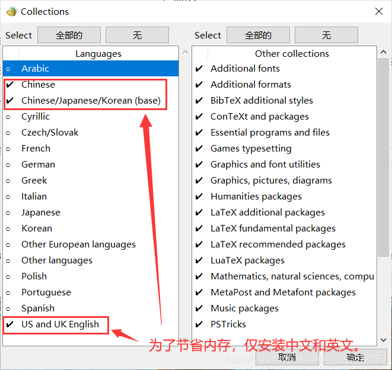

# Latex 安装记录


## 参考

1. [LaTex](https://www.latex-project.org/)
2. [一个非常快速的 Latex 入门教程](https://www.bilibili.com/video/BV11h41127FD?spm_id_from=333.880.my_history.page.click)


## 安装软件

下载软件

1. [TeX Live](https://www.tug.org/texlive/) 发行版软件 [清华镜像](https://mirrors.tuna.tsinghua.edu.cn/CTAN/systems/texlive/Images/) [上海交通大学](https://mirrors.sjtug.sjtu.edu.cn/ctan/systems/texlive/Images/)
2. [texstudio](http://texstudio.sourceforge.net/) 编辑器
3. vscode + LaTeX Workshop 

### 安装TexLive软件

1. 打开下载的texlive.iso文件，运行`install-tl-windows.bat`文件，进入第一个框框后点击`Advanced`. 可以修改安装路径，注意安装路径不要有中文和空格。

2. 在advanced 这一栏中，点击`Customize`取消掉不使用的语言，

   

3. 开始漫长的安装waiting

4. 设置环境变量，网友说要设置系统环境变量

   ```cmd
   #在系统环境变量一栏中添加一下：
   D:\texlive\2021\bin\win32
   ```


### 安装 [texstudio](http://texstudio.sourceforge.net/)

待补充……

### 安装VScode 

安装完成texlive 后，只要在vscode 的扩展中安装LaTeX Workshop 插件，就可以愉快的玩耍了。

## [SwiftLaTeX](https://github.com/SwiftLaTeX/SwiftLaTeX)

一个基于网页版的所见即所得的latex编辑器

运行demo

```text
You can download the zip file from the release page.
Unzip it to a local folder, and go to that folder. You will see many html files, which are use cases of SwiftLatex.
Open a terminal and type python3 -m http.server . (assume you have python in your computer)
You then can go to your browser and visit http://localhost:8000/ and see the demos.
```

如何编译：

```text
You can clone the repo and type make. :)
You may need to set up the emscripten first.
```

[emscripten](https://emcc.zcopy.site/)

## 模板

1. [overleaf](https://cn.overleaf.com/)

