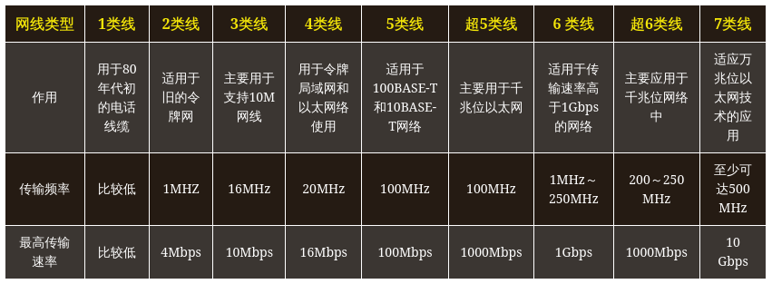
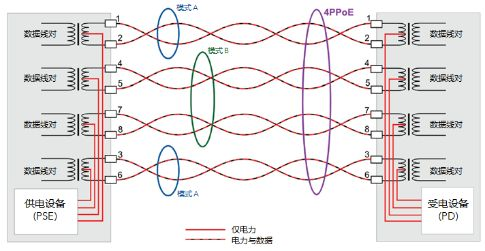
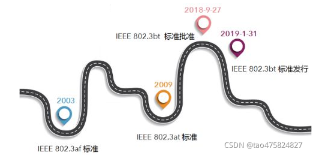

# 网线杂谈

## 网线分类

网线一般是由双绞线制作而成。

双绞线又可以分为非屏蔽类双绞线(UTP)和屏蔽类双绞线(STP)。

### 常见的双绞线型号

一类线（CAT1):主要用于传输语音（一类标准主要用于八十年代初之前的电话线缆），不同于数据传输。 

二类线（CAT2）:传输频率为1MHZ，用于语音传输和最高传输速率4Mbps的数据传输，常见于使用4MBPS规范令牌传递协议的旧的令牌网。 

三类线（CAT3）：传输频率16MHz，用于语音传输及最高传输速率为10Mbps的数据传输主要用于10BASE--T，在ANSI和EIA/TIA568标准中指定的电缆。 

四类线（CAT4）：传输频率为20MHz，用于语音传输和最高传输速率16Mbps的数据传输主要用于基于令牌的局域网和10BASE-T/100BASE-T。 

五类线（CAT5）：传输频率为100MHz，用于语音传输和最高传输速率为100Mbps的数据传输，主要用于100BASE-T和10BASE-T网络。这是最常用的以太网电缆，该类电缆增加了绕线密度，外套一种高质量的绝缘材料。 

超五类线（CAT5e）：传输频率为100MHz，主要用于千兆位以太网（1000Mbps）。具有衰减小，串扰少，并且具有更高的衰减与串扰的比值（ACR)和信噪比（StructuralReturn Loss)、更小的时延误差，性能得到很大提高。 

六类线（CAT6）：传输频率为250MHz，最适用于传输速率高于1Gbps的应用，主要用于千兆位以太网（1000Mbps）。六类双绞线在外形上和结构上与五类或超五类双绞线都有一定的差别，不仅增加了绝缘的十字骨架，将双绞线的四对线分别置于十字骨架的四个凹槽内，而且电缆的直径也更粗。 

超六类或6A（CAT6A）：传输频率是200～250 MHz，最大传输速度也可达到1000 Mbps，主要应用于千兆位网络中。超六类线是六类线的改进版，同样是ANSI/EIA/TIA-568B.2和ISO 6类/E级标准中规定的一种非屏蔽双绞线电缆，在串扰、衰减和信噪比等方面有较大改善。

七类线（CAT7）：传输频率至少可达500 MHz，传输速率可达10 Gbps，它主要为了适应万兆位以太网技术的应用和发展。该线是ISO 7类/F级标准中最新的一种屏蔽双绞线。  

### 超五类和六类网线区别

 超五类和六类网线连接使用并无不同，只是使用的场合和成本不一样。 

 超五类线的标识是“CAT5E”，带宽155M，是目前的主流产品；  六类线的标识是“ CAT6”，带宽250M，

六类非屏蔽双绞线可以非常好地支持千兆以太网，并实现100m的传输距离。六类布线系统被广泛应用子服务器机房的布线，以及保留升级至千兆以太网能力的水平布线。六类非屏蔽双绞线虽然价格较高，但由于与超五类布线系统具有非常好的兼容性，且能够非常好地支持1000Base-T，所以正慢慢成为综合布线的新宠。 

### STP、SFTP、UTP、FTP、ASTP网线的区分

STP：即独立屏蔽双绞线，在芯线外增加铝箔层，每对线都有一个铝箔屏蔽层，目的在于减少信号的衰减。每4对线合包还有一个金属编织屏蔽层，这已经达到七类网线的结构标准。适用于高速网络和高保密性传输，可支撑未来应用更新，可以统一布线平台，多种媒体信息共同传输。

SFTP：即双屏蔽双绞线，在STP的铝箔基础上增加编织网，通常用铝镁丝编织网、镀锡铜网，外层是PVC外被，总体说则是有两层屏蔽层、且两层屏蔽层之间必须有绝缘隔离。它的优势在于有效减少环境磁场、信号干扰，内部信号衰减程度低。缺点是柔软性差且昂贵，这种具抗干扰及高度保密传输的线材,适用特殊环境的专业布线工程中。

UTP：即非屏蔽双绞线，这类是目前普通市场应用最多的布线系统线材，用于传输带宽在250MHz以下，没有特殊性能要求的普通网络应用，整体性能符合要求、价格便宜、施工和维护方便。但此类型的性能最高极限仅支持六类网线的布线系统。

FTP：没有总屏蔽层，即铝箔屏蔽的双绞线，其具有使用带宽较大、有一定抗干扰能力、减少信号衰减，回收低烟无卤、环保的优点。

ASTP：即铠装型双绞屏蔽网线(电缆)则是较为特殊的双屏蔽网线，在以上双屏蔽线的基础上，外层为钢带铠装层，使用时，钢带铠装层两端接地，最内层屏蔽一端接地。具有双屏蔽线的效果外，强度较高，可用于鼠害频繁或有防爆要求的布线系统，一般屏蔽线比非屏蔽线在成本和安装上都会贵一些，弯曲性能稍差。但适用于一些特殊环境和屏敝系统综合布线。大家可以在了解自身情况后合理选择，优化成本及布线效果。

## POE供电

- PoE（Power over Ethernet）被称作以太网供电，简单来说它可以通过一根网线为支持PoE 的受电设备 (Powered Device，缩略为 PD) 同时提供电量和数据传输。
- PSE：供电端设备(PSE,Power Sourcing Equipment)
- PD: 受电设备 (Powered Device，缩略为 PD)

### 工作原理

如何通过网线传输电源，这就涉及到了电力传输的方式。
 电力传输可以选择和信号一起传输，也可以选择用信号不用的数据线来传输。
 在POE中，电力传输一共有3种模式。

#### 模式B AltB

用于百兆网。
 利用百兆网中不使用的4578线来进行电力信号的传输。并且规定，4、5为正极，7、8为负极。
 其实我觉得单独使用这个模式的话，自己手动做个水晶头，把4579剥离出来，最省钱。

#### 模式A AltA

用于百兆千兆万兆网均可。
 使用网络中的1236数据线，和网络数据同时进行传输。
 因为网络数据是差分信号，用来抵抗共模干扰。
 所以叠加一个直流信号并不会影响数据的传输。

#### 4PPoE

4PPoE 是”4 线对传输 PoE (4 Pair transmission PoE)”的缩写，这一模式被 802.3bt 协议所采纳，将使用双绞线的全部 4 对即 8 条线芯进行电力输送。

POE设备通常支持的协议有：

| 名称                   | 功率       | 支持模式            |
| ---------------------- | ---------- | ------------------- |
| IEEE 802.3af （POE）   | 15.4W      | AltA + AltB         |
| EEE 802.3at （POE+）   | 30W        | AltA + AltB         |
| IEEE 802.3bt （POE++） | 60W 至 90W | AltA + AltB + 4PPoE |

AF支持 百兆千兆，
AT也支持百兆千兆，
只是功率不同。

at是向下兼容af的。也就是说，如果你的交换机支持at标准，最大可供30W电，那他完全可以给支持af标准的需要7W的摄像机供电的
bt是向下兼容at和af的。

[一文参透POE交换机供电原理，8芯网线断芯也不怕！ ](https://www.sohu.com/a/325095807_692064)
