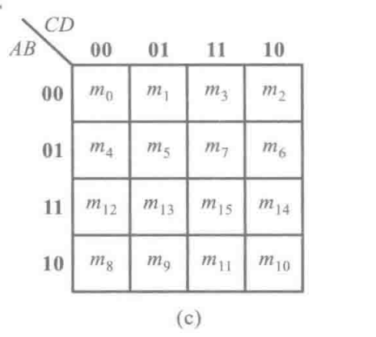

# 练习verilog

## hdlbits 学习问题记录
1. ！ 与~的不同是什么？？？
2. verilog 语法中的逻辑运算符与 verilog中自带的门电路有啥区别。


## 技巧
### 禁用隐式net的创建。
使用指令`default_nettype 可以禁用隐式net的创建

## 多维向量
在对象名称之前声明的维度称为“矢量宽度”维度。在对象名称之后声明的维度称为“数组”维度。
reg [7:0] mem [255:0];   // 256 unpacked elements, each of which is a 8-bit packed vector of reg.
reg mem2 [28:0];         // 29 unpacked elements, each of which is a 1-bit reg.


## 如何设计一个加法器

## 设计观念
不能先写代码，然后希望他可以生成一个合适的电路。

## 在设计中说的避免锁存器到底是什么？？？

## verilog 中的casex的用法，可以综合吗 casez
verilog 中的 z x 的含义

## $bits(out) $bits 是什么函数


## 关于verilog 中使用in[sel] 与 in[(sel+1)*4: sel*4] 的问题


### 正确的用法:
Vector indices can be variable, as long as the synthesizer can figure out that the width of the bits being selected is constant. In particular, selecting one bit out of a vector using a variable index will work.

```verilog
module top_module( 
    input [255:0] in,
    input [7:0] sel,
    output reg out );

    always @ (*) begin
        out = in[sel];
    end

endmodule
```


### 错误的用法：

Vector indices can be variable, as long as the synthesizer can figure out that the width of the bits being selected is constant. It's not always good at this. An error saying "... is not a constant" means it couldn't prove that the select width is constant. In particular, in[ sel*4+3 : sel*4 ] does not work.
Bit slicing ("Indexed vector part select", since Verilog-2001) has an even more compact syntax. 

```verilog
module top_module( 
    input [1023:0] in,
    input [7:0] sel,
    output [3:0] out );

assign out = in[(sel+1)*4 -1:sel*4];

endmodule
```
错误消息：
```tcl
Info (12021): Found 0 design units, including 0 entities, in source file tb_modules.sv
Error (10734): Verilog HDL error at top_module.v(6): sel is not a constant File: /home/h/work/hdlbits.2965080/top_module.v Line: 6
Error: Quartus Prime Analysis & Synthesis was unsuccessful. 1 error, 1 warning
    Error: Peak virtual memory: 386 megabytes
    Error: Processing ended: Mon Dec 13 09:56:29 2021
    Error: Elapsed time: 00:00:00
    Error: Total CPU time (on all processors): 00:00:00
Error (23031): Evaluation of Tcl script /home/h/hdlbits/compile.tcl unsuccessful
Error: Quartus Prime Shell was unsuccessful. 7 errors, 1 warning
    Error: Peak virtual memory: 481 megabytes
    Error: Processing ended: Mon Dec 13 09:56:30 2021
    Error: Elapsed time: 00:00:02
    Error: Total CPU time (on all processors): 00:00:01
```

高级用法：
可以规避[i*4]中i不是常数的错误。

```verilog
module top_module( 
    input [1023:0] in,
    input [7:0] sel,
    output [3:0] out );


//我的笨办法
reg [3:0] in_temp [255:0];

genvar  i;
generate 
for (i = 0; i < 256; i = i + 1) begin :g
    always @ (*) begin     
        in_temp[i] = in[i*4+3: i*4];
    end
end
endgenerate
assign out = in_temp[sel];


//比较高明的方法：
	// We can't part-select multiple bits without an error, but we can select one bit at a time,
	// four times, then concatenate them together.
	//assign out = {in[sel*4+3], in[sel*4+2], in[sel*4+1], in[sel*4+0]};

	// Alternatively, "indexed vector part select" works better, but has an unfamiliar syntax:
	//assign out = in[sel*4 +: 4];		// Select starting at index "sel*4", then select a total width of 4 bits with increasing (+:) index number.
	// assign out = in[sel*4+3 -: 4];	// Select starting at index "sel*4+3", then select a total width of 4 bits with decreasing (-:) index number.
	// Note: The width (4 in this case) must be constant.


endmodule

```

### 总结
情形一：如果只是单bit的，在使用in[i*4] 选择是可以的，

情形二：如果使用in[i*4+3 ： i*4]这种选择多个bit会出错，但是我们可以使用高级用法去完成这一操作。
有三种方法：
assign out = {in[sel*4+3], in[sel*4+2], in[sel*4+1], in[sel*4+0]};
assign out = in[sel*4 +: 4];	
assign out = in[sel*4+3 -: 4];


## 半加器 全加器

## 卡诺图化简法

理论：

注意： 只能圈起来2^n个最小项。

1. 将函数化为最小项之和的形式，
2. 画出表示该逻辑函数的卡诺图
3. 找出可以合并的最小项
4. 选取化简后的乘积项，选取原则是：
   1. 这些成绩项应包含函数式中所有的最小项（应覆盖卡诺图中所有的1）。
   2. 所用的乘积项数目最少。也就是可合并的最小项组成的矩阵数目最少。
   3. 每个乘积项包含的因子最少。也就是每个可合并的最小项矩形组中应该包含最多的最小项。

练习



hdlbits 中关于卡诺图的化简：


Minimum SOP and POS https://hdlbits.01xz.net/wiki/Exams/ece241_2013_q2
SOP 积之和 圈1和doncare项

pos 和之积 圈0和doncare项 之后 整体取反 再根据德摩根律化简即可。

# verilog 学习网站：
HDLBits https://hdlbits.01xz.net/wiki/Main_Page
菜鸟教程 
